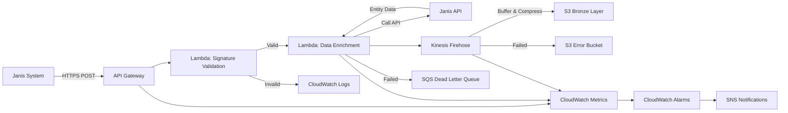

# Design Document: Webhook Ingestion System

## Overview

The Webhook Ingestion System provides real-time event processing for Janis notifications, enabling Cencosud to react immediately to critical business events. The system receives HTTP POST webhooks, validates their authenticity using HMAC-SHA256 signatures, enriches the event data by calling Janis APIs, and streams the enriched data to the Bronze layer of the Data Lake for downstream processing.

This design implements a serverless, highly available architecture using AWS API Gateway, Lambda, Kinesis Firehose, and S3, ensuring scalability, security, and cost-effectiveness.

## Architecture

### High-Level Architecture



### Component Interaction Flow

1. **Webhook Reception**: API Gateway receives POST requests from Janis on event-specific endpoints
2. **Authentication**: Lambda validates HMAC-SHA256 signature against shared secret from Secrets Manager
3. **Rate Limiting**: API Gateway enforces rate limits using token bucket algorithm
4. **Data Enrichment**: Lambda extracts entity ID, calls Janis API for complete data, adds metadata
5. **Streaming**: Enriched data sent to Kinesis Firehose for buffering and compression
6. **Storage**: Firehose writes compressed, partitioned data to S3 Bronze layer
7. **Error Handling**: Failed messages routed to DLQ for manual review and replay

### Design Decisions

**Decision 1: API Gateway + Lambda vs. Direct Lambda Integration**
- **Choice**: Use API Gateway as the entry point
- **Rationale**: API Gateway provides built-in rate limiting, throttling, request validation, and CORS support without custom code. It also offers better observability with native CloudWatch integration and request/response logging.

**Decision 2: Kinesis Firehose vs. Direct S3 Writes**
- **Choice**: Use Kinesis Firehose for buffering before S3
- **Rationale**: Firehose optimizes S3 costs by batching small webhook events into larger files, provides automatic compression, handles partitioning, and includes built-in retry logic for delivery failures.

**Decision 3: Synchronous API Enrichment vs. Asynchronous Processing**
- **Choice**: Synchronous enrichment within Lambda timeout
- **Rationale**: Ensures data completeness before storage, simplifies downstream processing, and provides immediate feedback to Janis. The 30-second Lambda timeout is sufficient for API calls with retry logic.

**Decision 4: Shared Secret Rotation Strategy**
- **Choice**: Monthly rotation with zero-downtime using versioned secrets
- **Rationale**: Secrets Manager supports multiple active versions, allowing gradual rollover. Lambda can validate against both old and new secrets during rotation window.


## Components and Interfaces

### API Gateway Configuration

**Endpoints**:
- `POST /webhook/order/created` - New order notifications
- `POST /webhook/order/updated` - Order modification notifications
- `POST /webhook/shipping/updated` - Shipping information updates
- `POST /webhook/payment/updated` - Payment status changes
- `POST /webhook/picking/completed` - Picking process completion

**Configuration**:
- **Integration Type**: Lambda Proxy Integration
- **Request Validation**: JSON schema validation enabled
- **Throttling**: 1,000 requests/second per endpoint, 2,000 burst capacity
- **Rate Limiting**: Token bucket algorithm with per-IP limits (100 req/min)
- **CORS**: Disabled (server-to-server communication only)
- **Logging**: Full request/response logging to CloudWatch
- **Custom Domain**: webhook.cencosud-datalake.com (production)

**Response Headers**:
```json
{
  "X-RateLimit-Limit": "1000",
  "X-RateLimit-Remaining": "847",
  "X-RateLimit-Reset": "1640995200"
}
```

**IP Whitelisting**: Implemented via Resource Policy restricting source IPs to Janis infrastructure ranges.

### Lambda Functions

#### Function 1: Webhook Validator

**Purpose**: Validate HMAC-SHA256 signatures and authenticate webhook requests

**Runtime**: Python 3.11  
**Memory**: 256 MB  
**Timeout**: 5 seconds  
**Concurrency**: Auto-scaling with reserved concurrency of 100

**Environment Variables**:
- `SECRET_NAME`: ARN of Secrets Manager secret containing shared key
- `LOG_LEVEL`: INFO (DEBUG for development)

**Logic Flow**:
1. Extract signature from `X-Janis-Signature` header
2. Retrieve current and previous secret versions from Secrets Manager
3. Compute HMAC-SHA256 of request body using both secrets
4. Compare computed signatures with provided signature (constant-time comparison)
5. Return 401 if validation fails, pass to enrichment Lambda if valid

**Error Handling**:
- Missing signature header → 401 Unauthorized
- Invalid signature → 401 Unauthorized with logged attempt
- Secrets Manager unavailable → 503 Service Unavailable with retry-after header


#### Function 2: Data Enrichment Processor

**Purpose**: Parse webhook payload, fetch complete entity data from Janis API, enrich and forward to Kinesis

**Runtime**: Python 3.11  
**Memory**: 512 MB  
**Timeout**: 30 seconds  
**Concurrency**: Auto-scaling with provisioned concurrency of 50 during peak hours (9 AM - 6 PM)

**Environment Variables**:
- `JANIS_API_BASE_URL`: https://api.janis.com/v2
- `JANIS_API_KEY_SECRET`: ARN of Secrets Manager secret for API authentication
- `KINESIS_STREAM_NAME`: Firehose delivery stream name
- `MAX_RETRIES`: 3
- `RETRY_BACKOFF_BASE`: 2 (exponential backoff: 2^attempt seconds)

**API Mapping**:
```python
EVENT_TYPE_TO_API = {
    "order.created": "/order/{order_id}",
    "order.updated": "/order/{order_id}",
    "shipping.updated": "/shipping/{shipping_id}",
    "payment.updated": "/payment/{payment_id}",
    "picking.completed": "/picking/{picking_id}"
}

# Additional calls for order events
ORDER_ITEMS_API = "/order/{order_id}/items"
```

**Enrichment Process**:
1. Parse webhook JSON payload
2. Extract `event_type` and entity ID (e.g., `order_id`)
3. Call primary Janis API endpoint with exponential backoff retry
4. For order events, make additional call to fetch order items
5. Merge webhook data with API response
6. Add metadata: `ingestion_timestamp`, `source_type: "webhook"`, `schema_version: "1.0"`
7. Send enriched JSON to Kinesis Firehose

**Error Handling**:
- Malformed JSON → 400 Bad Request
- Missing required fields → 400 Bad Request with validation details
- Janis API timeout → Retry with exponential backoff (max 3 attempts)
- Janis API 4xx error → Send to DLQ with error details
- Janis API 5xx error → Retry, then DLQ if exhausted
- Kinesis delivery failure → Automatic Lambda retry, then DLQ

**Dead Letter Queue**: SQS queue configured with 14-day retention, CloudWatch alarm triggers on message count > 0


### Kinesis Data Firehose

**Configuration**:
- **Buffer Size**: 5 MB
- **Buffer Interval**: 60 seconds
- **Compression**: GZIP
- **Encryption**: SSE-S3 (AES-256)

**Partitioning Strategy**:
```
s3://cencosud-datalake-bronze-prod/webhooks/
  orders/year=2026/month=01/day=15/hour=14/
  order-items/year=2026/month=01/day=15/hour=14/
  products/year=2026/month=01/day=15/hour=14/
  shipping/year=2026/month=01/day=15/hour=14/
  payments/year=2026/month=01/day=15/hour=14/
```

**Dynamic Partitioning**: Uses `event_type` field to route to appropriate prefix, with date/time extracted from `ingestion_timestamp`

**Error Handling**:
- **Retry Duration**: 3600 seconds (1 hour)
- **Retry Interval**: Exponential backoff starting at 60 seconds
- **Failed Records**: Routed to `s3://cencosud-datalake-errors-prod/webhooks/` with error metadata

**Monitoring**:
- DeliveryToS3.Success metric
- DeliveryToS3.DataFreshness metric (target < 120 seconds)
- IncomingBytes and IncomingRecords metrics

### AWS Secrets Manager

**Secrets**:
1. **janis-webhook-shared-secret**
   - Type: String
   - Rotation: Enabled (30 days)
   - Rotation Lambda: Coordinates with Janis team for synchronized rotation
   - Versions: AWSCURRENT and AWSPREVIOUS maintained during rotation window

2. **janis-api-key**
   - Type: String
   - Rotation: Manual (90 days)
   - Used for authenticating Lambda calls to Janis API

**Access Policy**: Restricted to webhook Lambda execution roles only


## Data Models

### Webhook Request Schema

```json
{
  "event_type": "order.created",
  "event_id": "evt_1234567890abcdef",
  "timestamp": "2026-01-15T14:30:00Z",
  "entity_id": "ORD-2026-001234",
  "payload": {
    "order_id": "ORD-2026-001234",
    "status": "pending",
    "created_at": "2026-01-15T14:29:55Z"
  }
}
```

**Required Fields**:
- `event_type` (string): Type of business event
- `entity_id` (string): Primary identifier for the entity
- `timestamp` (string): ISO 8601 UTC timestamp

**Validation Rules**:
- `event_type` must match one of: `order.created`, `order.updated`, `shipping.updated`, `payment.updated`, `picking.completed`
- `timestamp` must be valid ISO 8601 format
- `entity_id` must be non-empty string
- Request body size < 256 KB

### Enriched Data Schema (Bronze Layer)

```json
{
  "event_metadata": {
    "event_type": "order.created",
    "event_id": "evt_1234567890abcdef",
    "event_timestamp": "2026-01-15T14:30:00Z",
    "ingestion_timestamp": "2026-01-15T14:30:02.345Z",
    "source_type": "webhook",
    "schema_version": "1.0"
  },
  "original_webhook": {
    "entity_id": "ORD-2026-001234",
    "payload": { }
  },
  "enriched_data": {
    "order": {
      "order_id": "ORD-2026-001234",
      "customer_id": "CUST-789",
      "store_id": "STORE-042",
      "status": "pending",
      "total_amount": 125000,
      "currency": "CLP",
      "created_at": "2026-01-15T14:29:55Z",
      "updated_at": "2026-01-15T14:29:55Z"
    },
    "order_items": [
      {
        "item_id": "ITEM-001",
        "product_id": "PROD-5678",
        "quantity": 2,
        "unit_price": 50000,
        "subtotal": 100000
      }
    ]
  }
}
```

**Metadata Fields**:
- `ingestion_timestamp`: When webhook was received by our system
- `source_type`: Always "webhook" for this pipeline
- `schema_version`: Version of data structure for schema evolution


### S3 Storage Structure

**Bronze Layer Organization**:
```
s3://cencosud-datalake-bronze-prod/
  webhooks/
    orders/
      year=2026/month=01/day=15/hour=14/
        part-00001.json.gz
        part-00002.json.gz
    order-items/
      year=2026/month=01/day=15/hour=14/
    shipping/
      year=2026/month=01/day=15/hour=14/
    payments/
      year=2026/month=01/day=15/hour=14/
    picking/
      year=2026/month=01/day=15/hour=14/
```

**File Format**: Newline-delimited JSON (NDJSON) compressed with GZIP

**Lifecycle Policies**:
- Day 0-30: S3 Standard
- Day 31-90: S3 Infrequent Access
- Day 91-365: S3 Glacier Flexible Retrieval
- Day 365+: Delete

**Bucket Configuration**:
- Versioning: Disabled (immutable append-only data)
- Encryption: SSE-S3 (AES-256)
- Public Access: Blocked
- Replication: Cross-region replication to us-west-2 for disaster recovery

## Correctness Properties

*A property is a characteristic or behavior that should hold true across all valid executions of a system—essentially, a formal statement about what the system should do. Properties serve as the bridge between human-readable specifications and machine-verifiable correctness guarantees.*

### Property 1: Signature Validation Rejects Invalid Requests

*For any* incoming webhook request with an invalid or missing HMAC-SHA256 signature, the system should reject the request with HTTP 401 Unauthorized and log the authentication failure.

**Validates: Requirements 2.1, 2.3, 2.6**

### Property 2: Valid Webhooks Are Processed Within Timeout

*For any* valid webhook request, the system should complete signature validation, data enrichment, and Kinesis delivery within the 30-second Lambda timeout.

**Validates: Requirements 4.6**


### Property 3: Rate Limiting Enforces Configured Thresholds

*For any* sequence of webhook requests exceeding 1,000 requests per second to a single endpoint, the system should return HTTP 429 Too Many Requests for requests beyond the limit.

**Validates: Requirements 3.1, 3.4**

### Property 4: Enrichment Includes Complete Entity Data

*For any* successfully processed webhook, the enriched data stored in S3 should contain both the original webhook payload and the complete entity data fetched from the Janis API.

**Validates: Requirements 4.3, 4.5**

### Property 5: Failed Processing Routes to Dead Letter Queue

*For any* webhook that fails processing after 3 retry attempts, the system should route the original webhook data and error details to the Dead Letter Queue.

**Validates: Requirements 7.2, 7.3, 7.4**

### Property 6: Firehose Partitions Data by Event Type and Date

*For any* enriched webhook data delivered to S3, the file path should include partitions for event type, year, month, day, and hour extracted from the ingestion timestamp.

**Validates: Requirements 5.4**

### Property 7: All Stored Data Includes Required Metadata

*For any* webhook data stored in the Bronze layer, the record should include `ingestion_timestamp`, `source_type`, `event_type`, and `schema_version` metadata fields.

**Validates: Requirements 6.3**

### Property 8: Invalid Payloads Are Rejected with Detailed Errors

*For any* webhook request with a malformed JSON payload or missing required fields, the system should return HTTP 400 Bad Request with a detailed error message describing the validation failure.

**Validates: Requirements 9.2, 9.4**

### Property 9: Signature Validation Completes Within 100ms

*For any* webhook request, the HMAC-SHA256 signature validation process should complete within 100 milliseconds.

**Validates: Requirements 2.4**


### Property 10: API Gateway Responds Within 5 Seconds

*For any* valid webhook request, the API Gateway should return an HTTP response (200 OK or appropriate error code) within 5 seconds.

**Validates: Requirements 1.3**

### Property 11: Firehose Buffers Data Based on Size or Time Thresholds

*For any* stream of webhook data, Kinesis Firehose should write to S3 when either the 5 MB buffer size or 60-second buffer interval threshold is reached, whichever comes first.

**Validates: Requirements 5.2**

### Property 12: System Maintains Multi-AZ Availability

*For any* single Availability Zone failure, the system should continue processing webhooks without data loss using resources in other AZs.

**Validates: Requirements 11.1, 11.6**

## Error Handling

### Error Categories and Responses

**Authentication Errors**:
- Missing signature header → 401 Unauthorized
- Invalid signature → 401 Unauthorized
- Expired signature (if timestamp validation added) → 401 Unauthorized
- Secrets Manager unavailable → 503 Service Unavailable

**Validation Errors**:
- Malformed JSON → 400 Bad Request with parse error details
- Missing required fields → 400 Bad Request with field list
- Invalid field types → 400 Bad Request with type mismatch details
- Payload too large (>256 KB) → 413 Payload Too Large

**Rate Limiting Errors**:
- Per-endpoint limit exceeded → 429 Too Many Requests with rate limit headers
- Per-IP limit exceeded → 429 Too Many Requests with retry-after header
- Burst capacity exceeded → 429 Too Many Requests

**Processing Errors**:
- Janis API timeout → Retry with exponential backoff (2s, 4s, 8s)
- Janis API 4xx → Log error, send to DLQ, return 202 Accepted to Janis
- Janis API 5xx → Retry, then DLQ if exhausted, return 202 Accepted
- Kinesis delivery failure → Lambda automatic retry, then DLQ


### Retry Strategy

**Lambda Retry Configuration**:
- **Maximum Retry Attempts**: 2 (total 3 attempts including initial)
- **Retry Interval**: Exponential backoff with jitter
- **Maximum Event Age**: 6 hours
- **On Failure**: Send to SQS Dead Letter Queue

**Janis API Call Retry**:
```python
def call_janis_api_with_retry(endpoint, max_retries=3):
    for attempt in range(max_retries):
        try:
            response = requests.get(endpoint, timeout=10)
            response.raise_for_status()
            return response.json()
        except requests.Timeout:
            if attempt < max_retries - 1:
                sleep_time = (2 ** attempt) + random.uniform(0, 1)
                time.sleep(sleep_time)
            else:
                raise
        except requests.HTTPError as e:
            if e.response.status_code >= 500 and attempt < max_retries - 1:
                sleep_time = (2 ** attempt) + random.uniform(0, 1)
                time.sleep(sleep_time)
            else:
                raise
```

### Dead Letter Queue Processing

**DLQ Message Format**:
```json
{
  "original_webhook": { },
  "error_details": {
    "error_type": "JanisAPITimeout",
    "error_message": "Failed to fetch order data after 3 attempts",
    "failure_timestamp": "2026-01-15T14:35:00Z",
    "attempt_count": 3,
    "last_error": "Connection timeout after 10 seconds"
  },
  "processing_metadata": {
    "lambda_request_id": "abc-123-def-456",
    "lambda_function_version": "$LATEST"
  }
}
```

**DLQ Monitoring**:
- CloudWatch alarm triggers when `ApproximateNumberOfMessagesVisible` > 0
- SNS notification sent to operations team
- Dashboard widget shows DLQ message count and age

**Manual Replay Process**:
1. Investigate root cause from error details
2. Fix underlying issue (API credentials, network, etc.)
3. Use Lambda function to replay messages from DLQ
4. Verify successful processing in CloudWatch Logs
5. Purge processed messages from DLQ


## Testing Strategy

### Unit Testing

**Lambda Function Tests**:
- Signature validation with valid/invalid signatures
- Signature validation with rotated secrets (AWSCURRENT and AWSPREVIOUS)
- JSON payload parsing with valid/malformed data
- Required field validation
- API endpoint mapping for each event type
- Metadata enrichment logic
- Error response formatting

**Test Framework**: pytest with moto for AWS service mocking

**Example Test Cases**:
```python
def test_valid_signature_passes_validation():
    # Test that a correctly signed webhook passes validation
    
def test_invalid_signature_returns_401():
    # Test that an incorrectly signed webhook returns 401
    
def test_missing_required_field_returns_400():
    # Test that a webhook missing entity_id returns 400 with details
    
def test_enrichment_merges_api_data():
    # Test that enriched data contains both webhook and API response
```

### Integration Testing

**End-to-End Flow Tests**:
- Send test webhook through API Gateway
- Verify signature validation
- Verify Janis API call with correct parameters
- Verify enriched data arrives in Kinesis Firehose
- Verify S3 file created with correct partitioning
- Verify CloudWatch metrics recorded

**Error Scenario Tests**:
- Invalid signature rejection
- Malformed JSON handling
- Janis API timeout with retry
- DLQ routing on exhausted retries
- Rate limiting enforcement

**Test Environment**: Dedicated AWS account with isolated resources


### Property-Based Testing

Property-based tests will be implemented using **Hypothesis** for Python. Each test will run a minimum of 100 iterations with randomly generated inputs to verify universal properties.

**Property Test 1: Signature Validation Rejects Invalid Requests**
- **Feature**: webhook-ingestion, Property 1
- **Strategy**: Generate random webhook payloads and invalid signatures
- **Assertion**: All requests with invalid signatures return 401

**Property Test 2: Valid Webhooks Process Within Timeout**
- **Feature**: webhook-ingestion, Property 2
- **Strategy**: Generate random valid webhook payloads
- **Assertion**: Processing completes within 30 seconds

**Property Test 3: Rate Limiting Enforces Thresholds**
- **Feature**: webhook-ingestion, Property 3
- **Strategy**: Generate request sequences exceeding rate limits
- **Assertion**: Requests beyond threshold return 429

**Property Test 4: Enrichment Includes Complete Data**
- **Feature**: webhook-ingestion, Property 4
- **Strategy**: Generate random webhook events with mocked API responses
- **Assertion**: Enriched data contains both webhook and API data

**Property Test 5: Failed Processing Routes to DLQ**
- **Feature**: webhook-ingestion, Property 5
- **Strategy**: Generate webhooks that trigger API failures
- **Assertion**: After 3 retries, message appears in DLQ with error details

**Property Test 6: Firehose Partitions Correctly**
- **Feature**: webhook-ingestion, Property 6
- **Strategy**: Generate random webhook events with various timestamps
- **Assertion**: S3 paths match expected partition format

**Property Test 7: All Data Includes Metadata**
- **Feature**: webhook-ingestion, Property 7
- **Strategy**: Generate random webhook events
- **Assertion**: All stored records contain required metadata fields

**Property Test 8: Invalid Payloads Rejected with Details**
- **Feature**: webhook-ingestion, Property 8
- **Strategy**: Generate malformed JSON and missing required fields
- **Assertion**: All invalid payloads return 400 with descriptive errors

**Property Test 9: Signature Validation Performance**
- **Feature**: webhook-ingestion, Property 9
- **Strategy**: Generate random webhook payloads
- **Assertion**: Signature validation completes within 100ms

**Property Test 10: API Gateway Response Time**
- **Feature**: webhook-ingestion, Property 10
- **Strategy**: Generate random valid webhook requests
- **Assertion**: API Gateway responds within 5 seconds

**Property Test 11: Firehose Buffering Behavior**
- **Feature**: webhook-ingestion, Property 11
- **Strategy**: Generate webhook streams of varying sizes and rates
- **Assertion**: S3 writes occur when size or time threshold reached

**Property Test 12: Multi-AZ Availability**
- **Feature**: webhook-ingestion, Property 12
- **Strategy**: Simulate AZ failures during webhook processing
- **Assertion**: System continues processing without data loss


### Load Testing

**Performance Targets**:
- 10,000 concurrent requests without degradation
- Sub-second response time under normal load (< 1,000 req/s)
- 99.9% of requests processed within 5 seconds
- Handle 10x traffic spikes (10,000 req/s burst)

**Load Test Scenarios**:
1. **Steady State**: 1,000 req/s for 1 hour
2. **Spike Test**: Ramp from 100 to 10,000 req/s over 5 minutes
3. **Soak Test**: 500 req/s for 24 hours
4. **Stress Test**: Gradually increase until system breaks

**Tools**: Apache JMeter or Locust for load generation

**Metrics to Monitor**:
- API Gateway latency (p50, p95, p99)
- Lambda duration and concurrent executions
- Kinesis Firehose delivery lag
- Error rates and throttling events
- DLQ message count

## Monitoring and Observability

### CloudWatch Metrics

**API Gateway Metrics**:
- `Count`: Total requests per endpoint
- `4XXError`: Client errors (validation, auth failures)
- `5XXError`: Server errors
- `Latency`: Request processing time (p50, p95, p99)
- `IntegrationLatency`: Lambda execution time

**Lambda Metrics**:
- `Invocations`: Total function invocations
- `Errors`: Function errors
- `Duration`: Execution time
- `Throttles`: Throttled invocations
- `ConcurrentExecutions`: Concurrent function executions
- `DeadLetterErrors`: Failed DLQ deliveries

**Kinesis Firehose Metrics**:
- `IncomingBytes`: Data received from Lambda
- `IncomingRecords`: Records received
- `DeliveryToS3.Success`: Successful S3 deliveries
- `DeliveryToS3.DataFreshness`: Time from ingestion to S3 write
- `DeliveryToS3.Records`: Records delivered to S3

**Custom Metrics**:
- `WebhookProcessingLatency`: End-to-end processing time
- `JanisAPICallDuration`: Time to fetch entity data
- `EnrichmentSuccess`: Successful enrichments
- `EnrichmentFailure`: Failed enrichments by error type


### CloudWatch Alarms

**Critical Alarms** (Immediate notification):
- `HighErrorRate`: Error rate > 5% for 2 consecutive 5-minute periods
- `HighLatency`: p99 latency > 10 seconds for 2 consecutive periods
- `DLQMessagesPresent`: DLQ message count > 0
- `APIGateway5xxErrors`: 5xx errors > 10 in 5 minutes
- `LambdaThrottling`: Throttled invocations > 0

**Warning Alarms** (Notification during business hours):
- `ElevatedErrorRate`: Error rate > 2% for 10 minutes
- `IncreasedLatency`: p95 latency > 5 seconds for 10 minutes
- `LowFirehoseDeliverySuccess`: Success rate < 99% for 15 minutes
- `HighDataFreshness`: Data freshness > 5 minutes for 10 minutes

**Alarm Actions**:
- Critical: SNS topic → PagerDuty → On-call engineer
- Warning: SNS topic → Slack channel → Operations team

### CloudWatch Dashboard

**Dashboard Widgets**:

1. **Throughput Panel**:
   - Webhook requests per second (by endpoint)
   - Successful vs. failed requests
   - Rate limiting events

2. **Latency Panel**:
   - API Gateway latency (p50, p95, p99)
   - Lambda duration (p50, p95, p99)
   - End-to-end processing time

3. **Error Panel**:
   - Error rate percentage
   - Errors by type (4xx vs 5xx)
   - DLQ message count
   - Failed Janis API calls

4. **Data Pipeline Panel**:
   - Kinesis incoming records/bytes
   - Firehose delivery success rate
   - Data freshness metric
   - S3 objects created per hour

5. **Resource Utilization Panel**:
   - Lambda concurrent executions
   - Lambda memory utilization
   - API Gateway throttling events

**Dashboard URL**: Shared with operations team and embedded in runbooks


### Logging Strategy

**Log Levels**:
- **ERROR**: Authentication failures, processing errors, API failures
- **WARN**: Retry attempts, rate limiting events, validation warnings
- **INFO**: Successful webhook processing, enrichment completion
- **DEBUG**: Detailed request/response data (development only)

**Structured Logging Format**:
```json
{
  "timestamp": "2026-01-15T14:30:02.345Z",
  "level": "INFO",
  "request_id": "abc-123-def-456",
  "event_type": "order.created",
  "entity_id": "ORD-2026-001234",
  "message": "Webhook processed successfully",
  "duration_ms": 1234,
  "janis_api_duration_ms": 856
}
```

**Log Retention**:
- API Gateway logs: 30 days
- Lambda logs: 90 days
- Error logs: 365 days

**Log Insights Queries**:
```sql
-- Find slow webhook processing
fields @timestamp, event_type, duration_ms
| filter duration_ms > 5000
| sort duration_ms desc

-- Authentication failures by IP
fields @timestamp, sourceIp, event_type
| filter level = "ERROR" and message like /authentication failed/
| stats count() by sourceIp

-- Error rate by event type
fields @timestamp, event_type, level
| filter level = "ERROR"
| stats count() by event_type
```

### Distributed Tracing

**AWS X-Ray Integration**:
- Enabled on API Gateway and Lambda functions
- Trace webhook request from API Gateway → Lambda → Janis API → Kinesis
- Capture subsegments for:
  - Secrets Manager calls
  - Janis API calls
  - Kinesis PutRecord calls

**Trace Annotations**:
- `event_type`: Type of webhook event
- `entity_id`: Entity identifier
- `enrichment_success`: Boolean indicating enrichment success

**Service Map**: Visualize dependencies and identify bottlenecks


## Security Considerations

### Authentication and Authorization

**Webhook Authentication**:
- HMAC-SHA256 signature validation using shared secret
- Constant-time comparison to prevent timing attacks
- Support for secret rotation with dual-version validation
- IP whitelisting via API Gateway Resource Policy

**Janis API Authentication**:
- API key stored in AWS Secrets Manager
- Automatic rotation every 90 days
- Transmitted via HTTPS only

**IAM Roles and Policies**:
- Lambda execution role with least privilege
- Secrets Manager read-only access
- Kinesis Firehose write-only access
- CloudWatch Logs write access
- No cross-account access

### Data Protection

**Encryption in Transit**:
- TLS 1.2+ for all API Gateway endpoints
- HTTPS for all Janis API calls
- TLS for Kinesis Firehose delivery

**Encryption at Rest**:
- S3 SSE-S3 (AES-256) for Bronze layer
- Secrets Manager automatic encryption
- CloudWatch Logs encryption with KMS (optional)

**Data Retention and Deletion**:
- S3 lifecycle policies enforce retention limits
- DLQ messages expire after 14 days
- Logs automatically deleted per retention policy

### Network Security

**VPC Configuration**:
- Lambda functions deployed in private subnets
- NAT Gateway for outbound Janis API calls
- VPC endpoints for AWS services (Secrets Manager, S3, Kinesis)
- No direct internet access to Lambda functions

**Security Groups**:
- Outbound HTTPS (443) to Janis API only
- No inbound rules (Lambda doesn't accept connections)

**API Gateway Security**:
- Resource policy restricts source IPs
- WAF rules for common attack patterns (optional)
- Request size limits (256 KB)
- Throttling and rate limiting


### Compliance and Auditing

**CloudTrail Logging**:
- All API calls to AWS services logged
- Secrets Manager access audited
- S3 data access logged (optional with S3 Access Logging)

**Data Classification**:
- Webhook data classified as "Internal - Confidential"
- Contains customer order and payment information
- Subject to data retention policies

**Audit Requirements**:
- Monthly review of authentication failures
- Quarterly review of IAM permissions
- Annual security assessment

## Performance Optimization

### Lambda Optimization

**Cold Start Mitigation**:
- Provisioned concurrency (50 instances) during peak hours (9 AM - 6 PM)
- Minimal dependencies in deployment package
- Connection pooling for Janis API calls

**Memory Allocation**:
- Validator Lambda: 256 MB (CPU-bound signature validation)
- Enrichment Lambda: 512 MB (network I/O and JSON processing)
- Tuned based on CloudWatch Insights recommendations

**Code Optimization**:
- Reuse Secrets Manager client across invocations
- Cache secrets for 5 minutes to reduce API calls
- Use connection pooling for HTTP requests
- Minimize JSON serialization/deserialization

### API Gateway Optimization

**Caching**: Disabled (each webhook is unique and must be processed)

**Request Validation**: JSON schema validation at API Gateway level reduces Lambda invocations for invalid requests

**Integration Timeout**: 30 seconds to match Lambda timeout


### Kinesis Firehose Optimization

**Buffer Configuration**:
- 5 MB buffer size balances file size and latency
- 60-second interval ensures data freshness
- GZIP compression reduces S3 storage costs by ~70%

**Dynamic Partitioning**:
- Reduces downstream query costs by organizing data
- Enables efficient time-based queries
- Supports event-type filtering

**Batch Processing**: Firehose automatically batches records for efficient S3 writes

## Scalability

### Horizontal Scaling

**API Gateway**: Automatically scales to handle any request volume within account limits

**Lambda**: 
- Auto-scales to 1,000 concurrent executions (default account limit)
- Can request limit increase to 10,000+ if needed
- Each invocation processes one webhook independently

**Kinesis Firehose**:
- Automatically scales throughput
- No shard management required
- Handles up to 5,000 records/second per stream

### Vertical Scaling

**Lambda Memory**: Can increase to 10 GB if processing becomes more complex

**API Gateway Throttling**: Can increase per-endpoint limits via AWS support

### Scaling Limits and Monitoring

**Current Limits**:
- API Gateway: 10,000 req/s per region
- Lambda: 1,000 concurrent executions
- Kinesis Firehose: 5,000 records/s per stream

**Monitoring for Scale**:
- Track concurrent Lambda executions vs. limit
- Monitor API Gateway throttling events
- Alert when approaching 80% of any limit


## Disaster Recovery and High Availability

### Multi-AZ Deployment

**API Gateway**: Automatically deployed across multiple AZs in the region

**Lambda**: Automatically runs in multiple AZs with automatic failover

**Kinesis Firehose**: Synchronously replicates data across 3 AZs

**S3**: Automatically replicates data across multiple AZs (99.999999999% durability)

### Backup and Recovery

**S3 Cross-Region Replication**:
- Bronze layer replicated to us-west-2 for disaster recovery
- Replication lag < 15 minutes
- Enables recovery if primary region fails

**Secrets Rotation Backup**:
- Previous secret version maintained during rotation
- Allows rollback if rotation causes issues

**Infrastructure as Code**:
- All infrastructure defined in Terraform
- Can recreate entire stack in new region within 1 hour
- State file backed up to S3 with versioning

### Recovery Procedures

**Scenario 1: Lambda Function Failure**
- Automatic retry by Lambda service
- DLQ captures failed events
- Manual replay from DLQ after fix

**Scenario 2: Kinesis Firehose Failure**
- Automatic retry for 1 hour
- Failed records sent to error bucket
- Manual reprocessing from error bucket

**Scenario 3: Complete Region Failure**
- Janis switches to backup webhook endpoint in secondary region
- Terraform recreates infrastructure in us-west-2
- Historical data available via cross-region replication
- RTO: 2 hours, RPO: 15 minutes

### Availability Targets

**SLA**: 99.9% uptime (43 minutes downtime per month)

**Actual Target**: 99.95% uptime (22 minutes downtime per month)

**Measurement**: Calculated from API Gateway successful requests / total requests


## Cost Optimization

### Cost Breakdown (Estimated Monthly)

**API Gateway**:
- 10M requests/month × $3.50/million = $35
- Data transfer: Negligible (small payloads)

**Lambda**:
- 10M invocations × $0.20/million = $2
- Compute: 10M × 2 seconds × 512 MB = 10M GB-seconds × $0.0000166667 = $167
- Provisioned concurrency: 50 × 730 hours × $0.0000041667 = $152

**Kinesis Firehose**:
- 10M records × 5 KB = 50 GB ingested × $0.029/GB = $1.45
- Data format conversion: Not used

**S3 Storage**:
- 50 GB/month × 0.7 (compression) = 35 GB × $0.023/GB = $0.81
- PUT requests: ~1,000/month × $0.005/1000 = $0.005

**Secrets Manager**:
- 2 secrets × $0.40/month = $0.80
- API calls: 10M × $0.05/10,000 = $50 (mitigated by caching)

**CloudWatch**:
- Logs: 10 GB × $0.50/GB = $5
- Metrics: Custom metrics × $0.30/metric = $10
- Alarms: 10 alarms × $0.10 = $1

**Total Estimated Cost**: ~$425/month for 10M webhooks

### Cost Optimization Strategies

**Lambda**:
- Cache Secrets Manager responses (5-minute TTL) to reduce API calls from $50 to ~$5
- Use provisioned concurrency only during peak hours (9 AM - 6 PM) to save ~50%
- Right-size memory allocation based on actual usage

**Kinesis Firehose**:
- GZIP compression reduces S3 storage by 70%
- Batching reduces S3 PUT request costs

**S3**:
- Lifecycle policies transition old data to cheaper storage classes
- Intelligent Tiering for unpredictable access patterns

**CloudWatch**:
- Adjust log retention to balance compliance and cost
- Use metric filters instead of custom metrics where possible


## Deployment Strategy

### Infrastructure Deployment

**Terraform Modules**:
- `api-gateway`: REST API with endpoints and resource policies
- `lambda`: Validator and enrichment functions with layers
- `kinesis`: Firehose delivery streams with S3 destinations
- `s3`: Bronze bucket with lifecycle policies and replication
- `iam`: Roles and policies for all components
- `monitoring`: CloudWatch dashboards, alarms, and SNS topics
- `secrets`: Secrets Manager secrets with rotation

**Deployment Sequence**:
1. VPC and networking (if not exists)
2. S3 buckets (Bronze, errors, Terraform state)
3. IAM roles and policies
4. Secrets Manager secrets
5. Lambda functions and layers
6. Kinesis Firehose streams
7. API Gateway
8. CloudWatch alarms and dashboards

**Environment Promotion**:
- Dev → Staging → Production
- Automated deployment to Dev on merge to develop branch
- Manual approval required for Staging and Production
- Blue-green deployment for Lambda functions

### Application Deployment

**Lambda Deployment**:
- Package code and dependencies into ZIP
- Upload to S3 versioned bucket
- Update Lambda function code via Terraform
- Use aliases for blue-green deployment
- Gradual rollout: 10% → 50% → 100% over 30 minutes

**API Gateway Deployment**:
- Create new stage for each deployment
- Test new stage before switching traffic
- Use canary deployment for gradual rollout
- Rollback capability via stage reversion

### Rollback Procedures

**Lambda Rollback**:
- Revert to previous function version via alias
- Automatic rollback if error rate > 5%
- Manual rollback via Terraform or AWS Console

**API Gateway Rollback**:
- Switch traffic back to previous stage
- Can be done in < 1 minute

**Infrastructure Rollback**:
- Terraform state allows reverting to previous configuration
- Test rollback procedures quarterly


## Operational Runbooks

### Common Operations

**Viewing Recent Webhooks**:
```bash
# View CloudWatch Logs for recent webhook processing
aws logs tail /aws/lambda/janis-webhook-enrichment-prod --follow

# Query for specific event type
aws logs filter-log-events \
  --log-group-name /aws/lambda/janis-webhook-enrichment-prod \
  --filter-pattern "order.created"
```

**Checking DLQ Messages**:
```bash
# Get DLQ message count
aws sqs get-queue-attributes \
  --queue-url https://sqs.us-east-1.amazonaws.com/123456789/webhook-dlq-prod \
  --attribute-names ApproximateNumberOfMessages

# Receive messages from DLQ (without deleting)
aws sqs receive-message \
  --queue-url https://sqs.us-east-1.amazonaws.com/123456789/webhook-dlq-prod \
  --max-number-of-messages 10
```

**Replaying DLQ Messages**:
```bash
# Use replay Lambda function
aws lambda invoke \
  --function-name janis-webhook-dlq-replay-prod \
  --payload '{"maxMessages": 100}' \
  response.json
```

**Rotating Secrets**:
```bash
# Trigger manual secret rotation
aws secretsmanager rotate-secret \
  --secret-id janis-webhook-shared-secret

# Verify rotation completed
aws secretsmanager describe-secret \
  --secret-id janis-webhook-shared-secret
```

### Troubleshooting Guide

**Issue: High Error Rate**
1. Check CloudWatch dashboard for error types
2. Review Lambda logs for specific error messages
3. Verify Janis API availability
4. Check Secrets Manager for credential issues
5. Review recent deployments for code changes

**Issue: High Latency**
1. Check X-Ray traces for bottlenecks
2. Review Janis API response times
3. Check Lambda memory utilization
4. Verify no throttling events
5. Review concurrent execution count

**Issue: DLQ Messages Accumulating**
1. Retrieve sample messages from DLQ
2. Identify common error patterns
3. Fix root cause (credentials, API changes, etc.)
4. Test fix in development environment
5. Replay messages from DLQ
6. Monitor for successful processing

**Issue: Rate Limiting Triggered**
1. Identify source IPs from CloudWatch Logs
2. Verify legitimate traffic vs. potential attack
3. Adjust rate limits if needed
4. Contact Janis if they need higher limits
5. Consider implementing request queuing


## Future Enhancements

### Phase 2 Improvements

**Enhanced Validation**:
- Timestamp validation to reject old webhooks (prevent replay attacks)
- Schema versioning support for backward compatibility
- Custom validation rules per event type

**Advanced Monitoring**:
- Real-time anomaly detection using CloudWatch Anomaly Detection
- Automated remediation for common issues
- Business metrics dashboard (orders/hour, revenue trends)

**Performance Optimization**:
- Lambda@Edge for global webhook endpoints
- DynamoDB caching layer for frequently accessed data
- Batch processing for related webhooks

**Data Quality**:
- Automated data quality checks in Lambda
- Schema evolution tracking
- Data lineage visualization

### Phase 3 Improvements

**Event-Driven Architecture**:
- EventBridge integration for downstream consumers
- Event replay capability for historical analysis
- Event filtering and routing rules

**Advanced Security**:
- AWS WAF integration for DDoS protection
- Automated threat detection with GuardDuty
- Encryption with customer-managed KMS keys

**Multi-Region Active-Active**:
- Deploy webhook endpoints in multiple regions
- Global load balancing with Route 53
- Cross-region data synchronization

**Machine Learning Integration**:
- Predictive alerting for potential issues
- Automated capacity planning
- Intelligent error classification

## Appendix

### Glossary

- **HMAC-SHA256**: Hash-based Message Authentication Code using SHA-256, used for webhook signature validation
- **Token Bucket**: Rate limiting algorithm that allows burst traffic while maintaining average rate
- **Dead Letter Queue (DLQ)**: Queue for messages that failed processing after retries
- **Provisioned Concurrency**: Pre-initialized Lambda instances to reduce cold starts
- **Blue-Green Deployment**: Deployment strategy with two identical environments for zero-downtime updates

### References

- [AWS API Gateway Best Practices](https://docs.aws.amazon.com/apigateway/latest/developerguide/best-practices.html)
- [AWS Lambda Best Practices](https://docs.aws.amazon.com/lambda/latest/dg/best-practices.html)
- [Kinesis Data Firehose Documentation](https://docs.aws.amazon.com/firehose/latest/dev/what-is-this-service.html)
- [AWS Well-Architected Framework](https://aws.amazon.com/architecture/well-architected/)
- [HMAC Authentication Best Practices](https://www.rfc-editor.org/rfc/rfc2104)

