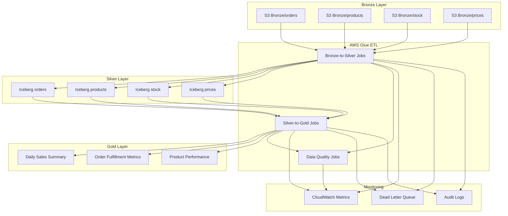

# Design Document: Data Transformation System

## Overview

Este documento describe el diseño del sistema de transformación de datos que procesa información desde la capa Bronze (datos raw) hacia las capas Silver (datos limpios) y Gold (datos curados). El sistema utiliza AWS Glue como motor de procesamiento serverless y Apache Iceberg como formato de tabla para proporcionar capacidades ACID, time travel y schema evolution.

El diseño sigue una arquitectura de medallion (Bronze → Silver → Gold) donde cada capa agrega valor incremental:
- **Bronze**: Datos raw sin procesar, réplica exacta de las fuentes
- **Silver**: Datos limpios, normalizados y deduplicados con calidad validada
- **Gold**: Datos curados, agregados y optimizados para consumo de BI

## Architecture

### High-Level Architecture



### Design Decisions

**Decision 1: AWS Glue como motor ETL**
- **Rationale**: Glue es serverless, elimina la necesidad de gestionar infraestructura, escala automáticamente y se integra nativamente con S3 y el Glue Data Catalog
- **Alternatives Considered**: EMR (más complejo de gestionar), Lambda (limitaciones de tiempo de ejecución)

**Decision 2: Apache Iceberg para Silver y Gold**
- **Rationale**: Iceberg proporciona transacciones ACID, time travel, schema evolution sin reescritura de datos, y optimización automática de archivos
- **Alternatives Considered**: Delta Lake (menos maduro en AWS), Parquet plano (sin capacidades ACID)

**Decision 3: Arquitectura Medallion (Bronze/Silver/Gold)**
- **Rationale**: Separación clara de responsabilidades, permite reprocessamiento desde cualquier capa, facilita debugging y auditoría
- **Alternatives Considered**: Procesamiento directo a warehouse (menos flexible), arquitectura lambda (más compleja)

**Decision 4: PySpark como lenguaje de transformación**
- **Rationale**: Procesamiento distribuido eficiente, API rica para transformaciones, integración nativa con Glue y Iceberg
- **Alternatives Considered**: Python puro (no escala), Scala (curva de aprendizaje más alta)

## Components and Interfaces

### 1. Bronze-to-Silver Glue Jobs

**Responsibility**: Transformar datos raw en datos limpios y normalizados

**Key Components**:
- `DataTypeConverter`: Convierte tipos MySQL a tipos Redshift-compatible
- `DataNormalizer`: Normaliza formatos de datos (timestamps, emails, teléfonos)
- `DataCleaner`: Aplica reglas de limpieza (trim, null conversion, encoding)
- `JSONFlattener`: Aplana estructuras JSON anidadas
- `IcebergWriter`: Escribe datos a tablas Iceberg con transacciones ACID

**Interfaces**:
```python
class BronzeToSilverJob:
    def read_bronze_data(self, s3_path: str) -> DataFrame
    def convert_data_types(self, df: DataFrame) -> DataFrame
    def normalize_formats(self, df: DataFrame) -> DataFrame
    def cleanse_data(self, df: DataFrame) -> DataFrame
    def flatten_json(self, df: DataFrame) -> DataFrame
    def write_to_iceberg(self, df: DataFrame, table_name: str) -> None
```

### 2. Deduplication Engine

**Responsibility**: Eliminar registros duplicados usando business keys y reglas de resolución

**Key Components**:
- `DuplicateDetector`: Identifica duplicados por business key
- `ConflictResolver`: Resuelve conflictos usando timestamp y source priority
- `MergeExecutor`: Ejecuta operaciones MERGE en Iceberg
- `AuditTracker`: Registra decisiones de deduplicación

**Interfaces**:
```python
class DeduplicationEngine:
    def identify_duplicates(self, df: DataFrame, business_key: str) -> DataFrame
    def resolve_conflicts(self, duplicates: DataFrame) -> DataFrame
    def execute_merge(self, df: DataFrame, table_name: str) -> None
    def log_deduplication_audit(self, decisions: List[Dict]) -> None
```

### 3. Data Gap Handler

**Responsibility**: Manejar campos faltantes con cálculos o marcadores de metadata

**Key Components**:
- `GapIdentifier`: Identifica campos faltantes según mapping
- `CalculatedFieldGenerator`: Genera campos calculables desde otros datos
- `MetadataAnnotator`: Marca campos no calculables con flags
- `GapReporter`: Genera reportes de data gaps

**Interfaces**:
```python
class DataGapHandler:
    def identify_gaps(self, df: DataFrame, schema_mapping: Dict) -> List[str]
    def calculate_derived_fields(self, df: DataFrame) -> DataFrame
    def annotate_missing_fields(self, df: DataFrame, gaps: List[str]) -> DataFrame
    def generate_gap_report(self, gaps: List[str]) -> Dict
```


### 4. Iceberg Table Manager

**Responsibility**: Gestionar configuración y operaciones de tablas Iceberg

**Key Components**:
- `TableCreator`: Crea tablas Iceberg con partitioning apropiado
- `SchemaEvolutionManager`: Maneja cambios de esquema de forma segura
- `CompactionScheduler`: Programa compactación automática de archivos
- `SnapshotManager`: Gestiona snapshots y time travel

**Interfaces**:
```python
class IcebergTableManager:
    def create_table(self, table_name: str, schema: StructType, partition_spec: Dict) -> None
    def evolve_schema(self, table_name: str, schema_changes: List[Dict]) -> bool
    def compact_files(self, table_name: str) -> None
    def list_snapshots(self, table_name: str) -> List[Dict]
    def rollback_to_snapshot(self, table_name: str, snapshot_id: str) -> None
```

### 5. Silver-to-Gold Aggregator

**Responsibility**: Crear datos curados y agregados para consumo de BI

**Key Components**:
- `AggregationEngine`: Ejecuta agregaciones predefinidas
- `DenormalizationEngine`: Denormaliza entidades relacionadas
- `MaterializedViewManager`: Gestiona vistas materializadas
- `IncrementalProcessor`: Procesa solo datos nuevos/modificados

**Interfaces**:
```python
class SilverToGoldAggregator:
    def create_daily_sales_summary(self, start_date: str, end_date: str) -> DataFrame
    def create_fulfillment_metrics(self, start_date: str, end_date: str) -> DataFrame
    def create_product_performance(self, start_date: str, end_date: str) -> DataFrame
    def denormalize_entities(self, df: DataFrame, join_specs: List[Dict]) -> DataFrame
```


### 6. Data Quality Validator

**Responsibility**: Validar calidad de datos y generar métricas

**Key Components**:
- `ValidationRuleEngine`: Ejecuta reglas de validación configurables
- `QualityMetricsCalculator`: Calcula métricas de completeness, validity, consistency
- `QualityGateEnforcer`: Bloquea datos de baja calidad
- `QualityReporter`: Genera reportes de calidad

**Interfaces**:
```python
class DataQualityValidator:
    def validate_nulls(self, df: DataFrame, required_fields: List[str]) -> ValidationResult
    def validate_data_types(self, df: DataFrame, schema: StructType) -> ValidationResult
    def validate_ranges(self, df: DataFrame, range_rules: Dict) -> ValidationResult
    def calculate_quality_metrics(self, df: DataFrame) -> QualityMetrics
    def enforce_quality_gate(self, metrics: QualityMetrics, thresholds: Dict) -> bool
```

### 7. Error Handler and Recovery Manager

**Responsibility**: Manejar errores y recuperación de fallos

**Key Components**:
- `ErrorClassifier`: Clasifica errores por tipo y severidad
- `StateManager`: Mantiene estado de procesamiento para restart
- `DLQWriter`: Escribe registros fallidos a Dead Letter Queue
- `RetryOrchestrator`: Implementa retry con exponential backoff

**Interfaces**:
```python
class ErrorHandler:
    def classify_error(self, error: Exception) -> ErrorType
    def save_processing_state(self, job_id: str, state: Dict) -> None
    def load_processing_state(self, job_id: str) -> Dict
    def write_to_dlq(self, failed_records: List[Dict], error_context: Dict) -> None
    def should_retry(self, error: ErrorType, attempt: int) -> bool
```


### 8. Monitoring and Observability Module

**Responsibility**: Proporcionar visibilidad completa del proceso de transformación

**Key Components**:
- `MetricsPublisher`: Publica métricas a CloudWatch
- `AlarmManager`: Gestiona alarmas de CloudWatch
- `DashboardGenerator`: Genera dashboards de monitoreo
- `NotificationService`: Envía notificaciones críticas

**Interfaces**:
```python
class MonitoringModule:
    def publish_job_metrics(self, job_id: str, metrics: Dict) -> None
    def publish_quality_metrics(self, table_name: str, metrics: QualityMetrics) -> None
    def create_alarm(self, alarm_name: str, metric: str, threshold: float) -> None
    def send_notification(self, topic: str, message: str, severity: str) -> None
```

### 9. Data Lineage Tracker

**Responsibility**: Rastrear linaje completo de datos a través de todas las capas

**Key Components**:
- `LineageRecorder`: Registra transformaciones y dependencias
- `MetadataStore`: Almacena metadata de transformaciones
- `LineageQueryAPI`: API para consultar linaje de datos
- `GovernanceIntegrator`: Integra con herramientas de governance

**Interfaces**:
```python
class DataLineageTracker:
    def record_transformation(self, source: str, target: str, job_id: str, metadata: Dict) -> None
    def trace_record_lineage(self, table_name: str, record_id: str) -> List[Dict]
    def query_lineage(self, table_name: str, filters: Dict) -> DataFrame
    def export_lineage_for_governance(self, format: str) -> str
```

## Data Models

### Bronze Layer Schema (Raw Data)


Datos raw almacenados en formato JSON en S3, sin transformaciones:

```json
{
  "order_id": "12345",
  "date_created": 1704067200,
  "status": "delivered",
  "amount": "150.50",
  "customer": {
    "email": "  customer@example.com  ",
    "phone": "+56912345678"
  },
  "source": "webhook",
  "ingestion_timestamp": "2024-01-01T00:00:00Z"
}
```

### Silver Layer Schema (Clean Data)

Datos limpios y normalizados en tablas Iceberg:

```python
orders_silver_schema = StructType([
    StructField("order_id", StringType(), nullable=False),
    StructField("date_created", TimestampType(), nullable=False),
    StructField("date_modified", TimestampType(), nullable=True),
    StructField("status", StringType(), nullable=False),
    StructField("amount", DecimalType(10, 2), nullable=False),
    StructField("customer_email", StringType(), nullable=True),
    StructField("customer_phone", StringType(), nullable=True),
    StructField("source", StringType(), nullable=False),
    StructField("ingestion_timestamp", TimestampType(), nullable=False),
    StructField("processing_timestamp", TimestampType(), nullable=False),
    # Data Gap metadata
    StructField("data_gap_flag", BooleanType(), nullable=False),
    StructField("gap_reason", StringType(), nullable=True),
    # Audit fields
    StructField("etl_job_id", StringType(), nullable=False),
    StructField("record_version", IntegerType(), nullable=False)
])
```

### Gold Layer Schema (Curated Data)

Datos agregados y optimizados para BI:

```python
daily_sales_summary_schema = StructType([
    StructField("date", DateType(), nullable=False),
    StructField("store_id", StringType(), nullable=False),
    StructField("product_category", StringType(), nullable=False),
    StructField("total_orders", LongType(), nullable=False),
    StructField("total_revenue", DecimalType(15, 2), nullable=False),
    StructField("avg_order_value", DecimalType(10, 2), nullable=False),
    StructField("total_items_sold", LongType(), nullable=False),
    StructField("unique_customers", LongType(), nullable=False),
    StructField("created_at", TimestampType(), nullable=False)
])
```


### Data Type Conversion Mapping

| MySQL Type | Bronze (Raw) | Silver (Iceberg) | Redshift Target |
|------------|--------------|------------------|-----------------|
| BIGINT (timestamp) | Long | TimestampType | TIMESTAMP |
| TINYINT(1) | Integer | BooleanType | BOOLEAN |
| VARCHAR(n) | String | StringType | VARCHAR(n) |
| DECIMAL(p,s) | String | DecimalType(p,s) | NUMERIC(p,s) |
| JSON | String | StringType | VARCHAR(65535) |
| DATETIME | String | TimestampType | TIMESTAMP |

### Iceberg Table Partitioning Strategy

**Orders Table**:
```python
partition_spec = {
    "partition_by": ["year(date_created)", "month(date_created)", "day(date_created)"],
    "rationale": "Queries typically filter by date ranges"
}
```

**Products Table**:
```python
partition_spec = {
    "partition_by": ["category"],
    "rationale": "Products queried by category for analytics"
}
```

**Stock Table**:
```python
partition_spec = {
    "partition_by": ["store_id", "date"],
    "rationale": "Stock queries are store-specific and date-based"
}
```

## Correctness Properties

*A property is a characteristic or behavior that should hold true across all valid executions of a system—essentially, a formal statement about what the system should do. Properties serve as the bridge between human-readable specifications and machine-verifiable correctness guarantees.*

Before defining the correctness properties, let me analyze each acceptance criterion for testability:


### Property Reflection

After analyzing all acceptance criteria, I've identified the following testable properties. Now I'll review them for redundancy:

**Redundancy Analysis**:
- Properties 8.5 and 10.3 both deal with routing failures to DLQ - these can be combined into one comprehensive property
- Properties 3.4, 12.2, and 12.4 all deal with audit/metadata completeness - these can be consolidated
- Properties 1.5 and 10.4 both deal with retry behavior - these can be combined
- Properties 5.3 and 10.6 both deal with data consistency - these overlap and can be unified
- Properties 6.5, 12.1, and 12.3 all deal with data lineage - these can be combined into one comprehensive property

After consolidation, the unique properties are:

### Correctness Properties

**Property 1: Data Type Conversion Correctness**
*For any* record with MySQL data types, after transformation the output should have the correct Redshift-compatible types (BIGINT timestamps → TIMESTAMP, TINYINT(1) → BOOLEAN, VARCHAR → VARCHAR, DECIMAL → NUMERIC, JSON → VARCHAR)
**Validates: Requirements 2.1**

**Property 2: Data Format Normalization**
*For any* record, after normalization all timestamps should be in 'YYYY-MM-DD HH:MM:SS' format, emails should match valid regex patterns, phone numbers should be in standard format, and addresses should have standardized components
**Validates: Requirements 2.2**

**Property 3: JSON Flattening Correctness**
*For any* record with nested JSON structures, the output should have individual columns for each nested field with correct values
**Validates: Requirements 2.3**

**Property 4: Data Cleansing Rules**
*For any* record, after cleansing all string fields should have trimmed whitespace, empty strings should be converted to NULL where appropriate, and encoding issues should be corrected
**Validates: Requirements 2.4**


**Property 5: Iceberg Write-Read Round Trip**
*For any* dataset written to Iceberg tables in Silver layer, reading it back should produce equivalent data with all values preserved
**Validates: Requirements 2.5**

**Property 6: Duplicate Detection by Business Key**
*For any* set of records with the same business key (order_id, item_id, product_id, or sku_id), the system should identify all of them as duplicates
**Validates: Requirements 3.1**

**Property 7: Timestamp-Based Conflict Resolution**
*For any* set of duplicate records, the system should keep the record with the most recent dateModified timestamp, and for identical timestamps prefer webhook source over polling source
**Validates: Requirements 3.2**

**Property 8: Calculated Fields Correctness**
*For any* record, calculated fields should be computed correctly: items_substituted_qty = COUNT(substitute_type='substitute'), items_qty_missing = SUM(quantity - COALESCE(quantity_picked, 0)), total_changes = amount - originalAmount
**Validates: Requirements 4.2**

**Property 9: Missing Field Metadata Annotation**
*For any* record with non-calculable missing fields, those fields should be NULL and have data_gap_flag=true with a gap_reason description
**Validates: Requirements 4.3**

**Property 10: Graceful Handling of Missing Non-Critical Fields**
*For any* record with missing non-critical fields, processing should complete successfully without throwing errors
**Validates: Requirements 4.5**

**Property 11: ACID Transaction Consistency**
*For any* write operation to Iceberg tables, the operation should be atomic (all-or-nothing) and data should remain consistent even during concurrent operations or failures
**Validates: Requirements 5.3, 10.6**

**Property 12: Time Travel Snapshot Access**
*For any* Iceberg table with historical snapshots, querying a past snapshot should return the data as it existed at that point in time
**Validates: Requirements 5.4**


**Property 13: Aggregation Calculation Correctness**
*For any* dataset, aggregated values in Gold tables (daily sales summary, fulfillment metrics, product performance) should match manual calculations from Silver data
**Validates: Requirements 6.1**

**Property 14: Incremental Processing Efficiency**
*For any* incremental Gold layer update, only records that are new or modified since the last update should be processed
**Validates: Requirements 6.4**

**Property 15: Schema Change Detection**
*For any* incoming data with schema differences from the current table schema, the system should detect and identify the specific changes
**Validates: Requirements 7.1**

**Property 16: Safe Schema Evolution**
*For any* safe schema evolution operation (add column, rename column, safe type change), the operation should succeed without data loss or corruption
**Validates: Requirements 7.2**

**Property 17: Schema Validation Before Application**
*For any* schema change request, validation should occur and complete before the schema is actually modified
**Validates: Requirements 7.3**

**Property 18: Schema Version History Completeness**
*For any* schema change, a version history entry should be created in the Glue Data Catalog with timestamp and change details
**Validates: Requirements 7.4**

**Property 19: Unsafe Schema Change Alerting**
*For any* schema change that requires manual intervention (unsafe type conversion, column deletion), an alert should be sent to data engineers
**Validates: Requirements 7.5**

**Property 20: Schema Rollback Capability**
*For any* schema change, rolling back to the previous schema version should restore the original schema without data loss
**Validates: Requirements 7.6**

**Property 21: Data Quality Validation Execution**
*For any* record, all configured quality checks (null validation, type validation, range validation, format validation) should be executed and results recorded
**Validates: Requirements 8.1**


**Property 22: Quality Metrics Calculation Accuracy**
*For any* dataset, calculated quality metrics (completeness, validity, consistency, accuracy percentages) should match manual calculations
**Validates: Requirements 8.2**

**Property 23: Quality Report Completeness**
*For any* quality report generated, it should contain quality scores by table and column, trend analysis, and identification of quality degradation
**Validates: Requirements 8.3**

**Property 24: Quality Gate Enforcement**
*For any* dataset with quality metrics below configured thresholds, the system should block it from progressing to the next layer
**Validates: Requirements 8.4**

**Property 25: Checkpoint Recovery**
*For any* long-running transformation that fails after a checkpoint, restarting should resume from the checkpoint without reprocessing completed work
**Validates: Requirements 9.6**

**Property 26: Comprehensive Error Handling**
*For any* error type (parsing, validation, schema incompatibility, resource exhaustion, downstream failure), the system should handle it gracefully without crashing
**Validates: Requirements 10.1**

**Property 27: Processing State Persistence**
*For any* job execution, the processing state should be saved at regular intervals and be restorable to enable restart from failure point
**Validates: Requirements 10.2**

**Property 28: Failed Record DLQ Routing with Metadata**
*For any* failed record (quality failure or processing error), it should be written to the Dead Letter Queue with original data, error description, processing timestamp, and job ID
**Validates: Requirements 8.5, 10.3**

**Property 29: Retry with Exponential Backoff**
*For any* retryable error, the system should retry up to 3 times with exponentially increasing delays between attempts
**Validates: Requirements 1.5, 10.4**

**Property 30: Manual Reprocessing Capability**
*For any* record in the Dead Letter Queue, it should be possible to reprocess it manually and have it flow through the normal pipeline
**Validates: Requirements 10.5**


**Property 31: CloudWatch Metrics Publishing**
*For any* job execution, metrics (duration, success rate, records processed, quality scores, resource utilization) should be published to CloudWatch
**Validates: Requirements 11.1**

**Property 32: Critical Event Notifications**
*For any* critical event (job failure, quality degradation, resource exhaustion), a notification should be sent through the configured notification service
**Validates: Requirements 11.4**

**Property 33: Complete Data Lineage Traceability**
*For any* record in Gold layer, it should be possible to trace back through Silver to Bronze layer with complete transformation history and source file locations
**Validates: Requirements 6.5, 12.1, 12.3**

**Property 34: Transformation Metadata Completeness**
*For any* transformation operation, metadata should be recorded including source locations, transformation rules applied, job execution details, and data quality results
**Validates: Requirements 3.4, 12.2, 12.4**

## Error Handling

### Error Classification

The system classifies errors into the following categories:

1. **Retryable Errors**:
   - Transient network failures
   - Temporary resource unavailability
   - Downstream service throttling
   - **Action**: Retry with exponential backoff (3 attempts)

2. **Data Quality Errors**:
   - Validation failures
   - Schema incompatibilities
   - Data format issues
   - **Action**: Route to DLQ for investigation

3. **Fatal Errors**:
   - Invalid configuration
   - Missing required resources
   - Authentication failures
   - **Action**: Fail job immediately and alert

4. **Partial Failures**:
   - Individual record processing errors
   - **Action**: Continue processing, log failed records to DLQ

### Error Recovery Strategy

```python
def process_with_recovery(records: List[Dict]) -> ProcessingResult:
    checkpoint_interval = 1000
    state = load_processing_state() or {"last_processed_index": 0}
    
    for i, record in enumerate(records[state["last_processed_index"]:]):
        try:
            process_record(record)
            
            if i % checkpoint_interval == 0:
                save_processing_state({"last_processed_index": i})
                
        except RetryableError as e:
            retry_with_backoff(lambda: process_record(record), max_attempts=3)
        except DataQualityError as e:
            write_to_dlq(record, error_context=e)
        except FatalError as e:
            save_processing_state({"last_processed_index": i})
            raise
```


### Dead Letter Queue Structure

```python
dlq_record_schema = {
    "dlq_id": "uuid",
    "original_record": "json",
    "error_type": "string",
    "error_message": "string",
    "error_stacktrace": "string",
    "job_id": "string",
    "job_name": "string",
    "processing_timestamp": "timestamp",
    "retry_count": "integer",
    "source_layer": "string",  # bronze, silver, gold
    "table_name": "string",
    "reprocessing_status": "string"  # pending, reprocessing, resolved, failed
}
```

## Testing Strategy

### Dual Testing Approach

The testing strategy combines two complementary approaches:

1. **Unit Tests**: Verify specific examples, edge cases, and error conditions
2. **Property-Based Tests**: Verify universal properties across all inputs

Both types of tests are necessary for comprehensive coverage. Unit tests catch concrete bugs and validate specific scenarios, while property-based tests verify general correctness across a wide range of inputs.

### Property-Based Testing Configuration

**Framework**: We will use **Hypothesis** for Python/PySpark property-based testing

**Configuration**:
- Minimum 100 iterations per property test (due to randomization)
- Each property test must reference its design document property
- Tag format: `# Feature: data-transformation, Property {number}: {property_text}`

**Example Property Test Structure**:
```python
from hypothesis import given, strategies as st
import pytest

@given(
    records=st.lists(
        st.fixed_dictionaries({
            'order_id': st.text(min_size=1),
            'date_created': st.integers(min_value=0),
            'amount': st.decimals(min_value=0, max_value=999999, places=2)
        }),
        min_size=1,
        max_size=1000
    )
)
@pytest.mark.property_test
def test_data_type_conversion_correctness(records):
    """
    Feature: data-transformation, Property 1: Data Type Conversion Correctness
    For any record with MySQL data types, after transformation the output 
    should have the correct Redshift-compatible types
    """
    # Arrange
    input_df = create_dataframe(records)
    
    # Act
    output_df = convert_data_types(input_df)
    
    # Assert
    for row in output_df.collect():
        assert isinstance(row['date_created'], datetime)  # BIGINT -> TIMESTAMP
        assert isinstance(row['amount'], Decimal)  # String -> DECIMAL
```


### Unit Testing Focus Areas

Unit tests should focus on:

1. **Specific Examples**: Demonstrate correct behavior with known inputs/outputs
2. **Edge Cases**: 
   - Empty datasets
   - Records with all NULL values
   - Maximum field lengths
   - Boundary values for numeric fields
   - Special characters in strings
3. **Error Conditions**:
   - Invalid data types
   - Schema mismatches
   - Missing required fields
   - Malformed JSON
4. **Integration Points**:
   - S3 read/write operations
   - Iceberg table operations
   - CloudWatch metrics publishing
   - DLQ writes

**Example Unit Test**:
```python
def test_empty_string_to_null_conversion():
    """Test that empty strings are converted to NULL"""
    # Arrange
    input_data = [
        {'customer_email': '  ', 'customer_phone': ''},
        {'customer_email': 'valid@email.com', 'customer_phone': ''}
    ]
    input_df = spark.createDataFrame(input_data)
    
    # Act
    output_df = cleanse_data(input_df)
    
    # Assert
    result = output_df.collect()
    assert result[0]['customer_email'] is None
    assert result[0]['customer_phone'] is None
    assert result[1]['customer_email'] == 'valid@email.com'
    assert result[1]['customer_phone'] is None
```

### Test Data Generation Strategy

For property-based tests, we need smart generators that constrain to valid input spaces:

```python
# Generator for valid MySQL timestamps (BIGINT)
mysql_timestamps = st.integers(
    min_value=946684800,  # 2000-01-01
    max_value=2147483647  # 2038-01-19 (max 32-bit timestamp)
)

# Generator for valid email addresses
valid_emails = st.emails()

# Generator for valid phone numbers
valid_phones = st.from_regex(r'^\+56[0-9]{9}$', fullmatch=True)

# Generator for nested JSON structures
nested_json = st.recursive(
    st.dictionaries(
        keys=st.text(alphabet=st.characters(whitelist_categories=('Lu', 'Ll')), min_size=1),
        values=st.one_of(st.text(), st.integers(), st.floats(), st.booleans())
    ),
    lambda children: st.dictionaries(
        keys=st.text(alphabet=st.characters(whitelist_categories=('Lu', 'Ll')), min_size=1),
        values=st.one_of(st.text(), st.integers(), children)
    ),
    max_leaves=10
)
```


### Testing Layers

**Bronze-to-Silver Tests**:
- Data type conversion accuracy
- Format normalization correctness
- JSON flattening completeness
- Data cleansing rules application
- Deduplication logic
- Data gap handling

**Silver-to-Gold Tests**:
- Aggregation calculation accuracy
- Incremental processing correctness
- Denormalization completeness
- Data lineage preservation

**Cross-Cutting Tests**:
- Error handling and recovery
- Quality validation and metrics
- Schema evolution safety
- ACID transaction guarantees
- Monitoring and observability

### Performance Testing

While not part of correctness properties, performance should be validated:

```python
def test_processing_throughput():
    """Validate that system meets performance requirements"""
    # Generate 100,000 test records
    test_records = generate_test_data(count=100000)
    
    # Measure processing time
    start_time = time.time()
    process_bronze_to_silver(test_records)
    elapsed_time = time.time() - start_time
    
    # Should process 100k records in under 60 seconds (100k/min requirement)
    assert elapsed_time < 60, f"Processing took {elapsed_time}s, expected < 60s"
```

## Implementation Notes

### AWS Glue Job Configuration

All Glue jobs should be configured with the following parameters:

```python
glue_job_config = {
    "GlueVersion": "4.0",
    "WorkerType": "G.1X",
    "NumberOfWorkers": 2,
    "MaxCapacity": 10,  # Auto-scaling up to 10 workers
    "Timeout": 120,  # 2 hours
    "MaxRetries": 3,
    "ExecutionProperty": {
        "MaxConcurrentRuns": 1
    },
    "DefaultArguments": {
        "--enable-metrics": "true",
        "--enable-continuous-cloudwatch-log": "true",
        "--enable-spark-ui": "true",
        "--spark-event-logs-path": "s3://glue-logs/spark-events/",
        "--enable-job-insights": "true",
        "--job-bookmark-option": "job-bookmark-enable"
    }
}
```


### Iceberg Table Configuration

Standard Iceberg table configuration for Silver and Gold layers:

```python
iceberg_table_config = {
    "format-version": "2",
    "write.format.default": "parquet",
    "write.parquet.compression-codec": "snappy",
    "write.target-file-size-bytes": "134217728",  # 128 MB
    "write.metadata.compression-codec": "gzip",
    "commit.retry.num-retries": "3",
    "commit.retry.min-wait-ms": "100",
    "history.expire.max-snapshot-age-ms": "2592000000",  # 30 days
    "write.metadata.delete-after-commit.enabled": "true",
    "write.metadata.previous-versions-max": "100"
}
```

### Data Quality Thresholds

Default quality thresholds for quality gates:

```python
quality_thresholds = {
    "completeness": {
        "critical_fields": 0.99,  # 99% non-null for critical fields
        "standard_fields": 0.95   # 95% non-null for standard fields
    },
    "validity": {
        "format_compliance": 0.98,  # 98% of values match expected formats
        "type_compliance": 1.0      # 100% type correctness required
    },
    "consistency": {
        "cross_table": 0.95,  # 95% consistency across related tables
        "referential_integrity": 0.99  # 99% valid foreign keys
    },
    "accuracy": {
        "range_compliance": 0.97  # 97% of values within expected ranges
    }
}
```

### Monitoring Metrics

Key metrics to publish to CloudWatch:

```python
cloudwatch_metrics = {
    "job_metrics": [
        "JobDuration",
        "JobSuccessRate",
        "RecordsProcessed",
        "RecordsPerMinute",
        "WorkersUsed"
    ],
    "quality_metrics": [
        "CompletenessScore",
        "ValidityScore",
        "ConsistencyScore",
        "AccuracyScore",
        "QualityGateFailures"
    ],
    "resource_metrics": [
        "CPUUtilization",
        "MemoryUtilization",
        "DiskIOUtilization",
        "NetworkBytesTransferred"
    ],
    "iceberg_metrics": [
        "TableFileCount",
        "TableSizeBytes",
        "SnapshotCount",
        "CompactionDuration"
    ]
}
```


### Data Lineage Metadata Schema

```python
lineage_metadata_schema = {
    "lineage_id": "uuid",
    "source_layer": "string",  # bronze, silver, gold
    "source_table": "string",
    "source_file_path": "string",
    "source_record_count": "long",
    "target_layer": "string",
    "target_table": "string",
    "target_file_path": "string",
    "target_record_count": "long",
    "transformation_job_id": "string",
    "transformation_job_name": "string",
    "transformation_rules": "array<string>",
    "transformation_timestamp": "timestamp",
    "data_quality_score": "double",
    "processing_duration_seconds": "long",
    "records_failed": "long",
    "records_deduplicated": "long"
}
```

## Deployment Considerations

### Infrastructure Requirements

- **VPC Configuration**: Glue jobs must run in private subnets with NAT Gateway for internet access
- **Security Groups**: Restrict inbound/outbound traffic to necessary services only
- **IAM Roles**: Separate roles for Bronze-to-Silver and Silver-to-Gold jobs with least privilege
- **S3 Bucket Policies**: Enforce encryption and versioning on all data lake buckets
- **KMS Keys**: Use separate KMS keys for Bronze, Silver, and Gold layers

### Operational Procedures

**Job Scheduling**:
- Bronze-to-Silver jobs triggered by S3 events (new data arrival)
- Silver-to-Gold jobs scheduled hourly for incremental updates
- Data quality jobs run after each transformation
- Compaction jobs scheduled daily during low-traffic periods

**Monitoring and Alerting**:
- CloudWatch alarms for job failures (immediate notification)
- Quality degradation alerts (15-minute evaluation period)
- Resource exhaustion warnings (5-minute evaluation period)
- DLQ size monitoring (alert when > 100 records)

**Backup and Recovery**:
- Iceberg snapshots retained for 30 days
- DLQ records retained for 90 days
- Job execution logs retained for 30 days
- Metadata and lineage data retained indefinitely

### Rollout Strategy

1. **Phase 1**: Deploy Bronze-to-Silver transformation for orders table
2. **Phase 2**: Add remaining entities (products, stock, prices)
3. **Phase 3**: Deploy Silver-to-Gold aggregations
4. **Phase 4**: Enable full monitoring and alerting
5. **Phase 5**: Implement automated data quality gates

Each phase includes validation period before proceeding to next phase.
