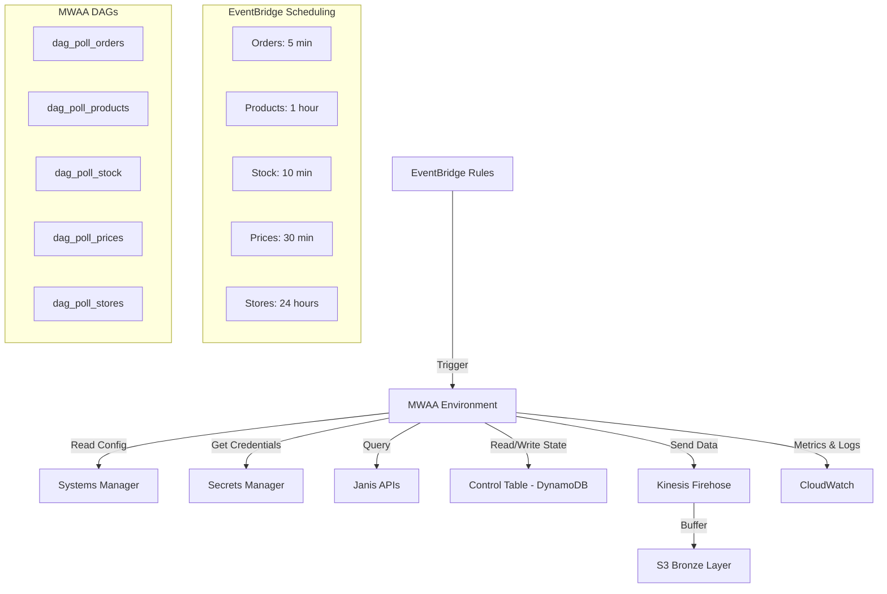
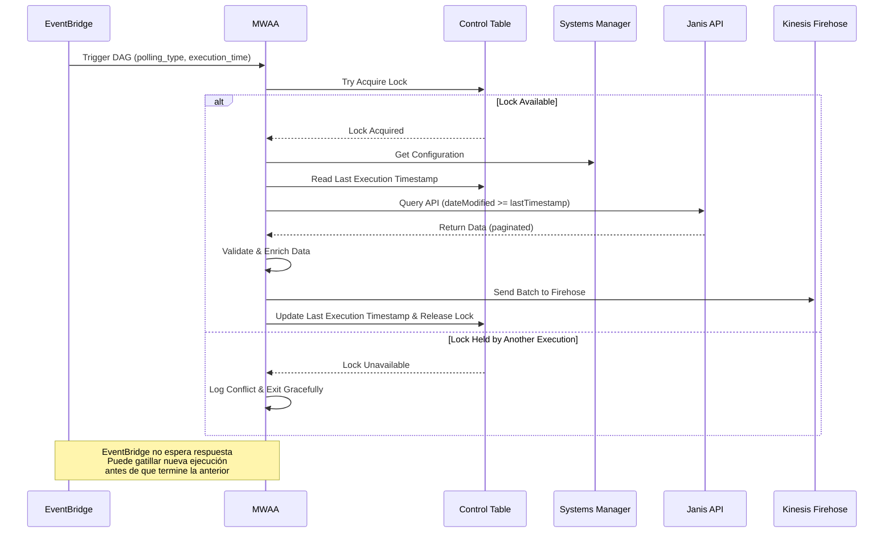

# Design Document: API Polling System

## Overview

El sistema de API Polling implementa una arquitectura event-driven que utiliza Amazon EventBridge para gatillar flujos de trabajo de Apache Airflow (MWAA) de manera programada. Este diseño optimiza el uso de recursos al eliminar el overhead de scheduling continuo en MWAA, delegando la responsabilidad de timing a EventBridge mientras MWAA se enfoca exclusivamente en la ejecución de tareas de polling.

La arquitectura sigue un patrón de orquestación híbrida donde EventBridge actúa como scheduler inteligente y MWAA como motor de ejecución bajo demanda, permitiendo escalabilidad eficiente y reducción de costos operacionales.

### Design Rationale

**EventBridge como Scheduler**: Se eligió EventBridge sobre el scheduling nativo de Airflow para reducir el overhead de MWAA. Con scheduling nativo, MWAA debe mantener workers activos constantemente para evaluar schedules, incluso cuando no hay trabajo. EventBridge permite que MWAA opere en modo "on-demand", iniciando workers solo cuando hay trabajo real que ejecutar.

**MWAA para Orquestación**: A pesar de usar EventBridge para scheduling, MWAA sigue siendo valioso para orquestar la lógica compleja de polling: manejo de estado, retry logic, paralelización de tareas, y gestión de dependencias entre pasos del workflow.

## Architecture

### High-Level Architecture



### Event Flow

1. **EventBridge Rule Triggers**: Regla programada se activa según schedule definido
2. **Event Payload Creation**: EventBridge construye payload con metadata (polling_type, execution_time, rule_name)
3. **MWAA DAG Invocation**: EventBridge invoca el DAG correspondiente vía API de MWAA
4. **Lock Acquisition**: DAG intenta adquirir lock en Control Table para prevenir ejecuciones concurrentes
5. **DAG Execution**: Si lock es adquirido, MWAA procesa el evento y ejecuta tareas de polling
6. **Data Delivery**: Datos obtenidos se envían a Kinesis Firehose
7. **State Update & Lock Release**: Control Table se actualiza con timestamp de última ejecución exitosa y se libera el lock

**Nota Importante sobre Concurrencia**: EventBridge NO espera confirmación de MWAA antes de gatillar la siguiente ejecución programada. Esto significa que si una ejecución de polling tarda más que el intervalo del schedule (ej: una ejecución de orders tarda 6 minutos pero el schedule es cada 5 minutos), EventBridge intentará iniciar una segunda ejecución. El mecanismo de locks en DynamoDB previene que ambas ejecuciones procesen datos simultáneamente - la segunda ejecución detectará el lock activo y terminará gracefully sin procesar datos.

### Component Interaction



## Components and Interfaces

### 1. EventBridge Scheduler

**Purpose**: Gatillar ejecuciones de DAGs de MWAA según schedules programados, eliminando la necesidad de scheduling continuo en Airflow.

**Configuration**:

```python
# EventBridge Rule Configuration
rules = {
    "orders": {
        "schedule": "rate(5 minutes)",
        "target_dag": "dag_poll_orders",
        "payload": {
            "polling_type": "orders",
            "execution_time": "<aws.events.event-time>",
            "rule_name": "poll-orders-rule"
        }
    },
    "products": {
        "schedule": "rate(1 hour)",
        "target_dag": "dag_poll_products",
        "payload": {
            "polling_type": "products",
            "execution_time": "<aws.events.event-time>",
            "rule_name": "poll-products-rule"
        }
    },
    "stock": {
        "schedule": "rate(10 minutes)",
        "target_dag": "dag_poll_stock",
        "payload": {
            "polling_type": "stock",
            "execution_time": "<aws.events.event-time>",
            "rule_name": "poll-stock-rule"
        }
    },
    "prices": {
        "schedule": "rate(30 minutes)",
        "target_dag": "dag_poll_prices",
        "payload": {
            "polling_type": "prices",
            "execution_time": "<aws.events.event-time>",
            "rule_name": "poll-prices-rule"
        }
    },
    "stores": {
        "schedule": "rate(24 hours)",
        "target_dag": "dag_poll_stores",
        "payload": {
            "polling_type": "stores",
            "execution_time": "<aws.events.event-time>",
            "rule_name": "poll-stores-rule"
        }
    }
}
```

**Retry Policy**:
- Maximum retry attempts: 3
- Retry interval: Exponential backoff (1s, 2s, 4s)
- Dead Letter Queue: SNS topic for failed triggers

**Monitoring Integration**:
- CloudWatch metrics: `TriggeredRules`, `FailedInvocations`, `ThrottledRules`
- CloudWatch alarms: Alert on rule failures or trigger delays > 5 minutes

**Maintenance Support**:
- Rules can be enabled/disabled via AWS Console, CLI, or Terraform
- Useful for maintenance windows or incident response

### 2. MWAA Environment

**Purpose**: Proporcionar entorno gestionado de Apache Airflow optimizado para ejecución bajo demanda de workflows de polling.

**Environment Specification**:

```python
# MWAA Environment Configuration
mwaa_config = {
    "environment_class": "mw1.small",  # 1 vCPU, 2 GB RAM
    "airflow_version": "2.7.2",
    "python_version": "3.11",
    "min_workers": 1,
    "max_workers": 3,
    "schedulers": 2,
    "network_configuration": {
        "subnet_ids": ["private-subnet-1", "private-subnet-2"],
        "security_group_ids": ["mwaa-sg"]
    },
    "logging_configuration": {
        "dag_processing_logs": {"enabled": True, "log_level": "INFO"},
        "scheduler_logs": {"enabled": True, "log_level": "INFO"},
        "task_logs": {"enabled": True, "log_level": "INFO"},
        "worker_logs": {"enabled": True, "log_level": "INFO"},
        "webserver_logs": {"enabled": True, "log_level": "INFO"}
    },
    "webserver_access_mode": "PRIVATE_ONLY",
    "execution_role_arn": "arn:aws:iam::account:role/mwaa-execution-role"
}
```

**IAM Permissions**:
- S3: Read DAGs, write logs
- Secrets Manager: Read API credentials
- Systems Manager: Read configuration parameters
- Kinesis Firehose: PutRecordBatch
- DynamoDB: Read/Write Control Table
- CloudWatch: PutMetricData, CreateLogStream

**S3 Bucket Structure**:
```
s3://janis-cencosud-mwaa-{env}/
├── dags/
│   ├── dag_poll_orders.py
│   ├── dag_poll_products.py
│   ├── dag_poll_stock.py
│   ├── dag_poll_prices.py
│   └── dag_poll_stores.py
├── plugins/
│   ├── janis_api_client.py
│   ├── control_table_manager.py
│   └── firehose_delivery.py
├── requirements.txt
└── logs/
```

### 3. DAG Architecture

**Purpose**: Definir workflows event-driven que responden a triggers de EventBridge para ejecutar polling de APIs de Janis.

**Common DAG Structure**:

```python
from airflow import DAG
from airflow.operators.python import PythonOperator
from datetime import datetime, timedelta

default_args = {
    'owner': 'data-engineering',
    'depends_on_past': False,
    'email': ['alerts@cencosud.com'],
    'email_on_failure': True,
    'email_on_retry': False,
    'retries': 3,
    'retry_delay': timedelta(seconds=1),
    'retry_exponential_backoff': True,
    'max_retry_delay': timedelta(seconds=4),
    'execution_timeout': timedelta(minutes=30)
}

dag = DAG(
    'dag_poll_orders',
    default_args=default_args,
    description='Poll Janis Orders API triggered by EventBridge',
    schedule_interval=None,  # Triggered by EventBridge
    start_date=datetime(2024, 1, 1),
    catchup=False,
    tags=['polling', 'orders', 'janis']
)

# Task 1: Validate EventBridge event
validate_event = PythonOperator(
    task_id='validate_event',
    python_callable=validate_eventbridge_payload,
    dag=dag
)

# Task 2: Get last execution timestamp
get_last_timestamp = PythonOperator(
    task_id='get_last_timestamp',
    python_callable=read_control_table,
    dag=dag
)

# Task 3: Poll API with pagination
poll_api = PythonOperator(
    task_id='poll_api',
    python_callable=poll_janis_api,
    dag=dag
)

# Task 4: Enrich data (fetch related entities)
enrich_data = PythonOperator(
    task_id='enrich_data',
    python_callable=fetch_related_entities,
    dag=dag
)

# Task 5: Validate data quality
validate_data = PythonOperator(
    task_id='validate_data',
    python_callable=validate_data_quality,
    dag=dag
)

# Task 6: Send to Kinesis Firehose
send_to_firehose = PythonOperator(
    task_id='send_to_firehose',
    python_callable=deliver_to_firehose,
    dag=dag
)

# Task 7: Update control table
update_control_table = PythonOperator(
    task_id='update_control_table',
    python_callable=update_last_timestamp,
    dag=dag
)

# Define task dependencies
validate_event >> get_last_timestamp >> poll_api >> enrich_data >> validate_data >> send_to_firehose >> update_control_table
```

**EventBridge Event Processing**:

```python
def validate_eventbridge_payload(**context):
    """
    Validate EventBridge event structure and extract metadata.
    Expected event format:
    {
        "polling_type": "orders",
        "execution_time": "2024-01-15T10:00:00Z",
        "rule_name": "poll-orders-rule"
    }
    """
    dag_run = context['dag_run']
    conf = dag_run.conf or {}
    
    required_fields = ['polling_type', 'execution_time', 'rule_name']
    for field in required_fields:
        if field not in conf:
            raise ValueError(f"Missing required field in EventBridge payload: {field}")
    
    # Store in XCom for downstream tasks
    context['ti'].xcom_push(key='event_metadata', value=conf)
    
    return conf
```

### 4. Control Table (DynamoDB)

**Purpose**: Mantener estado de última ejecución exitosa por tipo de dato para implementar polling incremental.

**Table Schema**:
```python
# DynamoDB Table: janis-polling-control
{
    "TableName": "janis-polling-control",
    "KeySchema": [
        {"AttributeName": "polling_type", "KeyType": "HASH"}
    ],
    "AttributeDefinitions": [
        {"AttributeName": "polling_type", "AttributeType": "S"}
    ],
    "BillingMode": "PAY_PER_REQUEST",
    "StreamSpecification": {
        "StreamEnabled": True,
        "StreamViewType": "NEW_AND_OLD_IMAGES"
    }
}

# Item Structure
{
    "polling_type": "orders",  # Partition key
    "last_execution_timestamp": "2024-01-15T10:00:00Z",
    "last_execution_status": "SUCCESS",
    "dag_run_id": "scheduled__2024-01-15T10:00:00+00:00",
    "records_processed": 1523,
    "execution_duration_seconds": 145,
    "lock_acquired_at": None,  # For concurrency control
    "lock_holder": None,
    "updated_at": "2024-01-15T10:02:25Z"
}
```

**Concurrency Control**:

```python
def acquire_lock(polling_type, dag_run_id):
    """
    Acquire lock to prevent concurrent executions.
    Uses conditional update to ensure atomicity.
    """
    try:
        response = dynamodb.update_item(
            TableName='janis-polling-control',
            Key={'polling_type': polling_type},
            UpdateExpression='SET lock_acquired_at = :now, lock_holder = :dag_run_id',
            ConditionExpression='attribute_not_exists(lock_acquired_at) OR lock_acquired_at < :timeout',
            ExpressionAttributeValues={
                ':now': datetime.utcnow().isoformat(),
                ':dag_run_id': dag_run_id,
                ':timeout': (datetime.utcnow() - timedelta(minutes=30)).isoformat()
            }
        )
        return True
    except ClientError as e:
        if e.response['Error']['Code'] == 'ConditionalCheckFailedException':
            return False  # Lock already held
        raise

def release_lock(polling_type):
    """Release lock after successful execution."""
    dynamodb.update_item(
        TableName='janis-polling-control',
        Key={'polling_type': polling_type},
        UpdateExpression='REMOVE lock_acquired_at, lock_holder'
    )
```

### 5. Incremental Query Manager

**Purpose**: Implementar lógica de consultas incrementales con overlap para prevenir pérdida de datos.

**Implementation**:
```python
def calculate_query_window(polling_type, event_metadata):
    """
    Calculate time window for incremental query.
    Implements 1-minute overlap to prevent data loss.
    """
    # Read last successful execution timestamp
    response = dynamodb.get_item(
        TableName='janis-polling-control',
        Key={'polling_type': polling_type}
    )
    
    if 'Item' not in response:
        # First execution - full refresh mode
        return {
            'mode': 'full_refresh',
            'start_date': None,
            'end_date': event_metadata['execution_time']
        }
    
    last_timestamp = response['Item']['last_execution_timestamp']
    
    # Parse timestamps (all in UTC)
    last_dt = datetime.fromisoformat(last_timestamp.replace('Z', '+00:00'))
    current_dt = datetime.fromisoformat(event_metadata['execution_time'].replace('Z', '+00:00'))
    
    # Apply 1-minute overlap
    start_dt = last_dt - timedelta(minutes=1)
    
    return {
        'mode': 'incremental',
        'start_date': start_dt.isoformat(),
        'end_date': current_dt.isoformat()
    }
```

### 6. API Client with Rate Limiting

**Purpose**: Manejar comunicación con APIs de Janis respetando límites de rate limiting y con retry logic robusto.

**Implementation**:

```python
import time
import requests
from requests.adapters import HTTPAdapter
from urllib3.util.retry import Retry

class JanisAPIClient:
    """
    API client with rate limiting, connection pooling, and retry logic.
    """
    
    def __init__(self, base_url, api_key, rate_limit=100):
        self.base_url = base_url
        self.api_key = api_key
        self.rate_limit = rate_limit  # requests per minute
        self.request_times = []
        
        # Configure session with connection pooling
        self.session = requests.Session()
        retry_strategy = Retry(
            total=3,
            backoff_factor=1,  # 1s, 2s, 4s
            status_forcelist=[429, 500, 502, 503, 504],
            allowed_methods=["GET", "POST"]
        )
        adapter = HTTPAdapter(
            max_retries=retry_strategy,
            pool_connections=10,
            pool_maxsize=20
        )
        self.session.mount("https://", adapter)
        self.session.mount("http://", adapter)
    
    def _enforce_rate_limit(self):
        """Enforce rate limiting using sliding window."""
        now = time.time()
        # Remove requests older than 1 minute
        self.request_times = [t for t in self.request_times if now - t < 60]
        
        if len(self.request_times) >= self.rate_limit:
            # Wait until oldest request is outside the window
            sleep_time = 60 - (now - self.request_times[0])
            if sleep_time > 0:
                time.sleep(sleep_time)
        
        self.request_times.append(now)
    
    def get(self, endpoint, params=None, timeout=30):
        """
        Make GET request with rate limiting and error handling.
        """
        self._enforce_rate_limit()
        
        url = f"{self.base_url}/{endpoint}"
        headers = {"Authorization": f"Bearer {self.api_key}"}
        
        try:
            response = self.session.get(
                url,
                headers=headers,
                params=params,
                timeout=timeout
            )
            
            # Handle specific status codes
            if response.status_code == 200:
                return response.json()
            elif response.status_code == 429:
                # Rate limit exceeded - wait and retry
                retry_after = int(response.headers.get('Retry-After', 60))
                time.sleep(retry_after)
                return self.get(endpoint, params, timeout)
            elif response.status_code in [401, 403]:
                # Authentication failure - alert and stop
                raise AuthenticationError(f"Authentication failed: {response.status_code}")
            elif response.status_code == 404:
                # Not found - log warning and return None
                logging.warning(f"Resource not found: {url}")
                return None
            else:
                response.raise_for_status()
        
        except requests.exceptions.Timeout:
            logging.error(f"Request timeout for {url}")
            raise
        except requests.exceptions.RequestException as e:
            logging.error(f"Request failed for {url}: {str(e)}")
            raise
```

### 7. Pagination Handler

**Purpose**: Manejar respuestas paginadas de APIs de manera eficiente con circuit breaker para prevenir loops infinitos.

**Implementation**:

```python
def fetch_paginated_data(api_client, endpoint, query_params, max_pages=1000):
    """
    Fetch all pages of data with circuit breaker.
    Processes each page immediately to minimize memory usage.
    """
    all_records = []
    offset = 0
    page_size = 100
    pages_fetched = 0
    
    while True:
        # Circuit breaker
        if pages_fetched >= max_pages:
            logging.error(f"Circuit breaker triggered: exceeded {max_pages} pages")
            raise CircuitBreakerError("Maximum pages exceeded")
        
        # Prepare pagination parameters
        params = {
            **query_params,
            'limit': page_size,
            'offset': offset
        }
        
        # Fetch page
        response = api_client.get(endpoint, params=params)
        
        if not response or 'data' not in response:
            break
        
        data = response['data']
        
        # Process page immediately (streaming approach)
        if data:
            all_records.extend(data)
            pages_fetched += 1
            
            # Check pagination metadata
            pagination = response.get('pagination', {})
            total_count = pagination.get('total_count', 0)
            has_more = pagination.get('has_more', False)
            
            logging.info(f"Fetched page {pages_fetched}: {len(data)} records (total so far: {len(all_records)}/{total_count})")
            
            # Determine if more pages exist
            if not has_more or len(data) < page_size:
                break
            
            # Update offset for next page
            offset = pagination.get('next_offset', offset + page_size)
        else:
            # Empty page - end of data
            break
    
    logging.info(f"Pagination complete: {len(all_records)} total records across {pages_fetched} pages")
    return all_records
```

### 8. Data Enrichment Engine

**Purpose**: Obtener entidades relacionadas en paralelo respetando rate limits.

**Implementation**:
```python
from concurrent.futures import ThreadPoolExecutor, as_completed
import threading

class DataEnrichmentEngine:
    """
    Fetch related entities in parallel with rate limit awareness.
    """
    
    def __init__(self, api_client, max_workers=5):
        self.api_client = api_client
        self.max_workers = max_workers
        self.lock = threading.Lock()
    
    def enrich_orders(self, orders):
        """
        Enrich orders with order items.
        """
        enriched_orders = []
        
        with ThreadPoolExecutor(max_workers=self.max_workers) as executor:
            future_to_order = {
                executor.submit(self._fetch_order_items, order['id']): order
                for order in orders
            }
            
            for future in as_completed(future_to_order):
                order = future_to_order[future]
                try:
                    items = future.result()
                    order['items'] = items if items else []
                    enriched_orders.append(order)
                except Exception as e:
                    logging.warning(f"Failed to fetch items for order {order['id']}: {str(e)}")
                    order['items'] = []
                    enriched_orders.append(order)
        
        return enriched_orders
    
    def _fetch_order_items(self, order_id):
        """Fetch items for a single order."""
        endpoint = f"order/{order_id}/items"
        response = self.api_client.get(endpoint)
        return response.get('data', []) if response else []
    
    def enrich_products(self, products):
        """
        Enrich products with SKU information.
        """
        enriched_products = []
        
        with ThreadPoolExecutor(max_workers=self.max_workers) as executor:
            future_to_product = {
                executor.submit(self._fetch_product_skus, product['id']): product
                for product in products
            }
            
            for future in as_completed(future_to_product):
                product = future_to_product[future]
                try:
                    skus = future.result()
                    product['skus'] = skus if skus else []
                    enriched_products.append(product)
                except Exception as e:
                    logging.warning(f"Failed to fetch SKUs for product {product['id']}: {str(e)}")
                    product['skus'] = []
                    enriched_products.append(product)
        
        return enriched_products
    
    def _fetch_product_skus(self, product_id):
        """Fetch SKUs for a single product."""
        endpoint = f"product/{product_id}/skus"
        response = self.api_client.get(endpoint)
        return response.get('data', []) if response else []
```

### 9. Data Validation Engine

**Purpose**: Validar estructura, tipos de datos y calidad de datos obtenidos.

**Implementation**:

```python
import jsonschema
from datetime import datetime

class DataValidationEngine:
    """
    Validate data structure, types, and quality.
    """
    
    def __init__(self, schema_registry):
        self.schema_registry = schema_registry
        self.validation_metrics = {
            'total_records': 0,
            'valid_records': 0,
            'invalid_records': 0,
            'duplicate_records': 0,
            'validation_errors': []
        }
    
    def validate_records(self, records, entity_type):
        """
        Validate all records against schema and business rules.
        """
        schema = self.schema_registry.get_schema(entity_type)
        validated_records = []
        seen_ids = set()
        
        for record in records:
            self.validation_metrics['total_records'] += 1
            
            # Check for duplicates
            record_id = record.get('id')
            if record_id in seen_ids:
                self.validation_metrics['duplicate_records'] += 1
                logging.warning(f"Duplicate record detected: {record_id}")
                continue
            seen_ids.add(record_id)
            
            # Validate against schema
            try:
                jsonschema.validate(instance=record, schema=schema)
            except jsonschema.ValidationError as e:
                self.validation_metrics['invalid_records'] += 1
                self.validation_metrics['validation_errors'].append({
                    'record_id': record_id,
                    'error': str(e)
                })
                logging.error(f"Schema validation failed for record {record_id}: {str(e)}")
                continue
            
            # Validate business rules
            if not self._validate_business_rules(record, entity_type):
                self.validation_metrics['invalid_records'] += 1
                continue
            
            self.validation_metrics['valid_records'] += 1
            validated_records.append(record)
        
        return validated_records
    
    def _validate_business_rules(self, record, entity_type):
        """
        Validate business-specific rules.
        """
        # Validate required fields are not null
        required_fields = self.schema_registry.get_required_fields(entity_type)
        for field in required_fields:
            if field not in record or record[field] is None:
                logging.error(f"Required field {field} is missing or null")
                return False
        
        # Validate date formats
        date_fields = self.schema_registry.get_date_fields(entity_type)
        for field in date_fields:
            if field in record:
                try:
                    datetime.fromisoformat(record[field].replace('Z', '+00:00'))
                except (ValueError, AttributeError):
                    logging.error(f"Invalid date format for field {field}: {record.get(field)}")
                    return False
        
        # Validate IDs are non-empty strings
        id_fields = self.schema_registry.get_id_fields(entity_type)
        for field in id_fields:
            if field in record:
                if not isinstance(record[field], str) or not record[field].strip():
                    logging.error(f"Invalid ID format for field {field}")
                    return False
        
        # Validate numeric ranges
        numeric_fields = self.schema_registry.get_numeric_fields(entity_type)
        for field, (min_val, max_val) in numeric_fields.items():
            if field in record:
                value = record[field]
                if not isinstance(value, (int, float)) or value < min_val or value > max_val:
                    logging.error(f"Numeric value out of range for field {field}: {value}")
                    return False
        
        return True
    
    def get_quality_metrics(self):
        """
        Calculate data quality metrics.
        """
        total = self.validation_metrics['total_records']
        if total == 0:
            return {
                'validation_failure_rate': 0.0,
                'duplicate_rate': 0.0,
                'completeness_score': 1.0
            }
        
        return {
            'validation_failure_rate': self.validation_metrics['invalid_records'] / total,
            'duplicate_rate': self.validation_metrics['duplicate_records'] / total,
            'completeness_score': self.validation_metrics['valid_records'] / total
        }
```

### 10. Kinesis Firehose Delivery Manager

**Purpose**: Entregar datos validados a Kinesis Firehose con batching eficiente y retry logic.

**Implementation**:

```python
import boto3
import json
from datetime import datetime

class FirehoseDeliveryManager:
    """
    Deliver records to Kinesis Firehose with batching and retry logic.
    """
    
    def __init__(self, stream_name, batch_size=500):
        self.firehose = boto3.client('firehose')
        self.stream_name = stream_name
        self.batch_size = batch_size
        self.dlq_topic = os.environ.get('DLQ_SNS_TOPIC')
    
    def deliver_records(self, records, metadata):
        """
        Deliver records in batches with metadata enrichment.
        """
        enriched_records = self._enrich_with_metadata(records, metadata)
        
        total_delivered = 0
        failed_records = []
        
        # Process in batches
        for i in range(0, len(enriched_records), self.batch_size):
            batch = enriched_records[i:i + self.batch_size]
            
            try:
                response = self._send_batch(batch)
                
                # Check for partial failures
                if response['FailedPutCount'] > 0:
                    failed_records.extend(self._extract_failed_records(batch, response))
                
                total_delivered += len(batch) - response['FailedPutCount']
                
            except Exception as e:
                logging.error(f"Batch delivery failed: {str(e)}")
                failed_records.extend(batch)
        
        # Retry failed records
        if failed_records:
            self._retry_failed_records(failed_records)
        
        logging.info(f"Delivered {total_delivered}/{len(enriched_records)} records to Firehose")
        
        return {
            'total_records': len(enriched_records),
            'delivered_records': total_delivered,
            'failed_records': len(failed_records)
        }
    
    def _enrich_with_metadata(self, records, metadata):
        """
        Add polling metadata to each record.
        """
        enriched = []
        for record in records:
            enriched_record = {
                **record,
                '_metadata': {
                    'source_type': 'polling',
                    'polling_timestamp': datetime.utcnow().isoformat(),
                    'dag_run_id': metadata.get('dag_run_id'),
                    'api_endpoint': metadata.get('api_endpoint'),
                    'eventbridge_rule': metadata.get('rule_name'),
                    'execution_time': metadata.get('execution_time')
                }
            }
            enriched.append(enriched_record)
        return enriched
    
    def _send_batch(self, batch):
        """
        Send batch to Firehose.
        """
        records = [
            {'Data': json.dumps(record) + '\n'}
            for record in batch
        ]
        
        response = self.firehose.put_record_batch(
            DeliveryStreamName=self.stream_name,
            Records=records
        )
        
        return response
    
    def _extract_failed_records(self, batch, response):
        """
        Extract records that failed to deliver.
        """
        failed = []
        for i, result in enumerate(response['RequestResponses']):
            if 'ErrorCode' in result:
                failed.append(batch[i])
        return failed
    
    def _retry_failed_records(self, failed_records, max_retries=3):
        """
        Retry failed records with exponential backoff.
        """
        for attempt in range(max_retries):
            if not failed_records:
                break
            
            logging.info(f"Retrying {len(failed_records)} failed records (attempt {attempt + 1}/{max_retries})")
            
            time.sleep(2 ** attempt)  # Exponential backoff
            
            still_failed = []
            for i in range(0, len(failed_records), self.batch_size):
                batch = failed_records[i:i + self.batch_size]
                try:
                    response = self._send_batch(batch)
                    if response['FailedPutCount'] > 0:
                        still_failed.extend(self._extract_failed_records(batch, response))
                except Exception as e:
                    logging.error(f"Retry failed: {str(e)}")
                    still_failed.extend(batch)
            
            failed_records = still_failed
        
        # Send remaining failures to DLQ
        if failed_records:
            self._send_to_dlq(failed_records)
    
    def _send_to_dlq(self, failed_records):
        """
        Send failed records to Dead Letter Queue.
        """
        if not self.dlq_topic:
            logging.error(f"No DLQ configured. {len(failed_records)} records lost.")
            return
        
        sns = boto3.client('sns')
        message = {
            'failed_count': len(failed_records),
            'records': failed_records[:10],  # Sample
            'timestamp': datetime.utcnow().isoformat()
        }
        
        sns.publish(
            TopicArn=self.dlq_topic,
            Subject='Firehose Delivery Failures',
            Message=json.dumps(message)
        )
        
        logging.error(f"Sent {len(failed_records)} failed records to DLQ")
```

## Data Models

### EventBridge Event Payload

```json
{
  "polling_type": "orders",
  "execution_time": "2024-01-15T10:00:00Z",
  "rule_name": "poll-orders-rule"
}
```

### Control Table Item
```json
{
  "polling_type": "orders",
  "last_execution_timestamp": "2024-01-15T10:00:00Z",
  "last_execution_status": "SUCCESS",
  "dag_run_id": "scheduled__2024-01-15T10:00:00+00:00",
  "records_processed": 1523,
  "execution_duration_seconds": 145,
  "lock_acquired_at": null,
  "lock_holder": null,
  "updated_at": "2024-01-15T10:02:25Z"
}
```

### Enriched Record for Firehose
```json
{
  "id": "order-12345",
  "customer_id": "cust-789",
  "status": "completed",
  "total_amount": 150.50,
  "created_at": "2024-01-15T09:45:00Z",
  "items": [
    {
      "product_id": "prod-456",
      "quantity": 2,
      "price": 75.25
    }
  ],
  "_metadata": {
    "source_type": "polling",
    "polling_timestamp": "2024-01-15T10:01:30Z",
    "dag_run_id": "scheduled__2024-01-15T10:00:00+00:00",
    "api_endpoint": "/api/v2/orders",
    "eventbridge_rule": "poll-orders-rule",
    "execution_time": "2024-01-15T10:00:00Z"
  }
}
```

### Configuration in Systems Manager Parameter Store
```json
{
  "/janis-polling/api/base_url": "https://api.janis.com",
  "/janis-polling/api/rate_limit": "100",
  "/janis-polling/api/timeout": "30",
  "/janis-polling/api/page_size": "100",
  "/janis-polling/retry/max_attempts": "3",
  "/janis-polling/retry/backoff_base": "1",
  "/janis-polling/firehose/orders_stream": "janis-orders-stream-prod",
  "/janis-polling/firehose/products_stream": "janis-products-stream-prod",
  "/janis-polling/firehose/batch_size": "500",
  "/janis-polling/monitoring/alert_email": "alerts@cencosud.com"
}
```

## Correctness Properties

*A property is a characteristic or behavior that should hold true across all valid executions of a system—essentially, a formal statement about what the system should do. Properties serve as the bridge between human-readable specifications and machine-verifiable correctness guarantees.*

### Property 1: EventBridge Trigger Delivery

*For any* EventBridge rule execution, the event payload should be successfully delivered to the target MWAA DAG with all required metadata fields (polling_type, execution_time, rule_name) present and correctly formatted.

**Validates: Requirements 1.2, 1.3**

### Property 2: Incremental Query Correctness

*For any* polling execution after the first, the query time window should start at (last_execution_timestamp - 1 minute) and end at the current execution_time, ensuring no data gaps exist between consecutive polling cycles.

**Validates: Requirements 4.2, 4.3**

### Property 3: Rate Limit Compliance

*For any* sequence of API requests within a 60-second window, the total number of requests should not exceed 100, ensuring compliance with Janis API rate limits.

**Validates: Requirements 5.1**

### Property 4: Retry Backoff Progression

*For any* failed API request that triggers retries, the delay between attempts should follow exponential backoff (1s, 2s, 4s), ensuring proper spacing of retry attempts.

**Validates: Requirements 5.2**

### Property 5: Pagination Completeness

*For any* API response with pagination metadata indicating has_more=true, the system should continue fetching subsequent pages until has_more=false or an empty data array is returned, ensuring all available data is retrieved.

**Validates: Requirements 6.3**

### Property 6: Circuit Breaker Protection

*For any* pagination loop, if the number of pages fetched exceeds 1000, the system should terminate the loop and raise a CircuitBreakerError, preventing infinite loops.

**Validates: Requirements 6.5**

### Property 7: Data Enrichment Completeness

*For any* order record retrieved, the system should attempt to fetch related order items, and the final enriched record should contain an 'items' array (empty if fetch fails), ensuring consistent data structure.

**Validates: Requirements 7.1**

### Property 8: Schema Validation

*For any* record received from the API, if the record fails JSON schema validation, it should be excluded from the validated dataset and logged in validation_metrics, ensuring only valid data proceeds downstream.

**Validates: Requirements 8.1, 8.2**

### Property 9: Duplicate Detection

*For any* set of records within a single polling execution, if multiple records share the same ID, only the first occurrence should be included in the validated dataset, preventing duplicate processing.

**Validates: Requirements 8.4**

### Property 10: Metadata Enrichment

*For any* record delivered to Kinesis Firehose, the record should contain a '_metadata' object with all required fields (source_type, polling_timestamp, dag_run_id, api_endpoint, eventbridge_rule, execution_time), ensuring traceability.

**Validates: Requirements 9.2**

### Property 11: Batch Size Compliance

*For any* batch sent to Kinesis Firehose, the number of records in the batch should not exceed 500, ensuring compliance with Firehose batch limits.

**Validates: Requirements 9.3**

### Property 12: Control Table Update Atomicity

*For any* successful DAG execution, the Control Table should be updated with the new timestamp only after all records have been successfully delivered to Firehose, ensuring consistency between state and delivered data.

**Validates: Requirements 4.5**

### Property 13: Concurrent Execution Prevention

*For any* polling_type, if a DAG execution attempts to acquire a lock while another execution holds the lock (lock_acquired_at within last 30 minutes), the lock acquisition should fail, preventing concurrent executions.

**Validates: Requirements 4.8**

### Property 14: Configuration Reload

*For any* configuration parameter change in Systems Manager Parameter Store, the next DAG execution should use the updated value without requiring DAG redeployment, ensuring dynamic configuration management.

**Validates: Requirements 12.3**

### Property 15: Performance SLA Compliance

*For any* order polling execution, if the number of records is less than 10,000, the total execution time should not exceed 4 minutes, ensuring performance SLA is met.

**Validates: Requirements 13.1, 13.2**

## Error Handling

### Error Categories and Responses

**Network Errors**:
- Timeout errors: Retry with exponential backoff (3 attempts)
- Connection errors: Retry with exponential backoff (3 attempts)
- DNS resolution failures: Alert operations team, fail DAG execution

**API Authentication Errors (401/403)**:
- Log error with full context
- Send immediate alert to operations team
- Fail DAG execution without retry
- Trigger incident response workflow

**Rate Limiting (429)**:
- Extract Retry-After header from response
- Wait for specified duration
- Retry request
- If repeated 429s, alert operations team

**API Server Errors (500/502/503)**:
- Retry with exponential backoff (3 attempts)
- Log each attempt with response details
- If all retries fail, alert operations team

**Data Validation Errors**:
- Log validation failure with record ID and error details
- Exclude invalid record from processing
- Continue processing remaining records
- Generate data quality report at end of execution

**Firehose Delivery Failures**:
- Retry failed records up to 3 times with exponential backoff
- Send remaining failures to Dead Letter Queue (SNS topic)
- Alert operations team if failure rate > 5%
- Continue DAG execution (don't fail entire DAG for partial failures)

**Control Table Lock Conflicts**:
- Log lock conflict with current lock holder information
- Fail current DAG execution gracefully
- Alert if lock is held for > 30 minutes (indicates stuck execution)

### Error Logging Structure

```python
error_log_entry = {
    'timestamp': '2024-01-15T10:01:45Z',
    'error_type': 'API_TIMEOUT',
    'error_description': 'Request timeout after 30 seconds',
    'failed_request': {
        'endpoint': '/api/v2/orders',
        'params': {'dateModified': '2024-01-15T09:55:00Z', 'limit': 100, 'offset': 0},
        'attempt': 2
    },
    'context': {
        'dag_run_id': 'scheduled__2024-01-15T10:00:00+00:00',
        'task_id': 'poll_api',
        'polling_type': 'orders'
    },
    'recovery_action': 'RETRY_WITH_BACKOFF'
}
```

### Recovery Mechanisms

**Manual DAG Rerun**:
```bash
# Trigger DAG manually via Airflow CLI
aws mwaa create-cli-token --name cencosud-mwaa-environment
# Use token to access Airflow UI and trigger DAG with custom conf
```

**Control Table Reset**:
```python
def reset_control_table_timestamp(polling_type, new_timestamp):
    """
    Manually reset last execution timestamp for recovery scenarios.
    """
    dynamodb.update_item(
        TableName='janis-polling-control',
        Key={'polling_type': polling_type},
        UpdateExpression='SET last_execution_timestamp = :ts, last_execution_status = :status',
        ExpressionAttributeValues={
            ':ts': new_timestamp,
            ':status': 'MANUAL_RESET'
        }
    )
```

**EventBridge Rule Management**:
```bash
# Disable rule for maintenance
aws events disable-rule --name poll-orders-rule

# Enable rule after maintenance
aws events enable-rule --name poll-orders-rule
```

**Data Replay**:
```python
# Trigger full refresh mode by removing control table entry
def trigger_full_refresh(polling_type):
    """
    Remove control table entry to trigger full refresh on next execution.
    """
    dynamodb.delete_item(
        TableName='janis-polling-control',
        Key={'polling_type': polling_type}
    )
```

## Testing Strategy

### Unit Testing

**API Client Tests**:
- Test rate limiting enforcement with mock requests
- Test retry logic with various HTTP status codes
- Test timeout handling
- Test connection pooling configuration

**Pagination Tests**:
- Test pagination with various page sizes
- Test circuit breaker activation
- Test handling of empty pages
- Test pagination metadata parsing

**Data Validation Tests**:
- Test schema validation with valid and invalid records
- Test duplicate detection
- Test business rule validation
- Test data quality metrics calculation

**Firehose Delivery Tests**:
- Test batch size compliance
- Test metadata enrichment
- Test retry logic for failed deliveries
- Test DLQ routing

### Property-Based Testing

Property-based tests will use **Hypothesis** (Python) with minimum 100 iterations per test.

**Test Configuration**:
```python
from hypothesis import given, settings
import hypothesis.strategies as st

@settings(max_examples=100)
@given(
    records=st.lists(st.dictionaries(...)),
    batch_size=st.integers(min_value=1, max_value=500)
)
def test_property(records, batch_size):
    # Test implementation
    pass
```

Each property test must reference its design document property with a comment:
```python
# Feature: api-polling, Property 3: Rate Limit Compliance
```

### Integration Testing

**EventBridge to MWAA Integration**:
- Test event payload delivery
- Test DAG triggering
- Test event metadata extraction in DAG context

**End-to-End Polling Flow**:
- Test complete polling cycle from EventBridge trigger to Firehose delivery
- Test incremental query logic with real Control Table
- Test error handling and recovery paths

**Performance Testing**:
- Test order polling completes within 4 minutes for 10,000 records
- Test memory usage remains stable during pagination
- Test parallel enrichment performance

## Monitoring and Observability

### CloudWatch Metrics

**DAG Execution Metrics**:

```python
# Custom metrics to publish
cloudwatch_metrics = [
    {
        'MetricName': 'DAGExecutionDuration',
        'Dimensions': [
            {'Name': 'DAGName', 'Value': 'dag_poll_orders'},
            {'Name': 'Environment', 'Value': 'prod'}
        ],
        'Value': execution_duration_seconds,
        'Unit': 'Seconds'
    },
    {
        'MetricName': 'DAGExecutionSuccess',
        'Dimensions': [
            {'Name': 'DAGName', 'Value': 'dag_poll_orders'},
            {'Name': 'Environment', 'Value': 'prod'}
        ],
        'Value': 1,  # 1 for success, 0 for failure
        'Unit': 'Count'
    },
    {
        'MetricName': 'RecordsRetrieved',
        'Dimensions': [
            {'Name': 'PollingType', 'Value': 'orders'},
            {'Name': 'Environment', 'Value': 'prod'}
        ],
        'Value': records_count,
        'Unit': 'Count'
    },
    {
        'MetricName': 'APIResponseTime',
        'Dimensions': [
            {'Name': 'Endpoint', 'Value': '/api/v2/orders'},
            {'Name': 'Environment', 'Value': 'prod'}
        ],
        'Value': response_time_ms,
        'Unit': 'Milliseconds'
    },
    {
        'MetricName': 'APIErrorRate',
        'Dimensions': [
            {'Name': 'Endpoint', 'Value': '/api/v2/orders'},
            {'Name': 'Environment', 'Value': 'prod'}
        ],
        'Value': error_count / total_requests,
        'Unit': 'Percent'
    },
    {
        'MetricName': 'DataQualityScore',
        'Dimensions': [
            {'Name': 'PollingType', 'Value': 'orders'},
            {'Name': 'Environment', 'Value': 'prod'}
        ],
        'Value': valid_records / total_records,
        'Unit': 'Percent'
    },
    {
        'MetricName': 'FirehoseDeliverySuccess',
        'Dimensions': [
            {'Name': 'StreamName', 'Value': 'janis-orders-stream'},
            {'Name': 'Environment', 'Value': 'prod'}
        ],
        'Value': delivered_records / total_records,
        'Unit': 'Percent'
    },
    {
        'MetricName': 'EventBridgeTriggerLatency',
        'Dimensions': [
            {'Name': 'RuleName', 'Value': 'poll-orders-rule'},
            {'Name': 'Environment', 'Value': 'prod'}
        ],
        'Value': (dag_start_time - event_time).total_seconds(),
        'Unit': 'Seconds'
    }
]
```

### CloudWatch Alarms

**Critical Alarms**:
```python
alarms = [
    {
        'AlarmName': 'DAGExecutionFailure-Orders',
        'MetricName': 'DAGExecutionSuccess',
        'Threshold': 0,
        'ComparisonOperator': 'LessThanThreshold',
        'EvaluationPeriods': 1,
        'AlarmActions': ['arn:aws:sns:us-east-1:account:critical-alerts']
    },
    {
        'AlarmName': 'APIErrorRateHigh-Orders',
        'MetricName': 'APIErrorRate',
        'Threshold': 10,
        'ComparisonOperator': 'GreaterThanThreshold',
        'EvaluationPeriods': 2,
        'AlarmActions': ['arn:aws:sns:us-east-1:account:api-alerts']
    },
    {
        'AlarmName': 'DataVolumeAnomaly-Orders',
        'MetricName': 'RecordsRetrieved',
        'Threshold': 50,  # 50% deviation
        'ComparisonOperator': 'GreaterThanThreshold',
        'EvaluationPeriods': 1,
        'TreatMissingData': 'notBreaching',
        'AlarmActions': ['arn:aws:sns:us-east-1:account:data-quality-alerts']
    },
    {
        'AlarmName': 'ExecutionTimeExceeded-Orders',
        'MetricName': 'DAGExecutionDuration',
        'Threshold': 240,  # 4 minutes
        'ComparisonOperator': 'GreaterThanThreshold',
        'EvaluationPeriods': 1,
        'AlarmActions': ['arn:aws:sns:us-east-1:account:performance-alerts']
    },
    {
        'AlarmName': 'EventBridgeRuleFailure',
        'MetricName': 'FailedInvocations',
        'Namespace': 'AWS/Events',
        'Threshold': 1,
        'ComparisonOperator': 'GreaterThanThreshold',
        'EvaluationPeriods': 1,
        'AlarmActions': ['arn:aws:sns:us-east-1:account:critical-alerts']
    },
    {
        'AlarmName': 'EventBridgeTriggerDelayHigh',
        'MetricName': 'EventBridgeTriggerLatency',
        'Threshold': 300,  # 5 minutes
        'ComparisonOperator': 'GreaterThanThreshold',
        'EvaluationPeriods': 2,
        'AlarmActions': ['arn:aws:sns:us-east-1:account:infrastructure-alerts']
    }
]
```

### Airflow UI Dashboards

**DAG Overview Dashboard**:
- DAG run history (last 30 days)
- Success/failure rates per DAG
- Average execution duration trends
- Current running tasks

**Task Performance Dashboard**:
- Task duration breakdown
- Task retry statistics
- Task failure patterns
- Resource utilization per task

**Data Quality Dashboard**:
- Records retrieved per polling cycle
- Validation failure rates
- Duplicate detection statistics
- Data completeness scores over time

### Notification Strategy

**Critical Notifications** (Immediate):
- DAG execution failures
- API authentication failures (401/403)
- EventBridge rule failures
- Control Table lock held > 30 minutes

**Warning Notifications** (Batched hourly):
- API error rate > 10%
- Data volume anomalies > 50% deviation
- Execution time > expected duration
- Firehose delivery failures > 5%

**Info Notifications** (Daily digest):
- Daily execution summary
- Data quality trends
- Performance metrics summary
- Configuration changes

## Configuration Management

### Systems Manager Parameter Store Structure

```
/janis-polling/
├── api/
│   ├── base_url                    # String: https://api.janis.com
│   ├── rate_limit                  # Integer: 100
│   ├── timeout                     # Integer: 30
│   └── page_size                   # Integer: 100
├── retry/
│   ├── max_attempts                # Integer: 3
│   └── backoff_base                # Integer: 1
├── firehose/
│   ├── orders_stream               # String: janis-orders-stream-prod
│   ├── products_stream             # String: janis-products-stream-prod
│   ├── stock_stream                # String: janis-stock-stream-prod
│   ├── prices_stream               # String: janis-prices-stream-prod
│   ├── stores_stream               # String: janis-stores-stream-prod
│   └── batch_size                  # Integer: 500
├── eventbridge/
│   ├── orders_schedule             # String: rate(5 minutes)
│   ├── products_schedule           # String: rate(1 hour)
│   ├── stock_schedule              # String: rate(10 minutes)
│   ├── prices_schedule             # String: rate(30 minutes)
│   └── stores_schedule             # String: rate(24 hours)
├── monitoring/
│   ├── alert_email                 # String: alerts@cencosud.com
│   ├── critical_sns_topic          # String: arn:aws:sns:...
│   └── dlq_sns_topic               # String: arn:aws:sns:...
└── performance/
    ├── max_workers_enrichment      # Integer: 5
    ├── circuit_breaker_max_pages   # Integer: 1000
    └── lock_timeout_minutes        # Integer: 30
```

### Environment-Specific Configuration

**Development**:
```python
dev_config = {
    '/janis-polling/api/base_url': 'https://api-dev.janis.com',
    '/janis-polling/api/rate_limit': '50',  # Lower for dev
    '/janis-polling/eventbridge/orders_schedule': 'rate(15 minutes)',  # Less frequent
    '/janis-polling/firehose/orders_stream': 'janis-orders-stream-dev'
}
```

**Production**:
```python
prod_config = {
    '/janis-polling/api/base_url': 'https://api.janis.com',
    '/janis-polling/api/rate_limit': '100',
    '/janis-polling/eventbridge/orders_schedule': 'rate(5 minutes)',
    '/janis-polling/firehose/orders_stream': 'janis-orders-stream-prod'
}
```

### Configuration Loading in DAG

```python
import boto3

class ConfigManager:
    """
    Load and cache configuration from Systems Manager Parameter Store.
    """
    
    def __init__(self, environment='prod'):
        self.ssm = boto3.client('ssm')
        self.environment = environment
        self.cache = {}
        self.cache_ttl = 300  # 5 minutes
        self.last_load = None
    
    def get_parameter(self, parameter_name, decrypt=False):
        """
        Get parameter with caching.
        """
        # Check cache freshness
        if self.last_load and (time.time() - self.last_load) < self.cache_ttl:
            if parameter_name in self.cache:
                return self.cache[parameter_name]
        
        # Fetch from Parameter Store
        try:
            response = self.ssm.get_parameter(
                Name=parameter_name,
                WithDecryption=decrypt
            )
            value = response['Parameter']['Value']
            
            # Update cache
            self.cache[parameter_name] = value
            self.last_load = time.time()
            
            return value
        except ClientError as e:
            logging.error(f"Failed to get parameter {parameter_name}: {str(e)}")
            raise
    
    def get_all_parameters(self, path='/janis-polling/'):
        """
        Get all parameters under a path.
        """
        try:
            response = self.ssm.get_parameters_by_path(
                Path=path,
                Recursive=True,
                WithDecryption=True
            )
            
            parameters = {}
            for param in response['Parameters']:
                key = param['Name'].replace(path, '')
                parameters[key] = param['Value']
            
            # Update cache
            self.cache.update(parameters)
            self.last_load = time.time()
            
            return parameters
        except ClientError as e:
            logging.error(f"Failed to get parameters from path {path}: {str(e)}")
            raise
    
    def validate_configuration(self):
        """
        Validate all required parameters are present and valid.
        """
        required_params = [
            '/janis-polling/api/base_url',
            '/janis-polling/api/rate_limit',
            '/janis-polling/firehose/orders_stream'
        ]
        
        for param in required_params:
            value = self.get_parameter(param)
            if not value:
                raise ValueError(f"Required parameter {param} is missing or empty")
        
        # Validate numeric parameters
        rate_limit = int(self.get_parameter('/janis-polling/api/rate_limit'))
        if rate_limit <= 0 or rate_limit > 1000:
            raise ValueError(f"Invalid rate_limit: {rate_limit}")
        
        logging.info("Configuration validation successful")
```

### Secrets Management

**API Credentials in Secrets Manager**:
```json
{
  "SecretId": "janis-api-credentials-prod",
  "SecretString": {
    "api_key": "sk_live_...",
    "client_id": "client_...",
    "client_secret": "secret_..."
  }
}
```

**Accessing Secrets in DAG**:
```python
def get_api_credentials():
    """
    Retrieve API credentials from Secrets Manager.
    """
    secrets_manager = boto3.client('secretsmanager')
    
    try:
        response = secrets_manager.get_secret_value(
            SecretId='janis-api-credentials-prod'
        )
        secret = json.loads(response['SecretString'])
        return secret
    except ClientError as e:
        logging.error(f"Failed to retrieve API credentials: {str(e)}")
        raise
```

## Performance Optimization

### Connection Pooling

**HTTP Session Configuration**:
```python
# Reuse session across requests
session = requests.Session()
adapter = HTTPAdapter(
    pool_connections=10,  # Number of connection pools
    pool_maxsize=20,      # Max connections per pool
    max_retries=retry_strategy
)
session.mount("https://", adapter)
```

### Parallel Processing

**Enrichment Parallelization**:
- Use ThreadPoolExecutor with 5 workers
- Respect rate limits across all threads
- Use thread-safe rate limiter with lock

**Pagination Streaming**:
- Process each page immediately after fetch
- Don't accumulate all pages in memory
- Stream records to Firehose in batches

### Memory Optimization

**Streaming Approach**:
```python
def stream_records_to_firehose(records_generator, firehose_manager):
    """
    Stream records to Firehose without loading all into memory.
    """
    batch = []
    for record in records_generator:
        batch.append(record)
        
        if len(batch) >= 500:
            firehose_manager.send_batch(batch)
            batch = []
    
    # Send remaining records
    if batch:
        firehose_manager.send_batch(batch)
```

### Caching Strategy

**Configuration Caching**:
- Cache Parameter Store values for 5 minutes
- Reload on cache miss or expiration
- Validate cached values on startup

**Metadata Caching**:
- Cache Firehose stream names
- Cache API endpoint URLs
- Cache schema definitions

### Resource Utilization Monitoring

**MWAA Worker Metrics**:

```python
# Publish resource utilization metrics
def publish_resource_metrics():
    """
    Publish CPU, memory, and network metrics for MWAA workers.
    """
    import psutil
    
    cloudwatch = boto3.client('cloudwatch')
    
    metrics = [
        {
            'MetricName': 'CPUUtilization',
            'Value': psutil.cpu_percent(),
            'Unit': 'Percent'
        },
        {
            'MetricName': 'MemoryUtilization',
            'Value': psutil.virtual_memory().percent,
            'Unit': 'Percent'
        },
        {
            'MetricName': 'NetworkBytesReceived',
            'Value': psutil.net_io_counters().bytes_recv,
            'Unit': 'Bytes'
        }
    ]
    
    cloudwatch.put_metric_data(
        Namespace='JanisPolling/Resources',
        MetricData=metrics
    )
```

### Performance SLA Targets

**Order Polling**:
- Target: Complete within 4 minutes for up to 10,000 records
- Breakdown:
  - API polling: 2 minutes
  - Data enrichment: 1 minute
  - Validation & delivery: 1 minute

**Product Polling**:
- Target: Complete within 10 minutes for up to 5,000 products
- Includes SKU enrichment for all products

**Stock Polling**:
- Target: Complete within 3 minutes for up to 20,000 stock records
- No enrichment required

**Price Polling**:
- Target: Complete within 5 minutes for up to 15,000 price records
- No enrichment required

**Store Polling**:
- Target: Complete within 2 minutes for up to 500 stores
- Infrequent execution (daily)

## Deployment Strategy

### Infrastructure Deployment (Terraform)

**Module Structure**:
```
terraform/modules/api-polling/
├── eventbridge.tf          # EventBridge rules and targets
├── mwaa.tf                 # MWAA environment configuration
├── dynamodb.tf             # Control Table
├── iam.tf                  # IAM roles and policies
├── cloudwatch.tf           # Alarms and dashboards
├── ssm.tf                  # Parameter Store configuration
├── variables.tf
├── outputs.tf
└── README.md
```

**Deployment Order**:
1. Deploy VPC and networking (prerequisite)
2. Deploy DynamoDB Control Table
3. Deploy IAM roles and policies
4. Deploy MWAA environment
5. Deploy EventBridge rules (initially disabled)
6. Upload DAGs to S3
7. Validate DAG syntax in MWAA
8. Enable EventBridge rules

### DAG Deployment

**S3 Upload**:
```bash
# Upload DAGs to MWAA S3 bucket
aws s3 sync ./airflow/dags/ s3://janis-cencosud-mwaa-prod/dags/

# Upload plugins
aws s3 sync ./airflow/plugins/ s3://janis-cencosud-mwaa-prod/plugins/

# Upload requirements
aws s3 cp ./airflow/requirements.txt s3://janis-cencosud-mwaa-prod/requirements.txt
```

**DAG Validation**:
```bash
# Validate DAG syntax locally
python -m py_compile airflow/dags/dag_poll_orders.py

# Check for import errors
python airflow/dags/dag_poll_orders.py
```

### Rollback Strategy

**Infrastructure Rollback**:
```bash
# Rollback to previous Terraform state
terraform apply -var-file="prod.tfvars" -target=module.api_polling -auto-approve

# Or use Terraform state manipulation
terraform state pull > backup.tfstate
terraform state push previous.tfstate
```

**DAG Rollback**:
```bash
# Restore previous DAG version from S3 versioning
aws s3api list-object-versions --bucket janis-cencosud-mwaa-prod --prefix dags/dag_poll_orders.py

# Copy previous version
aws s3api copy-object \
  --copy-source janis-cencosud-mwaa-prod/dags/dag_poll_orders.py?versionId=<version-id> \
  --bucket janis-cencosud-mwaa-prod \
  --key dags/dag_poll_orders.py
```

### Blue-Green Deployment

**Approach**:
1. Deploy new MWAA environment (green)
2. Upload new DAG versions to green environment
3. Test green environment with manual triggers
4. Update EventBridge rules to target green environment
5. Monitor green environment for 24 hours
6. Decommission blue environment if successful

## Security Considerations

### Network Security

**VPC Configuration**:
- MWAA deployed in private subnets
- No direct internet access
- VPC endpoints for AWS services (S3, Secrets Manager, Systems Manager)
- Security groups restrict inbound/outbound traffic

**API Communication**:
- All API calls over HTTPS
- TLS 1.2 minimum
- Certificate validation enabled

### Data Security

**Encryption at Rest**:
- DynamoDB Control Table: AWS managed KMS key
- S3 DAG bucket: AES-256 encryption
- CloudWatch Logs: KMS encryption

**Encryption in Transit**:
- All AWS service communication over TLS
- Kinesis Firehose uses HTTPS

### Access Control

**IAM Policies**:
- Least privilege principle
- Separate roles for MWAA execution and EventBridge
- No wildcard permissions in production

**Secrets Management**:
- API credentials in Secrets Manager
- Automatic rotation enabled (90 days)
- Audit logging for secret access

### Audit and Compliance

**CloudTrail Logging**:
- All API calls logged
- Log file integrity validation enabled
- Logs stored in dedicated audit bucket

**Access Logging**:
- S3 bucket access logging enabled
- DynamoDB streams for change tracking
- MWAA web server access logs

## Appendix

### Glossary of Terms

- **EventBridge**: Amazon EventBridge - Serverless event bus for scheduling and event routing
- **MWAA**: Amazon Managed Workflows for Apache Airflow - Managed orchestration service
- **DAG**: Directed Acyclic Graph - Workflow definition in Airflow
- **Control Table**: DynamoDB table storing execution state and timestamps
- **Incremental Query**: Query that fetches only new or modified data since last execution
- **Rate Limiting**: Throttling mechanism to respect API request limits
- **Circuit Breaker**: Pattern to prevent infinite loops or cascading failures
- **Dead Letter Queue**: Storage for messages that failed processing after retries

### References

- [Amazon EventBridge Documentation](https://docs.aws.amazon.com/eventbridge/)
- [Amazon MWAA Documentation](https://docs.aws.amazon.com/mwaa/)
- [Apache Airflow Documentation](https://airflow.apache.org/docs/)
- [AWS Well-Architected Framework](https://aws.amazon.com/architecture/well-architected/)
- [Kinesis Firehose Documentation](https://docs.aws.amazon.com/firehose/)

### Design Decisions Log

**Decision 1: EventBridge vs Airflow Scheduling**
- **Context**: Need to schedule periodic polling of Janis APIs
- **Options**: Native Airflow scheduling vs EventBridge scheduling
- **Decision**: Use EventBridge for scheduling, Airflow for execution
- **Rationale**: Reduces MWAA overhead by eliminating need for continuous scheduler workers. EventBridge is more cost-effective for simple time-based triggers. MWAA workers only spin up when there's actual work to do.

**Decision 2: DynamoDB vs RDS for Control Table**
- **Context**: Need to store last execution timestamps and state
- **Options**: DynamoDB vs RDS PostgreSQL
- **Decision**: Use DynamoDB
- **Rationale**: Simple key-value access pattern, serverless scaling, lower operational overhead, built-in streams for change tracking, better integration with serverless architecture.

**Decision 3: Parallel vs Sequential Enrichment**
- **Context**: Need to fetch related entities (order items, product SKUs)
- **Options**: Sequential fetching vs parallel with ThreadPoolExecutor
- **Decision**: Use parallel processing with 5 workers
- **Rationale**: Significantly reduces enrichment time while respecting rate limits. Thread-safe rate limiter ensures compliance across all threads.

**Decision 4: Streaming vs Batch Processing**
- **Context**: Handle large result sets from API pagination
- **Options**: Load all data into memory vs stream processing
- **Decision**: Use streaming approach
- **Rationale**: Minimizes memory footprint, prevents OOM errors, enables processing of arbitrarily large datasets, better performance for large polling cycles.

**Decision 5: 1-Minute Overlap for Incremental Queries**
- **Context**: Prevent data loss at execution boundaries
- **Options**: No overlap vs 1-minute overlap vs larger overlap
- **Decision**: Use 1-minute overlap
- **Rationale**: Balances data completeness with duplicate processing. Handles clock skew and late-arriving data. Duplicates are filtered by validation engine.
