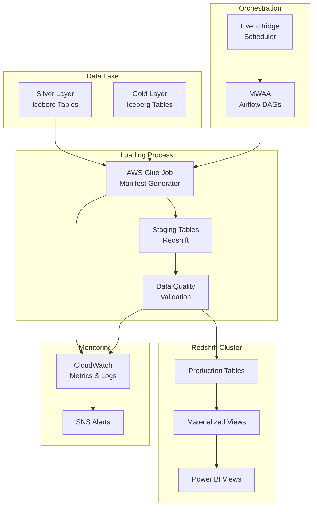

# Design Document: Redshift Loading System

## Overview

El sistema de carga a Redshift es el componente final del pipeline de datos Janis-Cencosud, responsable de transferir datos curados desde las capas Silver/Gold del Data Lake hacia el Amazon Redshift existente de Cencosud. Este diseño prioriza la compatibilidad total con la infraestructura actual, implementando una estrategia de migración sin downtime que permite validación paralela antes del cutover definitivo.

### Design Principles

1. **Zero-Downtime Migration**: Implementar tablas paralelas para validación sin interrumpir sistemas BI actuales
2. **Schema Compatibility**: Mantener compatibilidad exacta con esquemas, vistas y objetos dependientes existentes
3. **Incremental Loading**: Cargar solo datos nuevos/modificados usando snapshots de Iceberg
4. **Performance First**: Optimizar para cargas rápidas sin impactar consultas BI durante horario de negocio
5. **Data Quality**: Validar exhaustivamente antes de merge a tablas de producción

## Architecture

### High-Level Architecture



### Component Interaction Flow

1. **EventBridge** triggers MWAA DAG on schedule (e.g., every 15 minutes)
2. **MWAA DAG** orchestrates the loading process:
   - Queries Iceberg metadata for new snapshots since last load
   - Invokes Glue job to generate manifest files
   - Executes COPY commands to staging tables
   - Runs data quality validations
   - Performs UPSERT to production tables
   - Refreshes materialized views if needed
3. **CloudWatch** captures metrics and logs throughout the process
4. **SNS** sends alerts on failures or quality issues

## Components and Interfaces

### 1. Iceberg Snapshot Reader

**Purpose**: Identify incremental changes in Silver/Gold layers using Iceberg's snapshot metadata.

**Implementation**:
- Query Iceberg metadata tables to get snapshot IDs and timestamps
- Compare current snapshot with last processed snapshot (stored in DynamoDB state table)
- Extract list of data files added/modified between snapshots
- Generate manifest file with S3 paths for COPY command

**Interface**:
```python
class IcebergSnapshotReader:
    def get_latest_snapshot(self, table_name: str) -> SnapshotMetadata
    def get_incremental_files(self, table_name: str, from_snapshot: str, to_snapshot: str) -> List[str]
    def generate_manifest(self, files: List[str], output_path: str) -> str
```

**Rationale**: Iceberg's snapshot isolation provides ACID guarantees and efficient incremental reads without scanning entire datasets.

### 2. Schema Compatibility Validator

**Purpose**: Ensure new data structure matches existing Redshift schemas exactly.

**Implementation**:
- Query Redshift system tables (pg_table_def, pg_constraint) to get current schema
- Compare with Iceberg table schema from Glue Data Catalog
- Validate data types, column names, nullability, constraints
- Check distribution keys, sort keys, and compression encodings
- Fail fast if incompatibilities detected

**Interface**:
```python
class SchemaValidator:
    def get_redshift_schema(self, table_name: str) -> TableSchema
    def get_iceberg_schema(self, table_name: str) -> TableSchema
    def validate_compatibility(self, source: TableSchema, target: TableSchema) -> ValidationResult
    def get_distribution_keys(self, table_name: str) -> List[str]
    def get_sort_keys(self, table_name: str) -> List[str]
```

**Rationale**: Pre-flight validation prevents data corruption and BI disruption by catching schema mismatches before loading.

### 3. Staging Table Manager

**Purpose**: Create and manage temporary staging tables for data validation before production merge.

**Implementation**:
- Create staging table with suffix `_staging` matching production schema exactly
- Include all constraints, distribution keys, and sort keys
- Use COPY command with manifest file to load from S3
- Apply GZIP compression and parallel loading
- Drop staging table after successful merge or on failure

**Interface**:
```python
class StagingTableManager:
    def create_staging_table(self, table_name: str) -> str
    def copy_from_s3(self, staging_table: str, manifest_path: str) -> CopyResult
    def get_row_count(self, table_name: str) -> int
    def drop_staging_table(self, staging_table: str) -> None
```

**Rationale**: Staging tables provide isolation for validation and enable atomic UPSERT operations without locking production tables.

### 4. Data Type Mapper

**Purpose**: Convert Iceberg data types to Redshift-compatible types with proper handling of edge cases.

**Implementation**:
- Map Iceberg types to Redshift types according to specification
- Handle timezone conversions for timestamps (Iceberg UTC → Redshift timezone-aware)
- Preserve precision for DECIMAL/NUMERIC fields
- Validate NULL handling for each type
- Apply appropriate VARCHAR lengths based on data profiling

**Type Mapping Table**:
| Iceberg Type | Redshift Type | Notes |
|--------------|---------------|-------|
| TIMESTAMP | TIMESTAMP | Convert UTC to configured timezone |
| BIGINT | BIGINT | Direct mapping |
| STRING | VARCHAR(n) | Determine n from max length in data |
| BOOLEAN | BOOLEAN | Direct mapping |
| DECIMAL(p,s) | NUMERIC(p,s) | Preserve precision and scale |
| DATE | DATE | Direct mapping |
| DOUBLE | DOUBLE PRECISION | Direct mapping |
| FLOAT | REAL | Direct mapping |

**Interface**:
```python
class DataTypeMapper:
    def map_type(self, iceberg_type: str) -> str
    def convert_timestamp(self, value: datetime, target_tz: str) -> datetime
    def validate_precision(self, value: Decimal, precision: int, scale: int) -> bool
    def determine_varchar_length(self, table_name: str, column_name: str) -> int
```

**Rationale**: Explicit type mapping prevents data loss and ensures compatibility with existing BI queries.

### 5. COPY Command Executor

**Purpose**: Execute optimized COPY commands for parallel data loading from S3 to Redshift.

**Implementation**:
- Use manifest files to specify exact S3 paths
- Enable GZIP compression for network efficiency
- Set COMPUPDATE OFF to use existing compression encodings
- Configure STATUPDATE OFF to skip statistics during load
- Use IAM role for authentication (no credentials in code)
- Implement connection pooling for multiple concurrent COPY operations

**COPY Command Template**:
```sql
COPY {staging_table}
FROM 's3://{bucket}/{manifest_path}'
IAM_ROLE '{iam_role_arn}'
FORMAT AS PARQUET
MANIFEST
GZIP
COMPUPDATE OFF
STATUPDATE OFF
MAXERROR 0;
```

**Interface**:
```python
class CopyExecutor:
    def execute_copy(self, table_name: str, manifest_path: str) -> CopyMetrics
    def get_copy_errors(self, query_id: str) -> List[CopyError]
    def estimate_copy_time(self, file_count: int, total_size_mb: int) -> int
```

**Rationale**: Optimized COPY commands maximize throughput while respecting existing table configurations.

### 6. Data Quality Validator

**Purpose**: Validate data integrity and quality before merging to production tables.

**Implementation**:
- **Record Count Validation**: Compare source (Iceberg) vs staging table counts
- **Checksum Validation**: Compute and compare checksums for critical columns
- **Constraint Validation**: Check NOT NULL, data ranges, format patterns
- **Referential Integrity**: Validate foreign key relationships where applicable
- **Data Type Validation**: Ensure all conversions applied correctly
- **Anomaly Detection**: Compare statistical distributions with historical baselines

**Validation Checks**:
1. Row count match (source == staging)
2. NULL count per column within expected range
3. Min/max values within historical bounds
4. Duplicate primary key detection
5. Orphaned foreign key detection
6. Data freshness check (max timestamp)

**Interface**:
```python
class DataQualityValidator:
    def validate_row_counts(self, source_count: int, target_count: int) -> bool
    def validate_checksums(self, table_name: str) -> ChecksumResult
    def validate_constraints(self, table_name: str) -> List[ConstraintViolation]
    def validate_referential_integrity(self, table_name: str) -> List[IntegrityViolation]
    def generate_quality_report(self, table_name: str) -> QualityReport
```

**Rationale**: Multi-layered validation catches data issues before they impact BI users.

### 7. UPSERT Executor

**Purpose**: Merge staging data into production tables using efficient UPSERT patterns.

**Implementation Strategy**:
- **For tables with primary keys**: Use MERGE statement (Redshift 1.0.20+)
- **For tables without primary keys**: Use DELETE + INSERT pattern
- **Transaction Management**: Wrap in explicit transaction for atomicity
- **Lock Management**: Minimize lock duration by pre-computing deltas

**MERGE Pattern** (preferred):
```sql
BEGIN TRANSACTION;

MERGE INTO production_table
USING staging_table
ON production_table.id = staging_table.id
WHEN MATCHED THEN UPDATE SET
    column1 = staging_table.column1,
    column2 = staging_table.column2,
    updated_at = staging_table.updated_at
WHEN NOT MATCHED THEN INSERT VALUES (
    staging_table.id,
    staging_table.column1,
    staging_table.column2,
    staging_table.updated_at
);

COMMIT;
```

**DELETE + INSERT Pattern** (fallback):
```sql
BEGIN TRANSACTION;

-- Delete existing records that will be updated
DELETE FROM production_table
WHERE id IN (SELECT id FROM staging_table);

-- Insert all records from staging
INSERT INTO production_table
SELECT * FROM staging_table;

COMMIT;
```

**Interface**:
```python
class UpsertExecutor:
    def execute_merge(self, prod_table: str, staging_table: str, key_columns: List[str]) -> UpsertMetrics
    def execute_delete_insert(self, prod_table: str, staging_table: str, key_columns: List[str]) -> UpsertMetrics
    def estimate_lock_duration(self, row_count: int) -> int
```

**Rationale**: MERGE provides atomic UPSERT with better performance than DELETE+INSERT, but fallback ensures compatibility.

### 8. Materialized View Manager

**Purpose**: Create and refresh materialized views for common BI query patterns.

**Implementation**:
- Define materialized views for common aggregations (daily sales, inventory turnover, etc.)
- Schedule incremental refreshes during low-usage periods (e.g., 2-6 AM)
- Monitor view usage via system tables (SVV_MV_INFO)
- Automatically drop views with zero usage over 30 days
- Track refresh duration and optimize queries

**Materialized View Examples**:
```sql
-- Daily sales summary
CREATE MATERIALIZED VIEW mv_daily_sales AS
SELECT 
    DATE(order_date) as sale_date,
    store_id,
    product_category,
    COUNT(DISTINCT order_id) as order_count,
    SUM(order_total) as total_sales,
    AVG(order_total) as avg_order_value
FROM orders
GROUP BY 1, 2, 3;

-- Inventory turnover
CREATE MATERIALIZED VIEW mv_inventory_turnover AS
SELECT
    product_id,
    store_id,
    DATE_TRUNC('week', snapshot_date) as week,
    AVG(stock_quantity) as avg_stock,
    SUM(units_sold) as total_sold,
    CASE 
        WHEN AVG(stock_quantity) > 0 
        THEN SUM(units_sold) / AVG(stock_quantity) 
        ELSE 0 
    END as turnover_rate
FROM inventory_snapshots
GROUP BY 1, 2, 3;
```

**Refresh Strategy**:
- Incremental refresh when possible (Redshift auto-detects)
- Full refresh for complex aggregations
- Schedule based on data freshness requirements

**Interface**:
```python
class MaterializedViewManager:
    def create_view(self, view_name: str, query: str) -> None
    def refresh_view(self, view_name: str, incremental: bool = True) -> RefreshMetrics
    def get_view_usage(self, view_name: str) -> UsageStats
    def drop_unused_views(self, days_threshold: int = 30) -> List[str]
```

**Rationale**: Pre-computed aggregations dramatically improve BI query performance without impacting transactional loads.

### 9. Connection Pool Manager

**Purpose**: Manage database connections efficiently to avoid connection exhaustion.

**Implementation**:
- Use connection pooling library (e.g., psycopg2 pool or SQLAlchemy)
- Configure pool size based on Redshift cluster capacity
- Implement connection health checks and automatic reconnection
- Set appropriate timeouts for idle connections
- Use IAM authentication with automatic token refresh

**Configuration**:
```python
pool_config = {
    'min_connections': 2,
    'max_connections': 10,
    'connection_timeout': 30,
    'idle_timeout': 300,
    'max_lifetime': 3600
}
```

**Interface**:
```python
class ConnectionPoolManager:
    def get_connection(self) -> Connection
    def release_connection(self, conn: Connection) -> None
    def health_check(self) -> PoolHealth
    def refresh_iam_token(self) -> str
```

**Rationale**: Connection pooling prevents connection exhaustion and reduces authentication overhead.

### 10. State Manager

**Purpose**: Track loading state and enable idempotent operations.

**Implementation**:
- Store state in DynamoDB table with table-level granularity
- Track last processed Iceberg snapshot ID per table
- Record load timestamps, row counts, and checksums
- Enable recovery from partial failures
- Support concurrent loads of different tables

**State Schema**:
```python
{
    'table_name': 'orders',  # Partition key
    'last_snapshot_id': '1234567890',
    'last_load_timestamp': '2026-01-15T10:30:00Z',
    'last_row_count': 150000,
    'last_checksum': 'abc123def456',
    'load_status': 'SUCCESS',  # SUCCESS | FAILED | IN_PROGRESS
    'error_message': None
}
```

**Interface**:
```python
class StateManager:
    def get_last_snapshot(self, table_name: str) -> str
    def update_state(self, table_name: str, snapshot_id: str, metrics: LoadMetrics) -> None
    def mark_in_progress(self, table_name: str) -> None
    def mark_failed(self, table_name: str, error: str) -> None
```

**Rationale**: Persistent state enables incremental loading and recovery from failures without data duplication.

## Data Models

### LoadMetrics

Captures metrics for each load operation:

```python
@dataclass
class LoadMetrics:
    table_name: str
    snapshot_id: str
    start_time: datetime
    end_time: datetime
    source_row_count: int
    staging_row_count: int
    production_row_count: int
    files_processed: int
    bytes_processed: int
    copy_duration_seconds: int
    validation_duration_seconds: int
    upsert_duration_seconds: int
    status: str  # SUCCESS | FAILED | PARTIAL
    error_message: Optional[str]
```

### QualityReport

Captures data quality validation results:

```python
@dataclass
class QualityReport:
    table_name: str
    validation_time: datetime
    row_count_match: bool
    checksum_match: bool
    constraint_violations: List[ConstraintViolation]
    integrity_violations: List[IntegrityViolation]
    anomalies_detected: List[Anomaly]
    overall_status: str  # PASS | FAIL | WARNING
```

### TableSchema

Represents table schema for compatibility validation:

```python
@dataclass
class TableSchema:
    table_name: str
    columns: List[ColumnDefinition]
    primary_keys: List[str]
    foreign_keys: List[ForeignKeyDefinition]
    distribution_key: Optional[str]
    sort_keys: List[str]
    compression_encodings: Dict[str, str]
```

### ColumnDefinition

Represents individual column metadata:

```python
@dataclass
class ColumnDefinition:
    name: str
    data_type: str
    nullable: bool
    max_length: Optional[int]
    precision: Optional[int]
    scale: Optional[int]
    default_value: Optional[str]
```

## Correctness Properties

*A property is a characteristic or behavior that should hold true across all valid executions of a system—essentially, a formal statement about what the system should do. Properties serve as the bridge between human-readable specifications and machine-verifiable correctness guarantees.*


### Property Reflection

After analyzing all acceptance criteria, I identified the following testable properties and redundancies:

**Redundancies Identified:**
- Properties 2.1 and 2.2 both test schema compatibility - can be combined into one comprehensive property
- Properties 1.3 and 2.4 both test preservation of distribution/sort keys - can be combined
- Properties 1.4 and 2.5 both test compatibility with dependent objects - can be combined
- Property 6.2 overlaps with 4.1 (type conversion correctness) - can be combined

**Consolidated Properties:**
1. Schema metadata extraction and preservation (combines 1.2, 1.3, 2.1, 2.2, 2.3, 2.4)
2. Dependent object compatibility (combines 1.4, 2.5)
3. Data type mapping and conversion (combines 4.1, 4.2, 4.3, 4.4, 4.5, 6.2)
4. Incremental snapshot identification (3.1)
5. Manifest file generation (3.2)
6. Staging table schema matching (3.3, 2.6)
7. Row count invariant (6.1)
8. Checksum invariant (6.4)
9. Constraint validation (6.3)
10. Referential integrity (6.5)
11. Transaction atomicity (8.1, 8.2)
12. Error record routing (8.5)

### Correctness Properties

Property 1: Schema Metadata Preservation
*For any* Redshift table, when the schema validator extracts metadata (columns, types, constraints, distribution keys, sort keys, compression encodings), the extracted schema should exactly match the actual table definition in the Redshift system tables.
**Validates: Requirements 1.2, 1.3, 2.1, 2.2, 2.3, 2.4**

Property 2: Dependent Object Compatibility
*For any* existing materialized view, stored procedure, or function that references a loaded table, after a successful load operation, the dependent object should still execute without errors.
**Validates: Requirements 1.4, 2.5**

Property 3: Type Mapping Correctness
*For any* Iceberg data type, the type mapper should return the correct corresponding Redshift type according to the mapping specification, and for any value of that type (including NULL), the conversion should preserve the value's semantic meaning and precision.
**Validates: Requirements 4.1, 4.2, 4.3, 4.4, 4.5, 6.2**

Property 4: Incremental Snapshot Delta Identification
*For any* two Iceberg snapshots of the same table, the snapshot reader should correctly identify all and only the data files that were added or modified between those snapshots.
**Validates: Requirements 3.1**

Property 5: Manifest File Completeness
*For any* set of S3 file paths, the manifest generator should produce a valid JSON manifest that includes all input files and can be successfully parsed by Redshift COPY command.
**Validates: Requirements 3.2**

Property 6: Staging Table Schema Identity
*For any* production table, the staging table created by the staging manager should have an identical schema (columns, types, nullability, constraints, distribution keys, sort keys) to the production table.
**Validates: Requirements 3.3, 2.6**

Property 7: Row Count Invariant
*For any* load operation, the number of rows in the source Iceberg snapshot should equal the number of rows loaded to the staging table, which should equal the net change in the production table after UPSERT.
**Validates: Requirements 6.1**

Property 8: Checksum Invariant
*For any* table with defined checksum columns, the checksum computed over the source data should match the checksum computed over the loaded data in the staging table.
**Validates: Requirements 6.4**

Property 9: Constraint Satisfaction
*For any* data loaded into a staging table, all defined constraints (NOT NULL, CHECK constraints, data range validations) should be satisfied, and any violations should be detected and reported.
**Validates: Requirements 6.3**

Property 10: Referential Integrity Preservation
*For any* foreign key relationship defined between tables, after loading data to staging, all foreign key references should point to existing primary key values in the referenced table.
**Validates: Requirements 6.5**

Property 11: Transaction Atomicity
*For any* load operation, either all changes (staging table creation, COPY, validation, UPSERT, staging table drop) are successfully committed, or none of the changes are visible in the production tables (complete rollback).
**Validates: Requirements 8.1, 8.2**

Property 12: Error Record Routing
*For any* record that fails validation or loading, that record should appear in the error table with complete context (error type, error message, timestamp, source data).
**Validates: Requirements 8.5**

## Error Handling

### Error Categories

1. **Schema Incompatibility Errors**
   - Mismatched column names or types
   - Missing required columns
   - Incompatible distribution/sort keys
   - **Handling**: Fail fast before any data loading, alert immediately

2. **Data Quality Errors**
   - Row count mismatches
   - Checksum failures
   - Constraint violations
   - Referential integrity violations
   - **Handling**: Rollback transaction, route failed records to error table, alert

3. **Connection Errors**
   - Database connection failures
   - IAM authentication failures
   - Network timeouts
   - **Handling**: Retry with exponential backoff (3 attempts), then fail and alert

4. **COPY Command Errors**
   - S3 access denied
   - Malformed data files
   - Type conversion errors
   - **Handling**: Query STL_LOAD_ERRORS for details, route to error table, alert

5. **Transaction Errors**
   - Deadlocks
   - Lock timeouts
   - Serialization failures
   - **Handling**: Automatic rollback, retry once, then fail and alert

### Error Recovery Procedures

**Automatic Recovery**:
- Connection errors: Retry with exponential backoff (1s, 2s, 4s)
- Transient transaction errors: Single retry after 5-second delay
- Partial COPY failures: Automatic rollback and cleanup

**Manual Recovery**:
- Schema incompatibility: Requires schema migration or data transformation fix
- Persistent data quality issues: Requires investigation of upstream data
- Referential integrity violations: Requires data correction in source system

### Error Logging

All errors logged to CloudWatch Logs with structured format:
```json
{
  "timestamp": "2026-01-15T10:30:00Z",
  "table_name": "orders",
  "error_category": "DATA_QUALITY",
  "error_type": "ROW_COUNT_MISMATCH",
  "error_message": "Source: 1000 rows, Staging: 998 rows",
  "snapshot_id": "1234567890",
  "load_id": "load-20260115-103000",
  "severity": "ERROR"
}
```

## Testing Strategy

### Dual Testing Approach

This system requires both unit tests and property-based tests to ensure comprehensive correctness:

**Unit Tests**: Verify specific examples, edge cases, and error conditions
- Test specific type conversions (e.g., Iceberg TIMESTAMP with timezone → Redshift TIMESTAMP)
- Test error handling for specific failure scenarios (e.g., connection timeout)
- Test integration points between components (e.g., manifest generation → COPY execution)
- Test edge cases (empty tables, single-row tables, tables with all NULLs)

**Property-Based Tests**: Verify universal properties across all inputs
- Generate random table schemas and verify metadata extraction
- Generate random data sets and verify row count invariants
- Generate random Iceberg snapshots and verify delta identification
- Generate random type combinations and verify conversion correctness

Both testing approaches are complementary and necessary for comprehensive coverage. Unit tests catch concrete bugs in specific scenarios, while property tests verify general correctness across the input space.

### Property-Based Testing Configuration

**Framework**: Use `hypothesis` for Python-based property testing
- Minimum 100 iterations per property test
- Each test tagged with feature name and property number
- Tag format: `# Feature: redshift-loading, Property {N}: {property_text}`

**Test Organization**:
```
tests/
├── unit/
│   ├── test_schema_validator.py
│   ├── test_type_mapper.py
│   ├── test_copy_executor.py
│   └── test_upsert_executor.py
├── property/
│   ├── test_schema_properties.py      # Properties 1, 2, 6
│   ├── test_type_properties.py        # Property 3
│   ├── test_snapshot_properties.py    # Properties 4, 5
│   ├── test_validation_properties.py  # Properties 7, 8, 9, 10
│   └── test_transaction_properties.py # Properties 11, 12
└── integration/
    ├── test_end_to_end_load.py
    └── test_error_recovery.py
```

### Test Data Generation

**For Property Tests**:
- Generate random but valid table schemas with varying column counts, types, constraints
- Generate random Iceberg snapshots with varying file counts and sizes
- Generate random data sets with controlled distributions (normal, uniform, edge cases)
- Generate random error conditions (network failures, malformed data, constraint violations)

**For Unit Tests**:
- Use realistic sample data from actual Janis tables
- Include edge cases: empty strings, max VARCHAR lengths, boundary timestamps
- Include error cases: invalid types, NULL in NOT NULL columns, orphaned foreign keys

### Validation Approach

1. **Schema Validation Tests**: Verify schema extraction and comparison logic
2. **Type Conversion Tests**: Verify all Iceberg→Redshift type mappings
3. **Incremental Load Tests**: Verify snapshot delta identification
4. **Data Quality Tests**: Verify row counts, checksums, constraints
5. **Transaction Tests**: Verify atomicity and rollback behavior
6. **Error Handling Tests**: Verify error detection, logging, and recovery

### Performance Testing

While not part of correctness properties, performance should be validated:
- Load 1M rows within 5 minutes
- UPSERT 100K rows within 2 minutes
- Schema validation completes within 10 seconds
- Manifest generation for 1000 files within 30 seconds

## Deployment and Migration Strategy

### Phase 1: Parallel Validation (2 weeks)

**Objective**: Run new pipeline in parallel with existing MySQL→Redshift pipeline without impacting production.

**Implementation**:
1. Deploy infrastructure (Glue jobs, MWAA DAGs, Lambda functions)
2. Create parallel staging tables with `_new` suffix
3. Load data to parallel tables on same schedule as existing pipeline
4. Compare data between old and new tables:
   - Row counts
   - Checksums
   - Sample data validation
5. Monitor performance and error rates
6. Iterate on fixes without impacting production

**Success Criteria**:
- 99.9% data match rate between old and new pipelines
- Load times within 15-minute SLA
- Zero production impact

### Phase 2: Cutover Preparation (1 week)

**Objective**: Prepare for production cutover with minimal downtime.

**Implementation**:
1. Schedule cutover window (e.g., Sunday 2-6 AM)
2. Prepare rollback procedures and test them
3. Create cutover runbook with step-by-step instructions
4. Notify BI users of maintenance window
5. Prepare monitoring dashboards for cutover validation
6. Conduct dry-run of cutover in staging environment

**Success Criteria**:
- Rollback procedure tested and validated
- All stakeholders notified
- Runbook reviewed and approved

### Phase 3: Production Cutover (4-hour window)

**Objective**: Switch from old pipeline to new pipeline with minimal downtime.

**Implementation**:
1. **T-0:00**: Stop old MySQL→Redshift pipeline
2. **T-0:05**: Run final load from old pipeline to capture last changes
3. **T-0:15**: Rename tables:
   - `orders` → `orders_old`
   - `orders_new` → `orders`
4. **T-0:20**: Update materialized views to point to new tables
5. **T-0:30**: Run smoke tests on new tables
6. **T-0:45**: Enable new pipeline (EventBridge + MWAA)
7. **T-1:00**: Monitor first automated load
8. **T-2:00**: Validate BI dashboards and reports
9. **T-4:00**: Declare cutover complete or rollback

**Rollback Procedure** (if needed):
1. Stop new pipeline
2. Rename tables back: `orders` → `orders_new`, `orders_old` → `orders`
3. Restart old MySQL→Redshift pipeline
4. Validate BI dashboards
5. Investigate issues and reschedule cutover

**Success Criteria**:
- All tables successfully renamed
- First automated load completes successfully
- BI dashboards show correct data
- No data loss or corruption

### Phase 4: Monitoring and Optimization (ongoing)

**Objective**: Monitor new pipeline and optimize performance.

**Implementation**:
1. Monitor CloudWatch metrics daily for first week
2. Review error logs and address any issues
3. Optimize slow queries identified by BI users
4. Tune WLM queues based on actual usage patterns
5. Adjust materialized view refresh schedules
6. Decommission old pipeline after 30 days of stable operation

**Success Criteria**:
- Load SLA met 99% of the time
- Zero data quality incidents
- BI user satisfaction maintained or improved

## Infrastructure Requirements

### AWS Resources

**Compute**:
- AWS Glue: 2-10 G.1X workers with auto-scaling
- MWAA: mw1.small environment with 2-5 workers
- Lambda: 512 MB memory, 30-second timeout (for monitoring functions)

**Storage**:
- DynamoDB: On-demand capacity for state management
- S3: Standard storage for manifest files (lifecycle to Glacier after 30 days)

**Networking**:
- VPC endpoints for S3 and Redshift (avoid NAT Gateway costs)
- Security groups allowing Glue/MWAA → Redshift on port 5439
- IAM roles with least-privilege access

**Monitoring**:
- CloudWatch Logs: 7-day retention for operational logs, 30-day for audit logs
- CloudWatch Metrics: Custom metrics for load duration, row counts, error rates
- CloudWatch Alarms: Load failures, data quality issues, performance degradation
- SNS Topics: Critical alerts to operations team

### Redshift Configuration

**Cluster Sizing** (assuming existing cluster):
- Node type: Determined by existing configuration
- Number of nodes: Determined by existing configuration
- Maintenance window: Respect existing schedule (e.g., Sunday 2-6 AM)

**WLM Configuration**:
- ETL Queue: 30% memory, concurrency 3, timeout 30 minutes
- BI Queue: 50% memory, concurrency 10, timeout 5 minutes
- Admin Queue: 20% memory, concurrency 2, no timeout

**Performance Tuning**:
- Enable result caching for BI queries
- Configure short query acceleration (SQA)
- Set appropriate query monitoring rules (QMR)
- Enable automatic WLM

### Security Configuration

**IAM Roles**:
- `GlueRedshiftLoadRole`: Glue → Redshift + S3 read access
- `MWAARedshiftRole`: MWAA → Glue + Redshift + DynamoDB access
- `RedshiftS3Role`: Redshift → S3 read access for COPY

**Encryption**:
- Redshift: Use existing encryption configuration (KMS or hardware encryption)
- S3: Server-side encryption with S3-managed keys (SSE-S3)
- DynamoDB: Encryption at rest with AWS-managed keys
- Connections: SSL/TLS for all database connections

**Network Security**:
- Redshift in private subnet (no public access)
- VPC endpoints for S3 access (no internet gateway)
- Security groups with minimal required ports
- NACLs for additional subnet-level protection

## Operational Procedures

### Daily Operations

**Morning Checks** (9 AM):
1. Review CloudWatch dashboard for overnight loads
2. Check for any failed loads or data quality alerts
3. Verify data freshness (last load timestamp)
4. Review error table for any failed records

**Load Monitoring**:
- Loads run every 15 minutes during business hours (8 AM - 8 PM)
- Loads run hourly during off-hours (8 PM - 8 AM)
- Monitor load duration and alert if exceeds 10 minutes

### Weekly Operations

**Monday Morning**:
1. Review weekly load statistics (success rate, average duration, row counts)
2. Check storage usage and growth trends
3. Review materialized view usage and refresh times
4. Identify and investigate any anomalies

**Friday Afternoon**:
1. Review week's error logs and identify patterns
2. Plan any optimizations or fixes for next week
3. Update runbooks based on lessons learned

### Monthly Operations

**First Monday of Month**:
1. Review monthly cost report and identify optimization opportunities
2. Test backup restoration procedure
3. Review and update disaster recovery documentation
4. Conduct capacity planning based on growth trends

**Maintenance Tasks**:
1. Vacuum and analyze tables (during maintenance window)
2. Review and optimize slow queries
3. Update materialized view definitions based on BI usage
4. Archive old error records (>90 days)

### Incident Response

**Severity Levels**:
- **P1 (Critical)**: BI dashboards down, data corruption, complete load failure
  - Response time: 15 minutes
  - Resolution time: 2 hours
- **P2 (High)**: Partial load failure, data quality degradation, performance issues
  - Response time: 1 hour
  - Resolution time: 4 hours
- **P3 (Medium)**: Individual table load failure, minor data quality issues
  - Response time: 4 hours
  - Resolution time: 1 business day
- **P4 (Low)**: Optimization opportunities, non-critical errors
  - Response time: 1 business day
  - Resolution time: 1 week

**Escalation Path**:
1. On-call engineer (P1/P2)
2. Data engineering lead (P1)
3. Infrastructure team (P1 if Redshift cluster issues)
4. Business stakeholders (P1 if BI impact)

## Appendix

### Glossary of Terms

- **ACID**: Atomicity, Consistency, Isolation, Durability - properties of database transactions
- **COPY Command**: Redshift's bulk loading command for importing data from S3
- **Distribution Key**: Column used to distribute data across Redshift nodes
- **Iceberg**: Open table format for large analytic datasets with ACID transactions
- **Manifest File**: JSON file listing S3 paths for COPY command
- **Materialized View**: Pre-computed query result stored as a table
- **Sort Key**: Column(s) used to physically sort data within Redshift tables
- **UPSERT**: Update existing records or insert new ones (UPDATE + INSERT)
- **WLM**: Workload Management - Redshift's query queue management system

### References

- [Amazon Redshift COPY Command](https://docs.aws.amazon.com/redshift/latest/dg/r_COPY.html)
- [Apache Iceberg Specification](https://iceberg.apache.org/spec/)
- [AWS Glue Best Practices](https://docs.aws.amazon.com/glue/latest/dg/best-practices.html)
- [Redshift Performance Tuning](https://docs.aws.amazon.com/redshift/latest/dg/c-optimizing-query-performance.html)
- [Redshift Materialized Views](https://docs.aws.amazon.com/redshift/latest/dg/materialized-view-overview.html)
