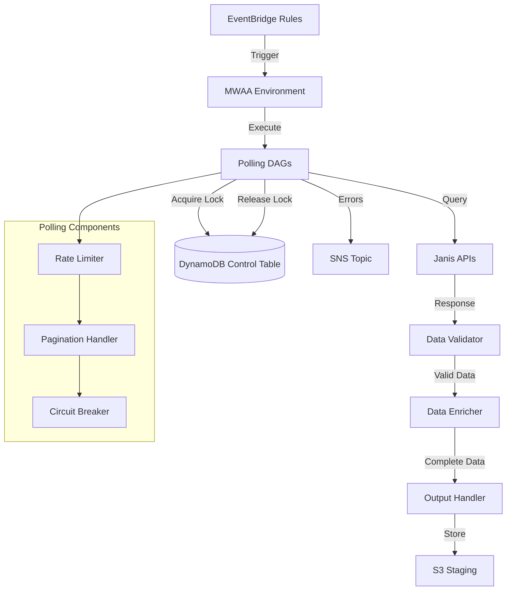

# Documento de Diseño: Sistema de Polling de APIs

## Visión General

El Sistema de Polling de APIs implementa una arquitectura serverless event-driven que consulta periódicamente las APIs REST de Janis para obtener datos operacionales. El sistema utiliza EventBridge para scheduling inteligente, MWAA (Apache Airflow) para orquestación de workflows, y DynamoDB para gestión de estado, asegurando polling incremental confiable sin duplicación de datos.

### Objetivos de Diseño

- **Event-Driven**: EventBridge dispara DAGs bajo demanda, eliminando overhead de scheduling interno de Airflow
- **Incremental**: Solo obtener datos nuevos o modificados usando filtros temporales
- **Resiliente**: Manejo robusto de errores con reintentos exponenciales y circuit breakers
- **Testeable**: Compatible con LocalStack para desarrollo y testing local
- **Eficiente**: Rate limiting y paginación controlada para no sobrecargar APIs

## Arquitectura

### Diagrama de Componentes



### Flujo de Ejecución

1. **Trigger**: EventBridge dispara DAG según schedule configurado
2. **Lock Acquisition**: DAG intenta adquirir lock en DynamoDB
3. **Incremental Query**: Si lock adquirido, consulta API con filtro dateModified
4. **Pagination**: Itera sobre páginas de resultados con circuit breaker
5. **Validation**: Valida datos contra esquemas JSON
6. **Enrichment**: Obtiene entidades relacionadas en paralelo
7. **Output**: Escribe datos validados con metadata
8. **Lock Release**: Actualiza timestamp y libera lock
9. **Error Handling**: En caso de error, notifica vía SNS y libera lock

## Componentes e Interfaces

### 1. EventBridge Scheduler

**Responsabilidad**: Disparar DAGs de MWAA en intervalos configurados

**Configuración**:
```python
schedules = {
    "orders": "rate(5 minutes)",
    "products": "rate(1 hour)",
    "stock": "rate(10 minutes)",
    "prices": "rate(30 minutes)",
    "stores": "rate(1 day)"
}
```

**Interfaz con MWAA**:
- Target: MWAA Environment ARN
- Input: `{"dag_id": "poll_{data_type}", "conf": {"data_type": "{data_type}"}}`

### 2. MWAA Environment

**Configuración**:
- Airflow Version: 2.7.2
- Python Version: 3.11
- Environment Class: mw1.small
- Min Workers: 1
- Max Workers: 3
- Execution Role: IAM role con permisos para DynamoDB, S3, CloudWatch

**DAG Structure**:
```python
from airflow import DAG
from airflow.operators.python import PythonOperator
from datetime import datetime

dag = DAG(
    dag_id='poll_orders',
    schedule_interval=None,  # Event-driven
    start_date=datetime(2024, 1, 1),
    catchup=False,
    tags=['polling', 'orders']
)

acquire_lock_task = PythonOperator(
    task_id='acquire_lock',
    python_callable=acquire_dynamodb_lock,
    dag=dag
)

poll_api_task = PythonOperator(
    task_id='poll_api',
    python_callable=poll_janis_api,
    dag=dag
)

validate_data_task = PythonOperator(
    task_id='validate_data',
    python_callable=validate_data,
    dag=dag
)

enrich_data_task = PythonOperator(
    task_id='enrich_data',
    python_callable=enrich_data,
    dag=dag
)

release_lock_task = PythonOperator(
    task_id='release_lock',
    python_callable=release_dynamodb_lock,
    trigger_rule='all_done',
    dag=dag
)

acquire_lock_task >> poll_api_task >> validate_data_task >> enrich_data_task >> release_lock_task
```

### 3. DynamoDB Control Table

**Schema**:
```python
{
    "TableName": "polling_control",
    "KeySchema": [
        {"AttributeName": "data_type", "KeyType": "HASH"}
    ],
    "AttributeDefinitions": [
        {"AttributeName": "data_type", "AttributeType": "S"}
    ],
    "BillingMode": "PAY_PER_REQUEST"
}
```

**Item Structure**:
```python
{
    "data_type": "orders",  # PK
    "lock_acquired": True,
    "lock_timestamp": "2024-01-15T10:30:00Z",
    "execution_id": "uuid-1234",
    "last_successful_execution": "2024-01-15T10:25:00Z",
    "last_modified_date": "2024-01-15T10:24:00Z",  # Para filtro incremental
    "status": "running",  # running | completed | failed
    "records_fetched": 0,
    "error_message": None
}
```

**Lock Operations**:
```python
def acquire_lock(data_type: str, execution_id: str) -> bool:
    """
    Intenta adquirir lock usando conditional update.
    Retorna True si lock adquirido, False si ya existe.
    """
    try:
        table.update_item(
            Key={'data_type': data_type},
            UpdateExpression='SET lock_acquired = :true, lock_timestamp = :now, execution_id = :exec_id, #status = :running',
            ConditionExpression='attribute_not_exists(lock_acquired) OR lock_acquired = :false',
            ExpressionAttributeNames={'#status': 'status'},
            ExpressionAttributeValues={
                ':true': True,
                ':false': False,
                ':now': datetime.utcnow().isoformat(),
                ':exec_id': execution_id,
                ':running': 'running'
            }
        )
        return True
    except ClientError as e:
        if e.response['Error']['Code'] == 'ConditionalCheckFailedException':
            return False
        raise

def release_lock(data_type: str, success: bool, last_modified: str = None):
    """
    Libera lock y actualiza timestamps si exitoso.
    """
    update_expr = 'SET lock_acquired = :false, #status = :status'
    expr_values = {':false': False}
    
    if success:
        update_expr += ', last_successful_execution = :now'
        expr_values[':now'] = datetime.utcnow().isoformat()
        expr_values[':status'] = 'completed'
        
        if last_modified:
            update_expr += ', last_modified_date = :last_mod'
            expr_values[':last_mod'] = last_modified
    else:
        expr_values[':status'] = 'failed'
    
    table.update_item(
        Key={'data_type': data_type},
        UpdateExpression=update_expr,
        ExpressionAttributeNames={'#status': 'status'},
        ExpressionAttributeValues=expr_values
    )
```

### 4. API Client con Rate Limiting

**Clase Principal**:
```python
import time
from typing import Dict, List, Optional
from datetime import datetime, timedelta
import requests
from requests.adapters import HTTPAdapter
from urllib3.util.retry import Retry

class JanisAPIClient:
    def __init__(self, base_url: str, api_key: str, rate_limit: int = 100):
        self.base_url = base_url
        self.api_key = api_key
        self.rate_limit = rate_limit  # requests per minute
        self.request_times = []
        self.session = self._create_session()
    
    def _create_session(self) -> requests.Session:
        """Crea sesión con retry strategy."""
        session = requests.Session()
        retry_strategy = Retry(
            total=3,
            backoff_factor=2,  # 2, 4, 8 segundos
            status_forcelist=[429, 500, 502, 503, 504],
            allowed_methods=["GET"]
        )
        adapter = HTTPAdapter(max_retries=retry_strategy)
        session.mount("http://", adapter)
        session.mount("https://", adapter)
        return session
    
    def _enforce_rate_limit(self):
        """Aplica rate limiting usando sliding window."""
        now = time.time()
        # Remover requests más antiguos que 1 minuto
        self.request_times = [t for t in self.request_times if now - t < 60]
        
        if len(self.request_times) >= self.rate_limit:
            # Esperar hasta que el request más antiguo tenga 60 segundos
            sleep_time = 60 - (now - self.request_times[0])
            if sleep_time > 0:
                time.sleep(sleep_time)
                self.request_times = []
        
        self.request_times.append(now)
    
    def get(self, endpoint: str, params: Dict = None) -> Dict:
        """Realiza GET request con rate limiting."""
        self._enforce_rate_limit()
        
        url = f"{self.base_url}/{endpoint}"
        headers = {"Authorization": f"Bearer {self.api_key}"}
        
        try:
            response = self.session.get(
                url,
                headers=headers,
                params=params,
                timeout=30
            )
            response.raise_for_status()
            return response.json()
        except requests.exceptions.HTTPError as e:
            if e.response.status_code == 429:
                # Rate limit hit, retry será manejado por Retry strategy
                raise
            elif 400 <= e.response.status_code < 500:
                # Client error, no reintentar
                raise ValueError(f"Client error: {e.response.status_code} - {e.response.text}")
            else:
                # Server error, retry será manejado por Retry strategy
                raise
```

### 5. Pagination Handler con Circuit Breaker

**Implementación**:
```python
class PaginationHandler:
    def __init__(self, client: JanisAPIClient, max_pages: int = 1000):
        self.client = client
        self.max_pages = max_pages
        self.page_size = 100
    
    def fetch_all_pages(self, endpoint: str, filters: Dict = None) -> List[Dict]:
        """
        Obtiene todas las páginas con circuit breaker.
        """
        all_records = []
        page = 1
        filters = filters or {}
        filters['pageSize'] = self.page_size
        
        while page <= self.max_pages:
            filters['page'] = page
            
            response = self.client.get(endpoint, params=filters)
            records = response.get('data', [])
            
            if not records:
                break
            
            all_records.extend(records)
            
            # Check si hay más páginas
            pagination = response.get('pagination', {})
            if not pagination.get('hasNextPage', False):
                break
            
            page += 1
        
        if page > self.max_pages:
            raise CircuitBreakerException(
                f"Circuit breaker triggered: exceeded {self.max_pages} pages"
            )
        
        return all_records

class CircuitBreakerException(Exception):
    pass
```

### 6. Incremental Polling Logic

**Implementación**:
```python
def build_incremental_filter(data_type: str, control_table) -> Dict:
    """
    Construye filtro incremental basado en última ejecución.
    """
    try:
        item = control_table.get_item(Key={'data_type': data_type})['Item']
        last_modified = item.get('last_modified_date')
        
        if last_modified:
            # Restar 1 minuto para ventana de solapamiento
            last_dt = datetime.fromisoformat(last_modified)
            overlap_dt = last_dt - timedelta(minutes=1)
            
            return {
                'dateModified': overlap_dt.isoformat(),
                'sortBy': 'dateModified',
                'sortOrder': 'asc'
            }
    except KeyError:
        # Primera ejecución, full refresh
        pass
    
    return {}

def deduplicate_records(records: List[Dict]) -> List[Dict]:
    """
    Deduplica registros basado en ID y timestamp de modificación.
    Mantiene el registro con timestamp más reciente.
    """
    seen = {}
    for record in records:
        record_id = record.get('id')
        modified_date = record.get('dateModified')
        
        if record_id not in seen:
            seen[record_id] = record
        else:
            # Comparar timestamps y mantener el más reciente
            existing_date = seen[record_id].get('dateModified')
            if modified_date > existing_date:
                seen[record_id] = record
    
    return list(seen.values())
```

### 7. Data Validator

**Implementación**:
```python
import jsonschema
from typing import List, Dict, Tuple

class DataValidator:
    def __init__(self, schema_path: str):
        with open(schema_path, 'r') as f:
            self.schema = json.load(f)
        self.validator = jsonschema.Draft7Validator(self.schema)
    
    def validate_batch(self, records: List[Dict]) -> Tuple[List[Dict], Dict]:
        """
        Valida lote de registros y retorna válidos + métricas.
        """
        valid_records = []
        invalid_count = 0
        duplicate_count = 0
        seen_ids = set()
        
        for record in records:
            # Validar esquema JSON
            if not self.validator.is_valid(record):
                invalid_count += 1
                errors = list(self.validator.iter_errors(record))
                logger.warning(f"Invalid record {record.get('id')}: {errors}")
                continue
            
            # Detectar duplicados
            record_id = record.get('id')
            if record_id in seen_ids:
                duplicate_count += 1
                continue
            seen_ids.add(record_id)
            
            # Validar reglas de negocio
            if not self._validate_business_rules(record):
                invalid_count += 1
                continue
            
            valid_records.append(record)
        
        metrics = {
            'total_records': len(records),
            'valid_records': len(valid_records),
            'invalid_records': invalid_count,
            'duplicate_records': duplicate_count,
            'validation_pass_rate': len(valid_records) / len(records) if records else 0
        }
        
        return valid_records, metrics
    
    def _validate_business_rules(self, record: Dict) -> bool:
        """Valida reglas de negocio específicas."""
        # Cantidades no negativas
        if 'quantity' in record and record['quantity'] < 0:
            return False
        
        # Fechas válidas
        if 'dateModified' in record:
            try:
                datetime.fromisoformat(record['dateModified'])
            except ValueError:
                return False
        
        return True
```

### 8. Data Enricher

**Implementación**:
```python
from concurrent.futures import ThreadPoolExecutor, as_completed
from typing import List, Dict

class DataEnricher:
    def __init__(self, client: JanisAPIClient, max_workers: int = 5):
        self.client = client
        self.max_workers = max_workers
    
    def enrich_orders(self, orders: List[Dict]) -> List[Dict]:
        """
        Enriquece órdenes con items en paralelo.
        """
        with ThreadPoolExecutor(max_workers=self.max_workers) as executor:
            future_to_order = {
                executor.submit(self._fetch_order_items, order['id']): order
                for order in orders
            }
            
            for future in as_completed(future_to_order):
                order = future_to_order[future]
                try:
                    items = future.result()
                    order['items'] = items
                    order['_enrichment_complete'] = True
                except Exception as e:
                    logger.error(f"Failed to enrich order {order['id']}: {e}")
                    order['items'] = []
                    order['_enrichment_complete'] = False
        
        return orders
    
    def enrich_products(self, products: List[Dict]) -> List[Dict]:
        """
        Enriquece productos con SKUs en paralelo.
        """
        with ThreadPoolExecutor(max_workers=self.max_workers) as executor:
            future_to_product = {
                executor.submit(self._fetch_product_skus, product['id']): product
                for product in products
            }
            
            for future in as_completed(future_to_product):
                product = future_to_product[future]
                try:
                    skus = future.result()
                    product['skus'] = skus
                    product['_enrichment_complete'] = True
                except Exception as e:
                    logger.error(f"Failed to enrich product {product['id']}: {e}")
                    product['skus'] = []
                    product['_enrichment_complete'] = False
        
        return products
    
    def _fetch_order_items(self, order_id: str) -> List[Dict]:
        """Obtiene items de una orden."""
        response = self.client.get(f"orders/{order_id}/items")
        return response.get('data', [])
    
    def _fetch_product_skus(self, product_id: str) -> List[Dict]:
        """Obtiene SKUs de un producto."""
        response = self.client.get(f"products/{product_id}/skus")
        return response.get('data', [])
```

## Modelos de Datos

### Polling Metadata

```python
{
    "execution_id": "uuid-1234-5678",
    "poll_timestamp": "2024-01-15T10:30:00Z",
    "data_type": "orders",
    "records_count": 150,
    "validation_metrics": {
        "total_records": 150,
        "valid_records": 148,
        "invalid_records": 2,
        "duplicate_records": 0,
        "validation_pass_rate": 0.9867
    },
    "enrichment_complete": True
}
```

### Output Record Format

```python
{
    "_metadata": {
        "execution_id": "uuid-1234",
        "poll_timestamp": "2024-01-15T10:30:00Z",
        "data_type": "orders",
        "enrichment_complete": True
    },
    "id": "order-123",
    "dateModified": "2024-01-15T10:25:00Z",
    "status": "pending",
    "items": [
        {"sku": "SKU-001", "quantity": 5},
        {"sku": "SKU-002", "quantity": 3}
    ],
    # ... resto de campos de la orden
}
```

## Propiedades de Correctitud

*Una propiedad es una característica o comportamiento que debe mantenerse verdadero en todas las ejecuciones válidas de un sistema - esencialmente, una declaración formal sobre lo que el sistema debe hacer. Las propiedades sirven como puente entre especificaciones legibles por humanos y garantías de correctitud verificables por máquina.*


### Propiedad 1: Adquisición de Lock Exitosa

*Para cualquier* data_type sin lock existente, cuando se intenta adquirir un lock, el sistema debe adquirirlo exitosamente y registrar el execution_id y timestamp.

**Valida: Requerimientos 3.2**

### Propiedad 2: Prevención de Ejecuciones Concurrentes

*Para cualquier* data_type con lock existente, cuando se intenta adquirir un lock, el sistema debe fallar la adquisición y omitir la ejecución sin generar error.

**Valida: Requerimientos 3.3**

### Propiedad 3: Actualización de Timestamp en Éxito

*Para cualquier* ejecución de polling exitosa, el sistema debe actualizar el timestamp last_successful_execution en DynamoDB con el timestamp actual.

**Valida: Requerimientos 3.5**

### Propiedad 4: Liberación de Lock en Éxito

*Para cualquier* ejecución de polling exitosa, el sistema debe liberar el lock en DynamoDB estableciendo lock_acquired en False.

**Valida: Requerimientos 3.6**

### Propiedad 5: Liberación de Lock en Fallo Preservando Timestamp

*Para cualquier* ejecución de polling fallida, el sistema debe liberar el lock pero preservar el valor anterior de last_successful_execution sin modificarlo.

**Valida: Requerimientos 3.7**

### Propiedad 6: Filtro Incremental con Timestamp Previo

*Para cualquier* consulta API con ejecución previa existente, el sistema debe incluir el parámetro dateModified con el valor de last_successful_execution menos 1 minuto.

**Valida: Requerimientos 4.1, 4.2**

### Propiedad 7: Deduplicación por ID y Timestamp

*Para cualquier* conjunto de registros con duplicados (mismo ID), el sistema debe mantener solo el registro con el timestamp de modificación más reciente.

**Valida: Requerimientos 4.4**

### Propiedad 8: Rate Limiting de Requests

*Para cualquier* ventana de 60 segundos, el sistema no debe realizar más de 100 requests a las APIs de Janis.

**Valida: Requerimientos 5.1**

### Propiedad 9: Reintentos con Backoff Exponencial

*Para cualquier* request fallido con HTTP 429 o 5xx, el sistema debe reintentar hasta 3 veces con delays de 2, 4 y 8 segundos respectivamente.

**Valida: Requerimientos 5.3, 5.4**

### Propiedad 10: Tamaño de Página Consistente

*Para cualquier* consulta API, el sistema debe incluir el parámetro pageSize con valor 100.

**Valida: Requerimientos 6.1**

### Propiedad 11: Circuit Breaker en Paginación

*Para cualquier* proceso de paginación que exceda 1000 páginas, el sistema debe detener la obtención y lanzar CircuitBreakerException.

**Valida: Requerimientos 6.3**

### Propiedad 12: Enriquecimiento de Órdenes

*Para cualquier* conjunto de órdenes obtenidas, cada orden debe tener un campo 'items' con los items correspondientes o un campo '_enrichment_complete' indicando el estado.

**Valida: Requerimientos 7.1**

### Propiedad 13: Enriquecimiento de Productos

*Para cualquier* conjunto de productos obtenidos, cada producto debe tener un campo 'skus' con los SKUs correspondientes o un campo '_enrichment_complete' indicando el estado.

**Valida: Requerimientos 7.2**

### Propiedad 14: Resiliencia en Enriquecimiento

*Para cualquier* fallo de enriquecimiento de una entidad relacionada, el sistema debe continuar procesando las demás entidades y marcar '_enrichment_complete' como False.

**Valida: Requerimientos 7.4**

### Propiedad 15: Validación de Esquema JSON

*Para cualquier* registro obtenido, el sistema debe validarlo contra el esquema JSON predefinido y excluir registros inválidos del output.

**Valida: Requerimientos 8.1**

### Propiedad 16: Detección de Duplicados en Lote

*Para cualquier* lote de registros con IDs duplicados, el sistema debe detectarlos y mantener solo una instancia de cada ID único.

**Valida: Requerimientos 8.3**

### Propiedad 17: Validación de Reglas de Negocio

*Para cualquier* registro, el sistema debe validar que las cantidades sean no negativas y las fechas tengan formato ISO válido.

**Valida: Requerimientos 8.4**

### Propiedad 18: Metadata de Polling Completa

*Para cualquier* registro procesado exitosamente, el sistema debe agregar metadata incluyendo execution_id, poll_timestamp y data_type.

**Valida: Requerimientos 9.2**

### Propiedad 19: Idempotencia de Operaciones

*Para cualquier* operación ejecutada múltiples veces con los mismos parámetros, el resultado debe ser idéntico (mismo estado final en DynamoDB y mismos datos obtenidos).

**Valida: Requerimientos 11.3**

### Propiedad 20: Salida Graciosa sin Lock

*Para cualquier* intento de adquisición de lock que falla, el sistema debe salir sin lanzar excepción y registrar una advertencia.

**Valida: Requerimientos 11.4**

## Manejo de Errores

### Estrategia de Reintentos

**Errores Transitorios (Reintentar)**:
- HTTP 429 (Rate Limit): Backoff exponencial 2, 4, 8 segundos
- HTTP 5xx (Server Error): Backoff exponencial 2, 4, 8 segundos
- Timeout de red: Backoff exponencial 2, 4, 8 segundos
- Fallo de enriquecimiento: Continuar con datos parciales

**Errores Permanentes (No Reintentar)**:
- HTTP 4xx (excepto 429): Registrar error y continuar
- Validación de esquema fallida: Excluir registro y continuar
- Lock ya adquirido: Salir graciosamente

### Notificaciones de Error

```python
def notify_error(data_type: str, error: Exception, execution_id: str):
    """
    Envía notificación de error vía SNS.
    """
    sns_client.publish(
        TopicArn=os.environ['ERROR_TOPIC_ARN'],
        Subject=f'Polling Error: {data_type}',
        Message=json.dumps({
            'data_type': data_type,
            'execution_id': execution_id,
            'error_type': type(error).__name__,
            'error_message': str(error),
            'timestamp': datetime.utcnow().isoformat()
        })
    )
```

### Logging Estructurado

```python
import logging
import json
from datetime import datetime

class StructuredLogger:
    def __init__(self, execution_id: str, data_type: str):
        self.execution_id = execution_id
        self.data_type = data_type
        self.logger = logging.getLogger(__name__)
    
    def log(self, level: str, message: str, **kwargs):
        log_entry = {
            'timestamp': datetime.utcnow().isoformat(),
            'execution_id': self.execution_id,
            'data_type': self.data_type,
            'level': level,
            'message': message,
            **kwargs
        }
        self.logger.log(getattr(logging, level.upper()), json.dumps(log_entry))
```

## Estrategia de Testing

### Testing Dual: Unit Tests + Property-Based Tests

El sistema utiliza un enfoque dual de testing:

**Unit Tests**: Verifican ejemplos específicos, casos edge y condiciones de error
- Casos específicos de primera ejecución (sin last_successful_execution)
- Manejo de respuestas vacías de API
- Comportamiento con credenciales inválidas
- Integración entre componentes

**Property-Based Tests**: Verifican propiedades universales a través de inputs generados
- Correctitud de lock acquisition/release
- Deduplicación de registros
- Rate limiting bajo carga
- Validación de esquemas
- Idempotencia de operaciones

### Configuración de Property-Based Testing

**Librería**: Hypothesis para Python
**Configuración**: Mínimo 100 iteraciones por test
**Estrategias de Generación**:

```python
from hypothesis import given, strategies as st
from hypothesis import settings

# Estrategia para generar data_types
data_types = st.sampled_from(['orders', 'products', 'stock', 'prices', 'stores'])

# Estrategia para generar timestamps
timestamps = st.datetimes(
    min_value=datetime(2024, 1, 1),
    max_value=datetime(2025, 12, 31)
)

# Estrategia para generar registros
records = st.lists(
    st.fixed_dictionaries({
        'id': st.uuids().map(str),
        'dateModified': timestamps.map(lambda dt: dt.isoformat()),
        'quantity': st.integers(min_value=0, max_value=1000)
    }),
    min_size=0,
    max_size=500
)

@settings(max_examples=100)
@given(data_type=data_types, execution_id=st.uuids().map(str))
def test_lock_acquisition_property(data_type, execution_id):
    """
    Feature: api-polling-system, Property 1: Para cualquier data_type sin lock existente,
    cuando se intenta adquirir un lock, el sistema debe adquirirlo exitosamente.
    """
    # Setup: Asegurar que no existe lock
    clear_lock(data_type)
    
    # Act: Intentar adquirir lock
    result = acquire_lock(data_type, execution_id)
    
    # Assert: Lock debe ser adquirido
    assert result is True
    
    # Verify: Lock debe estar en DynamoDB
    item = get_control_item(data_type)
    assert item['lock_acquired'] is True
    assert item['execution_id'] == execution_id
```

### Tests de Integración con LocalStack

```python
import pytest
import boto3
from testcontainers.localstack import LocalStackContainer

@pytest.fixture(scope="session")
def localstack():
    with LocalStackContainer(image="localstack/localstack:latest") as container:
        container.with_services("dynamodb", "s3", "sns", "events")
        yield container

@pytest.fixture
def aws_clients(localstack):
    endpoint_url = localstack.get_url()
    return {
        'dynamodb': boto3.client('dynamodb', endpoint_url=endpoint_url),
        's3': boto3.client('s3', endpoint_url=endpoint_url),
        'sns': boto3.client('sns', endpoint_url=endpoint_url),
        'events': boto3.client('events', endpoint_url=endpoint_url)
    }

def test_end_to_end_polling_flow(aws_clients):
    """
    Test de integración completo del flujo de polling.
    """
    # Setup: Crear tabla DynamoDB
    create_control_table(aws_clients['dynamodb'])
    
    # Setup: Crear bucket S3
    create_staging_bucket(aws_clients['s3'])
    
    # Act: Ejecutar polling completo
    result = execute_polling_dag(
        data_type='orders',
        clients=aws_clients
    )
    
    # Assert: Verificar resultados
    assert result['status'] == 'success'
    assert result['records_fetched'] > 0
    
    # Verify: Lock debe estar liberado
    item = get_control_item('orders', aws_clients['dynamodb'])
    assert item['lock_acquired'] is False
```

### Cobertura de Testing

**Objetivo**: 80% de cobertura de código
**Herramientas**: pytest-cov

```bash
pytest --cov=max/polling --cov-report=html --cov-report=term
```

## Configuración de LocalStack

### Docker Compose

```yaml
version: '3.8'

services:
  localstack:
    image: localstack/localstack:latest
    ports:
      - "4566:4566"
    environment:
      - SERVICES=dynamodb,s3,sns,events,logs
      - DEBUG=1
      - DATA_DIR=/tmp/localstack/data
      - DOCKER_HOST=unix:///var/run/docker.sock
    volumes:
      - "./localstack-data:/tmp/localstack"
      - "/var/run/docker.sock:/var/run/docker.sock"
    networks:
      - polling-network

networks:
  polling-network:
    driver: bridge
```

### Script de Inicialización

```bash
#!/bin/bash
# scripts/init-localstack.sh

set -e

echo "Waiting for LocalStack to be ready..."
until aws --endpoint-url=http://localhost:4566 dynamodb list-tables; do
  sleep 2
done

echo "Creating DynamoDB table..."
aws --endpoint-url=http://localhost:4566 dynamodb create-table \
  --table-name polling_control \
  --attribute-definitions AttributeName=data_type,AttributeType=S \
  --key-schema AttributeName=data_type,KeyType=HASH \
  --billing-mode PAY_PER_REQUEST

echo "Creating S3 bucket..."
aws --endpoint-url=http://localhost:4566 s3 mb s3://polling-staging

echo "Creating SNS topic..."
aws --endpoint-url=http://localhost:4566 sns create-topic \
  --name polling-errors

echo "LocalStack initialized successfully!"
```

### Variables de Entorno

```bash
# .env.local
LOCALSTACK_ENDPOINT=http://localhost:4566
AWS_ACCESS_KEY_ID=test
AWS_SECRET_ACCESS_KEY=test
AWS_DEFAULT_REGION=us-east-1
JANIS_API_BASE_URL=https://api.janis.test
JANIS_API_KEY=test-key
```

## Consideraciones de Seguridad

### Gestión de Credenciales

**AWS Secrets Manager** para almacenar:
- API Key de Janis
- Credenciales de servicios externos

```python
import boto3
from botocore.exceptions import ClientError

def get_secret(secret_name: str) -> dict:
    """
    Obtiene secreto de AWS Secrets Manager.
    """
    client = boto3.client('secretsmanager')
    
    try:
        response = client.get_secret_value(SecretId=secret_name)
        return json.loads(response['SecretString'])
    except ClientError as e:
        logger.error(f"Failed to retrieve secret {secret_name}: {e}")
        raise
```

### IAM Roles y Políticas

**MWAA Execution Role**:
```json
{
  "Version": "2012-10-17",
  "Statement": [
    {
      "Effect": "Allow",
      "Action": [
        "dynamodb:GetItem",
        "dynamodb:PutItem",
        "dynamodb:UpdateItem"
      ],
      "Resource": "arn:aws:dynamodb:*:*:table/polling_control"
    },
    {
      "Effect": "Allow",
      "Action": [
        "s3:PutObject",
        "s3:GetObject"
      ],
      "Resource": "arn:aws:s3:::polling-staging/*"
    },
    {
      "Effect": "Allow",
      "Action": [
        "sns:Publish"
      ],
      "Resource": "arn:aws:sns:*:*:polling-errors"
    },
    {
      "Effect": "Allow",
      "Action": [
        "secretsmanager:GetSecretValue"
      ],
      "Resource": "arn:aws:secretsmanager:*:*:secret:janis-api-*"
    },
    {
      "Effect": "Allow",
      "Action": [
        "logs:CreateLogGroup",
        "logs:CreateLogStream",
        "logs:PutLogEvents"
      ],
      "Resource": "arn:aws:logs:*:*:*"
    }
  ]
}
```

### Cifrado

- **DynamoDB**: Cifrado en reposo con AWS KMS
- **S3**: Cifrado en reposo con SSE-S3
- **Secrets Manager**: Cifrado automático con KMS
- **Tránsito**: TLS 1.2+ para todas las comunicaciones

## Optimizaciones de Rendimiento

### Paralelización de Enriquecimiento

ThreadPoolExecutor con 5 workers permite enriquecer múltiples entidades simultáneamente, reduciendo tiempo total de procesamiento.

### Batch Operations

Operaciones de escritura a S3 y DynamoDB se realizan en lotes cuando es posible para reducir número de llamadas API.

### Connection Pooling

Sesión de requests reutilizada para todas las llamadas API, reduciendo overhead de establecimiento de conexión.

### Caching de Esquemas

Esquemas JSON cargados una vez al inicio y reutilizados para todas las validaciones.

## Monitoreo y Métricas

### CloudWatch Logs

Todos los DAGs escriben logs estructurados a CloudWatch Logs con:
- execution_id para correlación
- data_type para filtrado
- Timestamps ISO 8601
- Niveles de log apropiados (INFO, WARNING, ERROR)

### Métricas Personalizadas

```python
def emit_metrics(data_type: str, metrics: dict):
    """
    Emite métricas personalizadas a CloudWatch.
    """
    cloudwatch = boto3.client('cloudwatch')
    
    cloudwatch.put_metric_data(
        Namespace='Polling/DataIngestion',
        MetricData=[
            {
                'MetricName': 'RecordsFetched',
                'Value': metrics['records_fetched'],
                'Unit': 'Count',
                'Dimensions': [
                    {'Name': 'DataType', 'Value': data_type}
                ]
            },
            {
                'MetricName': 'ValidationPassRate',
                'Value': metrics['validation_pass_rate'],
                'Unit': 'Percent',
                'Dimensions': [
                    {'Name': 'DataType', 'Value': data_type}
                ]
            },
            {
                'MetricName': 'ExecutionDuration',
                'Value': metrics['duration_seconds'],
                'Unit': 'Seconds',
                'Dimensions': [
                    {'Name': 'DataType', 'Value': data_type}
                ]
            }
        ]
    )
```

## Decisiones de Diseño

### ¿Por qué EventBridge en lugar de Airflow Scheduling?

EventBridge permite scheduling más granular y reduce overhead de MWAA al no tener que mantener scheduler corriendo constantemente. MWAA solo se activa cuando hay trabajo real que hacer.

### ¿Por qué DynamoDB para Control Table?

DynamoDB proporciona operaciones atómicas (conditional updates) necesarias para implementar locks distribuidos de forma confiable. Además, es serverless y escala automáticamente.

### ¿Por qué ThreadPoolExecutor en lugar de AsyncIO?

ThreadPoolExecutor es más simple de implementar y debuggear. Para el volumen esperado de enriquecimiento (cientos de entidades), el overhead de threads es aceptable.

### ¿Por qué Validación antes de Enriquecimiento?

Validar primero evita gastar recursos de API en enriquecer datos que serán descartados. Reduce carga en APIs de Janis.

### ¿Por qué Ventana de Solapamiento de 1 Minuto?

Previene pérdida de datos en caso de que registros se modifiquen exactamente en el momento de la ejecución anterior. El costo de procesar algunos duplicados es menor que el riesgo de perder datos.
