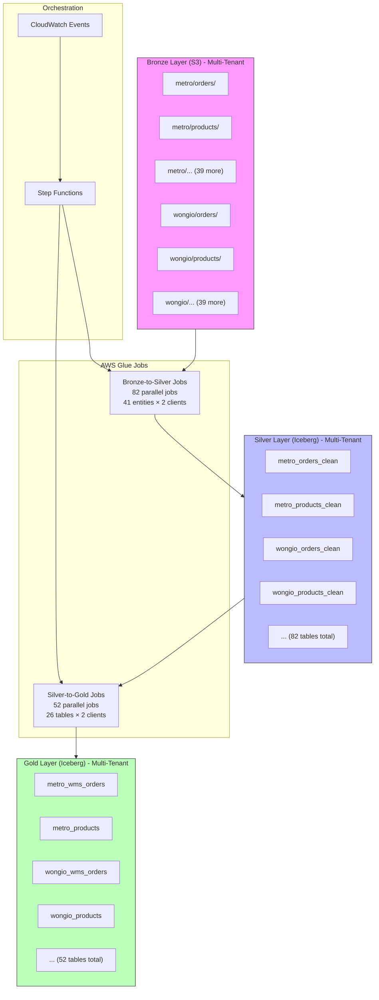

# Design Document: ETL Pipeline Expansion for 41 Janis APIs

## Overview

Este documento describe el diseño técnico para expandir el pipeline ETL existente (Bronze→Silver→Gold) desde procesar 1 tipo de entidad (ventas) a 41 tipos de entidades de Janis Commerce, generando 26 tablas finales optimizadas en la capa Gold/Redshift. El diseño se enfoca exclusivamente en AWS Glue Jobs de transformación, asumiendo que los datos JSON ya están disponibles en la capa Bronze.

El pipeline expandido procesará datos de órdenes, productos, inventario, precios, logística, clientes y otros dominios de negocio, aplicando transformaciones de tipos, cálculos derivados, manejo de data gaps y validaciones de calidad.

## Architecture

### High-Level Architecture (Multi-Tenant)



### Data Flow (Multi-Tenant)

1. **Bronze Layer**: Datos JSON raw organizados por cliente (metro/wongio), luego por 41 tipos de entidades, con particionamiento temporal (year/month/day/hour). Estructura: `s3://data-lake-bronze/{client}/{entity_type}/year=.../month=.../day=.../hour=.../*.json`
2. **Bronze-to-Silver**: 82 Glue Jobs paralelos (41 entidades × 2 clientes) que aplican limpieza, deduplicación y conversión de tipos
3. **Silver Layer**: 82 tablas Iceberg con datos normalizados y validados, separadas por cliente: `silver.{client}_{entity_type}_clean`
4. **Silver-to-Gold**: 52 Glue Jobs (26 tablas × 2 clientes) que aplican schema mapping, aplanamiento de JSON y agregaciones
5. **Gold Layer**: 52 tablas Iceberg optimizadas para consultas analíticas en Redshift, separadas por cliente: `gold.{client}_{table_name}`

### Entity Grouping by Domain

**Orders Domain (9 tables)**:
- wms_orders, wms_order_items, wms_order_shipping, wms_order_payments
- wms_order_payments_connector_responses, wms_order_custom_data_fields
- wms_order_item_weighables, wms_order_status_changes, invoices

**Catalog Domain (4 tables)**:
- products, skus, categories, brands

**Logistics Domain (5 tables)**:
- wms_logistic_carriers, wms_logistic_delivery_planning
- wms_logistic_delivery_ranges, wms_order_picking, picking_round_orders

**Inventory Domain (3 tables)**:
- stock, price, promotional_prices

**Other Domain (5 tables)**:
- wms_stores, customers, admins, promotions, ff_comments

## Components and Interfaces

### 1. Bronze-to-Silver Glue Jobs (Multi-Tenant)

**Purpose**: Transform raw JSON data into clean, normalized Iceberg tables maintaining client separation

**Input**: S3 paths in Bronze layer (e.g., `s3://data-lake-bronze/{client}/orders/year=2026/month=02/day=23/hour=10/*.json`)

**Output**: Iceberg tables in Silver layer (e.g., `silver.{client}_orders_clean`)

**Key Responsibilities**:
- Read JSON files from Bronze with schema inference
- Maintain client separation throughout processing
- Apply deduplication logic based on primary keys and timestamps
- Convert MySQL types to Redshift-compatible types
- Validate required fields and data formats
- Write to Iceberg tables with ACID guarantees
- Route invalid records to error tables

**Configuration Parameters**:
```python
{
    "client": "metro",  # metro or wongio
    "entity_type": "orders",  # One of 41 entity types
    "bronze_path": "s3://data-lake-bronze/metro/orders/",
    "silver_table": "silver.metro_orders_clean",
    "primary_key": ["id"],
    "dedup_timestamp_field": "date_modified",
    "required_fields": ["id", "store_id", "date_created"],
    "partition_keys": ["year", "month", "day"]
}
```

### 2. Silver-to-Gold Glue Jobs (Multi-Tenant)

**Purpose**: Transform normalized data into curated, analytics-ready tables maintaining client separation

**Input**: Iceberg tables in Silver layer (client-specific)

**Output**: Iceberg tables in Gold layer (52 final tables: 26 tables × 2 clients)

**Key Responsibilities**:
- Apply schema mapping (select specific fields, rename columns)
- Maintain client separation throughout processing
- Flatten nested JSON structures
- Calculate derived fields
- Handle data gaps (assign NULL with metadata)
- Validate data quality (PKs, FKs, ranges, formats)
- Write to partitioned Iceberg tables

**Configuration Parameters**:
```python
{
    "client": "metro",  # metro or wongio
    "source_tables": ["silver.metro_orders_clean", "silver.metro_order_items_clean"],
    "target_table": "gold.metro_wms_orders",
    "field_mapping": {
        "id": "order_id",
        "dateCreated": "date_created",
        "totals.items.amount": "items_amount"
    },
    "calculated_fields": {
        "total_changes": "items_amount - items_original_amount"
    },
    "data_gaps": ["items_substituted_qty", "points_card"],
    "partition_keys": ["year", "month", "day"]
}
```

### 3. Deduplication Engine

**Purpose**: Eliminate duplicate records from webhook and polling sources

**Algorithm**:
```python
def deduplicate(records, primary_key, timestamp_field):
    """
    Keep most recent record for each primary key
    """
    # Group by primary key
    grouped = records.groupBy(primary_key)
    
    # For each group, keep record with max timestamp
    deduped = grouped.agg(
        max(timestamp_field).alias("max_timestamp")
    )
    
    # Join back to get full record
    result = records.join(
        deduped,
        (records[primary_key] == deduped[primary_key]) &
        (records[timestamp_field] == deduped["max_timestamp"])
    )
    
    return result
```

**Edge Cases**:
- Records with identical timestamps: prefer webhook source over polling
- Records with NULL timestamps: use ingestion timestamp
- Records with conflicting business keys: log warning and keep first

### 4. Type Conversion Engine

**Purpose**: Convert MySQL types to Redshift-compatible types

**Conversion Rules**:

| MySQL Type | Redshift Type | Conversion Logic |
|------------|---------------|------------------|
| BIGINT (Unix timestamp) | TIMESTAMP | `from_unixtime(field)` |
| TINYINT(1) | BOOLEAN | `CASE WHEN field = 1 THEN true ELSE false END` |
| DECIMAL(12,9) | NUMERIC(12,9) | Direct cast with precision preservation |
| VARCHAR(n) | VARCHAR(n) | Direct copy, no conversion |
| INT (IDs) | BIGINT | Cast to BIGINT |
| JSON | VARCHAR(65535) | Serialize to string |

**Implementation**:
```python
def convert_types(df, schema_mapping):
    """
    Apply type conversions based on schema mapping
    """
    for field, target_type in schema_mapping.items():
        if target_type == "TIMESTAMP":
            df = df.withColumn(field, from_unixtime(col(field)))
        elif target_type == "BOOLEAN":
            df = df.withColumn(field, 
                when(col(field) == 1, True).otherwise(False))
        elif target_type.startswith("NUMERIC"):
            df = df.withColumn(field, col(field).cast(target_type))
        elif target_type == "BIGINT":
            df = df.withColumn(field, col(field).cast("bigint"))
    
    return df
```

### 5. JSON Flattening Engine

**Purpose**: Convert nested JSON structures to flat relational tables

**Strategies**:

**Array Explosion** (for one-to-many relationships):
```python
# Input: order with items array
{
    "id": "123",
    "items": [
        {"sku": "A1", "quantity": 2},
        {"sku": "A2", "quantity": 1}
    ]
}

# Output: separate records in order_items table
order_id | sku | quantity
123      | A1  | 2
123      | A2  | 1
```

**Object Flattening** (for nested objects):
```python
# Input: order with nested totals
{
    "id": "123",
    "totals": {
        "items": {
            "amount": 100,
            "originalAmount": 120
        }
    }
}

# Output: flattened columns
order_id | items_amount | items_original_amount
123      | 100          | 120
```

**Key-Value Expansion** (for dynamic fields):
```python
# Input: order with custom data
{
    "id": "123",
    "customData": {
        "delivery_notes": "Ring doorbell",
        "gift_wrap": "true"
    }
}

# Output: key-value table
order_id | field           | value
123      | delivery_notes  | Ring doorbell
123      | gift_wrap       | true
```

### 6. Data Gap Handler

**Purpose**: Manage fields not available in Janis APIs

**Documented Data Gaps**:

| Table | Missing Fields | Handling Strategy |
|-------|----------------|-------------------|
| wms_orders | items_substituted_qty, items_qty_missing, points_card, status_vtex | Assign NULL, log to data_gaps_log |
| wms_logistic_delivery_planning | dynamic_quota, carrier, quota, offset_start, edited | Assign NULL, log to data_gaps_log |
| wms_order_payments | authorization_code | Assign NULL, log to data_gaps_log |
| wms_order_payments_connector_responses | id, parent | Assign NULL, log to data_gaps_log |
| wms_order_custom_data_fields | id | Assign NULL, log to data_gaps_log |
| products | cart_limit, min_stock | Assign NULL, log to data_gaps_log |
| skus | ord, cart_limit, legal_unit_multiplier, min_stock | Assign NULL, log to data_gaps_log |
| customers | vtex_id, phone_alt | Assign NULL, log to data_gaps_log |
| picking_round_orders | picking_round | Assign NULL, log to data_gaps_log |

**Implementation**:
```python
def handle_data_gaps(df, table_name, gap_fields):
    """
    Add NULL columns for missing fields and log gaps
    """
    for field in gap_fields:
        # Add NULL column
        df = df.withColumn(field, lit(None).cast("string"))
        
        # Log to audit table
        log_data_gap(table_name, field, df.count())
    
    return df
```

### 7. Calculated Fields Engine

**Purpose**: Compute derived fields from source data

**Calculation Rules**:

| Table | Field | Formula |
|-------|-------|---------|
| wms_orders | total_changes | `totals.items.amount - totals.items.originalAmount` |
| wms_order_picking | total_time | `(endPickingTime - startPickingTime) / 1000` |
| admins | username | `firstName + " " + lastName` |
| wms_order_items | quantity_difference | `quantity_picked - quantity` |

**Implementation**:
```python
def calculate_derived_fields(df, table_name):
    """
    Add calculated fields based on table-specific rules
    """
    if table_name == "wms_orders":
        df = df.withColumn("total_changes",
            col("items_amount") - col("items_original_amount"))
    
    elif table_name == "wms_order_picking":
        df = df.withColumn("total_time",
            (col("endPickingTime") - col("startPickingTime")) / 1000)
    
    elif table_name == "admins":
        df = df.withColumn("username",
            concat(col("firstName"), lit(" "), col("lastName")))
    
    elif table_name == "wms_order_items":
        df = df.withColumn("quantity_difference",
            when(col("quantity_picked").isNotNull() & col("quantity").isNotNull(),
                col("quantity_picked") - col("quantity")
            ).otherwise(None))
    
    return df
```

### 8. Data Quality Validator

**Purpose**: Validate data quality before writing to Gold layer

**Validation Rules**:

**Primary Key Uniqueness**:
```python
def validate_pk_uniqueness(df, pk_fields):
    """
    Ensure primary key is unique
    """
    total_count = df.count()
    distinct_count = df.select(pk_fields).distinct().count()
    
    if total_count != distinct_count:
        duplicates = df.groupBy(pk_fields).count().filter("count > 1")
        log_quality_issue("pk_not_unique", duplicates)
        return False
    
    return True
```

**Foreign Key Integrity**:
```python
def validate_fk_integrity(child_df, parent_df, fk_field, pk_field):
    """
    Ensure foreign keys exist in parent table
    """
    orphans = child_df.join(
        parent_df,
        child_df[fk_field] == parent_df[pk_field],
        "left_anti"
    )
    
    if orphans.count() > 0:
        log_quality_issue("fk_orphan", orphans)
        return False
    
    return True
```

**Range Validation**:
```python
def validate_ranges(df, field_ranges):
    """
    Validate numeric fields are within expected ranges
    """
    for field, (min_val, max_val) in field_ranges.items():
        invalid = df.filter(
            (col(field) < min_val) | (col(field) > max_val)
        )
        
        if invalid.count() > 0:
            log_quality_issue("range_violation", invalid)
```

**Format Validation**:
```python
def validate_formats(df, format_rules):
    """
    Validate string fields match expected formats
    """
    for field, pattern in format_rules.items():
        invalid = df.filter(~col(field).rlike(pattern))
        
        if invalid.count() > 0:
            log_quality_issue("format_violation", invalid)
```

### 9. Step Functions Orchestrator

**Purpose**: Coordinate execution of Glue Jobs in correct sequence

**Workflow Definition**:
```json
{
  "Comment": "ETL Pipeline for 41 Janis APIs",
  "StartAt": "BronzeToSilverParallel",
  "States": {
    "BronzeToSilverParallel": {
      "Type": "Parallel",
      "Branches": [
        {
          "StartAt": "ProcessOrders",
          "States": {
            "ProcessOrders": {
              "Type": "Task",
              "Resource": "arn:aws:glue:us-east-1:123456789012:job/bronze-to-silver-orders",
              "Retry": [
                {
                  "ErrorEquals": ["States.ALL"],
                  "IntervalSeconds": 60,
                  "MaxAttempts": 3,
                  "BackoffRate": 2.0
                }
              ],
              "End": true
            }
          }
        },
        // ... 40 more branches for other entity types
      ],
      "Next": "SilverToGoldByDomain"
    },
    "SilverToGoldByDomain": {
      "Type": "Parallel",
      "Branches": [
        {
          "StartAt": "ProcessOrdersDomain",
          "States": {
            "ProcessOrdersDomain": {
              "Type": "Parallel",
              "Branches": [
                // 9 jobs for orders domain tables
              ],
              "End": true
            }
          }
        },
        // ... 4 more branches for other domains
      ],
      "Next": "ValidateDataQuality"
    },
    "ValidateDataQuality": {
      "Type": "Task",
      "Resource": "arn:aws:glue:us-east-1:123456789012:job/validate-gold-quality",
      "End": true
    }
  }
}
```

## Data Models (Multi-Tenant)

### S3 Structure

```
s3://data-lake/
├── bronze/
│   ├── metro/
│   │   ├── orders/year=2026/month=02/day=25/hour=10/*.json
│   │   ├── products/year=2026/month=02/day=25/hour=10/*.json
│   │   ├── stock/year=2026/month=02/day=25/hour=10/*.json
│   │   └── ... (38 more entity types)
│   └── wongio/
│       ├── orders/year=2026/month=02/day=25/hour=10/*.json
│       ├── products/year=2026/month=02/day=25/hour=10/*.json
│       ├── stock/year=2026/month=02/day=25/hour=10/*.json
│       └── ... (38 more entity types)
├── silver/
│   ├── metro_orders_clean/
│   ├── metro_products_clean/
│   ├── metro_stock_clean/
│   ├── ... (38 more tables for metro)
│   ├── wongio_orders_clean/
│   ├── wongio_products_clean/
│   ├── wongio_stock_clean/
│   └── ... (38 more tables for wongio)
└── gold/
    ├── metro_wms_orders/
    ├── metro_products/
    ├── metro_stock/
    ├── ... (23 more tables for metro)
    ├── wongio_wms_orders/
    ├── wongio_products/
    ├── wongio_stock/
    └── ... (23 more tables for wongio)
```

## Data Models

### Bronze Layer Schema (Example: Orders)

```json
{
  "id": "string",
  "storeId": "string",
  "dateCreated": 1706025600,
  "dateModified": 1706029200,
  "status": "string",
  "totals": {
    "items": {
      "amount": 100.50,
      "originalAmount": 120.00
    }
  },
  "items": [
    {
      "id": "string",
      "sku": "string",
      "quantity": 2,
      "price": 50.25
    }
  ],
  "shipping": {
    "addresses": [
      {
        "city": "Lima",
        "lat": -12.046374,
        "lng": -77.042793
      }
    ]
  }
}
```

### Bronze Layer Schema (Example: Orders)

```json
{
  "id": "string",
  "storeId": "string",
  "dateCreated": 1706025600,
  "dateModified": 1706029200,
  "status": "string",
  "totals": {
    "items": {
      "amount": 100.50,
      "originalAmount": 120.00
    }
  },
  "items": [
    {
      "id": "string",
      "sku": "string",
      "quantity": 2,
      "price": 50.25
    }
  ],
  "shipping": {
    "addresses": [
      {
        "city": "Lima",
        "lat": -12.046374,
        "lng": -77.042793
      }
    ]
  }
}
```

### Silver Layer Schema (Example: metro_orders_clean)

```sql
CREATE TABLE silver.metro_orders_clean (
    id VARCHAR(255) PRIMARY KEY,
    store_id VARCHAR(255) NOT NULL,
    date_created TIMESTAMP NOT NULL,
    date_modified TIMESTAMP,
    status VARCHAR(50),
    items_amount NUMERIC(10,2),
    items_original_amount NUMERIC(10,2),
    year INT,
    month INT,
    day INT
)
USING iceberg
PARTITIONED BY (year, month, day);
```

### Gold Layer Schema (Example: metro_wms_orders)

```sql
CREATE TABLE gold.metro_wms_orders (
    order_id VARCHAR(255) PRIMARY KEY,
    store_id VARCHAR(255) NOT NULL,
    date_created TIMESTAMP NOT NULL,
    date_modified TIMESTAMP,
    status VARCHAR(50),
    items_amount NUMERIC(10,2),
    items_original_amount NUMERIC(10,2),
    total_changes NUMERIC(10,2),  -- Calculated field
    items_substituted_qty INT,     -- Data gap (NULL)
    items_qty_missing INT,         -- Data gap (NULL)
    points_card VARCHAR(255),      -- Data gap (NULL)
    status_vtex VARCHAR(50),       -- Data gap (NULL)
    year INT,
    month INT,
    day INT
)
USING iceberg
PARTITIONED BY (year, month, day);
```

### Complete Gold Layer Tables (52 tables: 26 per client)

**Per Client (metro and wongio):**

**Orders Domain**:
1. wms_orders (43 fields from 91 available)
2. wms_order_items (18 fields from 43 available)
3. wms_order_shipping (14 fields from 38 available)
4. wms_order_payments (11 fields from 56 available)
5. wms_order_payments_connector_responses (5 fields)
6. wms_order_custom_data_fields (5 fields)
7. wms_order_item_weighables (7 fields from 10 available)
8. wms_order_status_changes (6 fields from 9 available)
9. invoices (6 fields from 16 available)

**Catalog Domain**:
10. products (20 fields from 40 available)
11. skus (32 fields from 47 available)
12. categories (5 fields from 13 available)
13. brands (4 fields from 12 available)

**Logistics Domain**:
14. wms_logistic_carriers (6 fields from 40 available)
15. wms_logistic_delivery_planning (26 fields)
16. wms_logistic_delivery_ranges (6 fields from 10 available)
17. wms_order_picking (6 fields from 7 available)
18. picking_round_orders (2 fields)

**Inventory Domain**:
19. stock (12 fields from 22 available)
20. price (10 fields from 26 available)
21. promotional_prices (15 fields from 26 available)

**Other Domain**:
22. wms_stores (23 fields from 45 available)
23. customers (13 fields from 34 available)
24. admins (7 fields from 22 available)
25. promotions (12 fields from 26 available)
26. ff_comments (7 fields)

## Correctness Properties

*A property is a characteristic or behavior that should hold true across all valid executions of a system—essentially, a formal statement about what the system should do. Properties serve as the bridge between human-readable specifications and machine-verifiable correctness guarantees.*

### Property 1: Deduplication Preserves Most Recent Record

*For any* set of duplicate records with the same primary key, after deduplication, the resulting dataset should contain exactly one record per primary key, and that record should have the most recent timestamp.

**Validates: Requirements 1.2, 1.3**

### Property 2: Type Conversions Preserve Data Integrity

*For any* BIGINT Unix timestamp, after conversion to TIMESTAMP ISO 8601, converting back to Unix timestamp should yield the original value (within 1 second tolerance for rounding).

**Validates: Requirements 3.1**

### Property 3: Boolean Conversion is Bijective

*For any* TINYINT(1) value (0 or 1), converting to BOOLEAN and back to TINYINT should yield the original value.

**Validates: Requirements 3.2**

### Property 4: Decimal Precision is Preserved

*For any* DECIMAL(12,9) coordinate value, after conversion to NUMERIC(12,9), the value should be equal to the original within 0.000000001 tolerance.

**Validates: Requirements 3.3**

### Property 5: VARCHAR Fields Remain Unchanged

*For any* VARCHAR field containing numeric characters, after processing, the field should remain as VARCHAR with identical content.

**Validates: Requirements 3.4**

### Property 6: Calculated Fields are Correct

*For any* order record with items_amount and items_original_amount, the calculated total_changes field should equal items_amount - items_original_amount.

**Validates: Requirements 4.1**

### Property 7: Calculated Fields Handle NULL Gracefully

*For any* record where a source field for a calculated field is NULL, the calculated field should be NULL without causing an error.

**Validates: Requirements 4.6**

### Property 8: Field Renaming Preserves Values

*For any* record, after applying schema mapping with field renaming, the value in the renamed field should equal the value in the original field.

**Validates: Requirements 6.5**

### Property 9: JSON Flattening Preserves Data

*For any* nested JSON object, after flattening to prefixed columns, reconstructing the object from the flattened columns should yield an equivalent structure.

**Validates: Requirements 6.6**

### Property 10: Array Explosion Preserves Relationships

*For any* parent record with an array of child elements, after exploding the array into separate records, each child record should have a foreign key pointing to the parent, and the count of child records should equal the array length.

**Validates: Requirements 7.1**

### Property 11: Object Flattening Uses Correct Prefixes

*For any* nested JSON object, after flattening, each field should have a column name that is the concatenation of parent keys separated by underscores.

**Validates: Requirements 7.2**

### Property 12: Foreign Key Relationships are Preserved

*For any* child record with a foreign key, after processing, the foreign key value should exist in the parent table's primary key column.

**Validates: Requirements 7.6**

### Property 13: Primary Keys are Unique

*For any* Gold table, after processing, the primary key column(s) should have no duplicate values.

**Validates: Requirements 12.1**

### Property 14: Foreign Keys Reference Existing Parents

*For any* child table with foreign keys, all foreign key values should exist in the corresponding parent table's primary key column.

**Validates: Requirements 12.2**

### Property 15: Numeric Fields are Within Valid Ranges

*For any* numeric field with defined constraints (e.g., quantity >= 0, price >= 0, latitude between -90 and 90), all values should be within the valid range.

**Validates: Requirements 12.3**

### Property 16: Format Validation Passes for Valid Data

*For any* field with format constraints (e.g., email with @, phone with digits), all values should match the expected format pattern.

**Validates: Requirements 12.4**

## Error Handling

### Error Categories

**1. Data Parsing Errors**:
- **Cause**: Malformed JSON, unexpected data types
- **Handling**: Log error with record ID, move to error table, continue processing
- **Recovery**: Manual review and reprocessing

**2. Schema Incompatibility**:
- **Cause**: New fields in source data, type mismatches
- **Handling**: Log warning, add NULL column if safe, alert data engineers
- **Recovery**: Update schema mapping configuration

**3. Data Quality Violations**:
- **Cause**: NULL required fields, duplicate PKs, orphan FKs
- **Handling**: Log to data_quality_issues table, optionally block write
- **Recovery**: Fix source data or adjust validation rules

**4. Resource Exhaustion**:
- **Cause**: Large data volumes, memory pressure
- **Handling**: Enable auto-scaling, implement checkpointing
- **Recovery**: Restart from last checkpoint

**5. Downstream System Failures**:
- **Cause**: S3 unavailable, Glue Catalog errors
- **Handling**: Retry with exponential backoff (3 attempts)
- **Recovery**: Alert on-call engineer if retries exhausted

### Error Tables

**error_records**:
```sql
CREATE TABLE silver.error_records (
    error_id VARCHAR(255) PRIMARY KEY,
    entity_type VARCHAR(100),
    record_id VARCHAR(255),
    error_type VARCHAR(100),
    error_message TEXT,
    original_record TEXT,
    timestamp TIMESTAMP
);
```

**data_quality_issues**:
```sql
CREATE TABLE silver.data_quality_issues (
    issue_id VARCHAR(255) PRIMARY KEY,
    table_name VARCHAR(100),
    record_id VARCHAR(255),
    validation_rule VARCHAR(100),
    error_message TEXT,
    timestamp TIMESTAMP
);
```

**data_gaps_log**:
```sql
CREATE TABLE silver.data_gaps_log (
    gap_id VARCHAR(255) PRIMARY KEY,
    entity_type VARCHAR(100),
    field_name VARCHAR(100),
    record_count INT,
    timestamp TIMESTAMP
);
```

## Testing Strategy

### Dual Testing Approach

The testing strategy combines unit tests for specific examples and edge cases with property-based tests for universal correctness properties. Both are complementary and necessary for comprehensive coverage.

**Unit Tests**: Focus on specific examples, edge cases, and error conditions. Avoid writing too many unit tests since property-based tests handle covering lots of inputs.

**Property Tests**: Focus on universal properties that hold for all inputs using randomization. Each property test should run a minimum of 100 iterations.

### Property-Based Testing Configuration

We will use **pytest** with **Hypothesis** library for Python/PySpark property-based testing.

**Configuration**:
```python
from hypothesis import given, settings
import hypothesis.strategies as st

@settings(max_examples=100)
@given(
    records=st.lists(
        st.fixed_dictionaries({
            'id': st.text(min_size=1),
            'timestamp': st.integers(min_value=0)
        }),
        min_size=1
    )
)
def test_deduplication_property(records):
    """
    Feature: etl-41-apis-expansion, Property 1: Deduplication Preserves Most Recent Record
    
    For any set of duplicate records with the same primary key, 
    after deduplication, the resulting dataset should contain exactly 
    one record per primary key with the most recent timestamp.
    """
    # Test implementation
    pass
```

### Unit Test Examples

**Test Type Conversions**:
```python
def test_unix_timestamp_to_iso8601():
    """Test specific timestamp conversion"""
    input_ts = 1706025600  # 2024-01-23 12:00:00 UTC
    expected = "2024-01-23T12:00:00Z"
    result = convert_timestamp(input_ts)
    assert result == expected

def test_tinyint_to_boolean():
    """Test boolean conversion"""
    assert convert_boolean(1) == True
    assert convert_boolean(0) == False
```

**Test Calculated Fields**:
```python
def test_total_changes_calculation():
    """Test specific calculation"""
    record = {
        'items_amount': 100.0,
        'items_original_amount': 120.0
    }
    result = calculate_total_changes(record)
    assert result == -20.0

def test_total_changes_with_null():
    """Test NULL handling"""
    record = {
        'items_amount': None,
        'items_original_amount': 120.0
    }
    result = calculate_total_changes(record)
    assert result is None
```

**Test Data Gap Handling**:
```python
def test_data_gap_assigns_null():
    """Test that missing fields get NULL"""
    record = {'id': '123', 'store_id': 'S1'}
    result = handle_data_gaps(record, 'wms_orders', ['points_card'])
    assert 'points_card' in result
    assert result['points_card'] is None
```

### Integration Tests

**End-to-End Pipeline Test**:
```python
def test_bronze_to_gold_pipeline():
    """Test complete pipeline for one entity"""
    # 1. Write test data to Bronze
    write_test_data_to_bronze('orders', sample_orders)
    
    # 2. Run Bronze-to-Silver job
    run_glue_job('bronze-to-silver-orders')
    
    # 3. Verify Silver data
    silver_data = read_silver_table('orders_clean')
    assert silver_data.count() > 0
    
    # 4. Run Silver-to-Gold job
    run_glue_job('silver-to-gold-wms-orders')
    
    # 5. Verify Gold data
    gold_data = read_gold_table('wms_orders')
    assert gold_data.count() > 0
    assert_schema_matches(gold_data, expected_schema)
```

### Property Test Tags

Each property test must include a comment tag referencing the design document property:

```python
"""
Feature: etl-41-apis-expansion, Property 1: Deduplication Preserves Most Recent Record
"""
```

This ensures traceability between design properties and test implementation.
