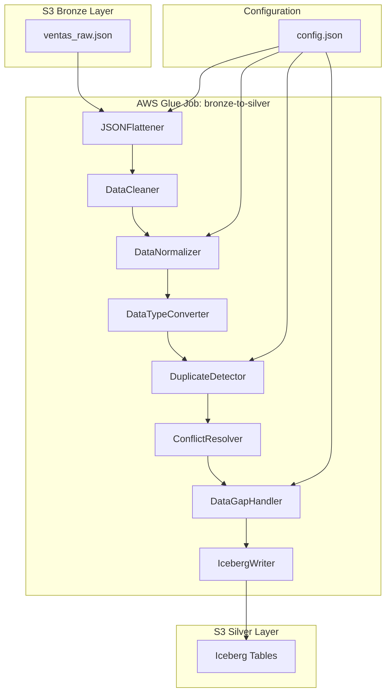

# Documento de Diseño: Pipeline ETL Bronze-to-Silver

## Overview

Este documento describe el diseño técnico de un pipeline ETL Bronze-to-Silver que transforma datos raw en formato JSON desde S3 Bronze a datos limpios y estructurados en tablas Apache Iceberg en S3 Silver.

El pipeline está compuesto por 8 módulos de transformación que se ejecutan secuencialmente en un AWS Glue Job usando PySpark. Cada módulo es independiente y reutilizable, siguiendo el principio de responsabilidad única.

**Flujo del Pipeline:**
```
S3 Bronze (JSON) 
  → JSONFlattener 
  → DataCleaner 
  → DataNormalizer 
  → DataTypeConverter 
  → DuplicateDetector 
  → ConflictResolver 
  → DataGapHandler 
  → IcebergWriter 
  → S3 Silver (Iceberg)
```

**Tecnologías:**
- Python 3.11
- PySpark 3.5+
- AWS Glue 4.0
- Apache Iceberg 1.4+
- LocalStack para desarrollo local

## Architecture

### Arquitectura de Alto Nivel



### Principios de Diseño

1. **Modularidad**: Cada módulo es una clase independiente con una interfaz clara
2. **Inmutabilidad**: Los módulos no modifican el DataFrame de entrada, retornan uno nuevo
3. **Configurabilidad**: El comportamiento se controla mediante un archivo de configuración JSON
4. **Observabilidad**: Cada módulo registra métricas y logs en CloudWatch
5. **Tolerancia a Fallos**: Los errores se capturan y registran sin detener el pipeline completo

### Patrón de Diseño

Todos los módulos siguen el patrón **Strategy Pattern** con una interfaz común:

```python
class TransformationModule:
    def transform(self, df: DataFrame, config: dict) -> DataFrame:
        """
        Transforma el DataFrame de entrada según la lógica del módulo.
        
        Args:
            df: PySpark DataFrame de entrada
            config: Diccionario de configuración
            
        Returns:
            PySpark DataFrame transformado
        """
        pass
```

## Components and Interfaces

### 1. JSONFlattener

**Responsabilidad:** Convertir estructuras JSON anidadas en formato tabular plano.

**Interfaz:**
```python
class JSONFlattener:
    def __init__(self):
        self.max_depth = 10  # Profundidad máxima de recursión
        
    def transform(self, df: DataFrame, config: dict) -> DataFrame:
        """Aplana todas las columnas struct y array del DataFrame."""
        pass
        
    def _flatten_struct(self, df: DataFrame, col_name: str, prefix: str = "") -> DataFrame:
        """Aplana una columna de tipo struct recursivamente."""
        pass
        
    def _explode_arrays(self, df: DataFrame) -> DataFrame:
        """Explota columnas de tipo array en filas separadas."""
        pass
        
    def _resolve_name_collision(self, existing_names: list, new_name: str) -> str:
        """Resuelve colisiones de nombres agregando sufijos numéricos."""
        pass
```

**Algoritmo de Aplanamiento:**
1. Identificar todas las columnas de tipo `StructType`
2. Para cada struct, crear columnas nuevas con notación de punto (ej: `address.city`)
3. Identificar todas las columnas de tipo `ArrayType`
4. Explotar arrays usando `explode()` de PySpark
5. Repetir recursivamente hasta que no haya más estructuras anidadas
6. Resolver colisiones de nombres agregando sufijos `_1`, `_2`, etc.

### 2. DataCleaner

**Responsabilidad:** Limpiar datos eliminando espacios, manejando nulos y corrigiendo encodings.

**Interfaz:**
```python
class DataCleaner:
    def transform(self, df: DataFrame, config: dict) -> DataFrame:
        """Limpia el DataFrame aplicando todas las reglas de limpieza."""
        pass
        
    def _trim_strings(self, df: DataFrame) -> DataFrame:
        """Elimina espacios en blanco al inicio y final de strings."""
        pass
        
    def _empty_to_null(self, df: DataFrame) -> DataFrame:
        """Convierte strings vacíos a null."""
        pass
        
    def _fix_encoding(self, df: DataFrame) -> DataFrame:
        """Detecta y corrige problemas de encoding UTF-8."""
        pass
```

**Reglas de Limpieza:**
1. **Trim**: Aplicar `trim()` a todas las columnas de tipo `StringType`
2. **Empty to Null**: Convertir `""` a `null` usando `when(col == "", None)`
3. **Encoding**: Detectar caracteres inválidos UTF-8 y reemplazarlos con `?`

### 3. DataNormalizer

**Responsabilidad:** Estandarizar formatos de emails, teléfonos y fechas según configuración.

**Interfaz:**
```python
class DataNormalizer:
    def transform(self, df: DataFrame, config: dict) -> DataFrame:
        """Normaliza columnas según los mapeos de configuración."""
        pass
        
    def _normalize_emails(self, df: DataFrame, email_columns: list) -> DataFrame:
        """Convierte emails a minúsculas."""
        pass
        
    def _normalize_phones(self, df: DataFrame, phone_columns: list) -> DataFrame:
        """Elimina caracteres no numéricos de teléfonos."""
        pass
        
    def _normalize_dates(self, df: DataFrame, date_columns: list) -> DataFrame:
        """Estandariza formatos de fecha."""
        pass
        
    def _normalize_timestamps(self, df: DataFrame, timestamp_columns: list) -> DataFrame:
        """Estandariza formatos de timestamp."""
        pass
```

**Configuración Esperada:**
```json
{
  "normalization": {
    "email_columns": ["email", "contact_email"],
    "phone_columns": ["phone", "mobile"],
    "date_columns": ["birth_date", "registration_date"],
    "timestamp_columns": ["created_at", "updated_at"]
  }
}
```

**Transformaciones:**
- **Emails**: `lower(col)`
- **Teléfonos**: `regexp_replace(col, "[^0-9]", "")`
- **Fechas**: `to_date(col, "yyyy-MM-dd")`
- **Timestamps**: `to_timestamp(col, "yyyy-MM-dd HH:mm:ss")`

### 4. DataTypeConverter

**Responsabilidad:** Convertir tipos de datos de MySQL a tipos compatibles con Redshift.

**Interfaz:**
```python
class DataTypeConverter:
    def __init__(self):
        self.type_mapping = {
            "string_to_boolean": BooleanType(),
            "string_to_date": DateType(),
            "string_to_timestamp": TimestampType(),
            "string_to_decimal": DecimalType(18, 2),
            "string_to_integer": IntegerType(),
            "string_to_long": LongType()
        }
        
    def transform(self, df: DataFrame, config: dict) -> DataFrame:
        """Convierte tipos de datos según el mapeo de configuración."""
        pass
        
    def _infer_and_convert(self, df: DataFrame, col_name: str) -> DataFrame:
        """Infiere el tipo correcto y convierte la columna."""
        pass
        
    def _is_boolean_string(self, values: list) -> bool:
        """Detecta si una columna string contiene valores booleanos."""
        pass
        
    def _is_date_string(self, values: list) -> bool:
        """Detecta si una columna string contiene fechas."""
        pass
        
    def _is_numeric_string(self, values: list) -> bool:
        """Detecta si una columna string contiene números."""
        pass
```

**Lógica de Inferencia:**
1. Para cada columna de tipo `StringType`:
   - Tomar una muestra de valores (100 registros)
   - Intentar parsear como boolean (`"true"`, `"false"`, `"1"`, `"0"`)
   - Intentar parsear como fecha (varios formatos comunes)
   - Intentar parsear como timestamp
   - Intentar parsear como número (integer, long, decimal)
2. Si >90% de los valores se parsean exitosamente, aplicar la conversión
3. Si la conversión falla, mantener el tipo original y registrar warning

**Mapeo de Tipos MySQL → Redshift:**
- `VARCHAR` → `StringType` (sin cambio)
- `INT` → `IntegerType`
- `BIGINT` → `LongType`
- `FLOAT` → `FloatType`
- `DOUBLE` → `DoubleType`
- `DECIMAL(p,s)` → `DecimalType(18,2)`
- `DATE` → `DateType`
- `DATETIME` → `TimestampType`
- `BOOLEAN` → `BooleanType`

### 5. DuplicateDetector

**Responsabilidad:** Identificar registros duplicados basándose en claves de negocio.

**Interfaz:**
```python
class DuplicateDetector:
    def transform(self, df: DataFrame, config: dict) -> DataFrame:
        """Detecta duplicados y agrega columnas de marcado."""
        pass
        
    def _mark_duplicates(self, df: DataFrame, key_columns: list) -> DataFrame:
        """Marca registros duplicados con is_duplicate=true."""
        pass
        
    def _assign_group_ids(self, df: DataFrame, key_columns: list) -> DataFrame:
        """Asigna duplicate_group_id a grupos de duplicados."""
        pass
```

**Configuración Esperada:**
```json
{
  "duplicate_detection": {
    "key_columns": ["id", "fecha_venta"]
  }
}
```

**Algoritmo:**
1. Agrupar por `key_columns` y contar registros
2. Si count > 1, marcar como duplicado
3. Usar `row_number()` sobre `Window.partitionBy(key_columns)` para asignar IDs de grupo
4. Agregar columnas:
   - `is_duplicate: BooleanType`
   - `duplicate_group_id: LongType`

### 6. ConflictResolver

**Responsabilidad:** Resolver conflictos cuando registros duplicados tienen valores diferentes.

**Interfaz:**
```python
class ConflictResolver:
    def transform(self, df: DataFrame, config: dict) -> DataFrame:
        """Resuelve conflictos y elimina duplicados."""
        pass
        
    def _select_best_record(self, df: DataFrame, timestamp_col: str) -> DataFrame:
        """Selecciona el mejor registro de cada grupo de duplicados."""
        pass
        
    def _count_nulls(self, df: DataFrame) -> DataFrame:
        """Cuenta valores null por fila para desempate."""
        pass
```

**Estrategia de Resolución:**
1. **Criterio 1**: Seleccionar registro con timestamp más reciente
2. **Criterio 2**: Si timestamps iguales, seleccionar registro con menos nulls
3. **Criterio 3**: Si empate persiste, seleccionar primer registro (determinístico)

**Implementación:**
```python
# Agregar columna de conteo de nulls
null_count_expr = sum([when(col(c).isNull(), 1).otherwise(0) for c in df.columns])
df = df.withColumn("_null_count", null_count_expr)

# Crear ventana para ranking
window = Window.partitionBy("duplicate_group_id").orderBy(
    col("timestamp_column").desc(),
    col("_null_count").asc()
)

# Seleccionar el mejor registro (rank=1)
df = df.withColumn("_rank", row_number().over(window))
df = df.filter(col("_rank") == 1)
df = df.drop("is_duplicate", "duplicate_group_id", "_null_count", "_rank")
```

### 7. DataGapHandler

**Responsabilidad:** Manejar datos faltantes en campos críticos.

**Interfaz:**
```python
class DataGapHandler:
    def transform(self, df: DataFrame, config: dict) -> DataFrame:
        """Maneja brechas de datos según configuración."""
        pass
        
    def _mark_critical_gaps(self, df: DataFrame, critical_columns: list) -> DataFrame:
        """Marca registros con brechas en campos críticos."""
        pass
        
    def _fill_defaults(self, df: DataFrame, default_values: dict) -> DataFrame:
        """Rellena valores null con defaults configurados."""
        pass
        
    def _filter_incomplete(self, df: DataFrame, reject_incomplete: bool) -> DataFrame:
        """Filtra registros incompletos si está configurado."""
        pass
```

**Configuración Esperada:**
```json
{
  "data_gaps": {
    "critical_columns": ["id", "monto", "fecha_venta"],
    "default_values": {
      "es_valido": false,
      "estado": "pendiente"
    },
    "reject_incomplete": false
  }
}
```

**Lógica:**
1. Identificar registros con nulls en `critical_columns`
2. Agregar columna `has_critical_gaps: BooleanType`
3. Si `default_values` está configurado, rellenar nulls
4. Si `reject_incomplete=true`, filtrar registros con `has_critical_gaps=true`

### 8. IcebergTableManager

**Responsabilidad:** Gestionar la creación y evolución de tablas Apache Iceberg.

**Interfaz:**
```python
class IcebergTableManager:
    def __init__(self, catalog_name: str, warehouse_path: str):
        self.catalog_name = catalog_name
        self.warehouse_path = warehouse_path
        self.catalog = self._init_catalog()
        
    def _init_catalog(self):
        """Inicializa el catálogo de Iceberg."""
        pass
        
    def table_exists(self, database: str, table: str) -> bool:
        """Verifica si una tabla existe."""
        pass
        
    def create_table(self, database: str, table: str, schema: StructType, 
                    partition_cols: list = None) -> Table:
        """Crea una nueva tabla Iceberg."""
        pass
        
    def evolve_schema(self, database: str, table: str, new_schema: StructType) -> Table:
        """Evoluciona el esquema de una tabla existente."""
        pass
        
    def get_table(self, database: str, table: str) -> Table:
        """Obtiene referencia a una tabla existente."""
        pass
```

**Configuración de Iceberg:**
```python
spark.conf.set("spark.sql.catalog.iceberg", "org.apache.iceberg.spark.SparkCatalog")
spark.conf.set("spark.sql.catalog.iceberg.type", "hadoop")
spark.conf.set("spark.sql.catalog.iceberg.warehouse", "s3://data-lake-silver/iceberg")
```

**Evolución de Esquema:**
- Detectar columnas nuevas comparando esquemas
- Usar `ALTER TABLE ADD COLUMN` para agregar columnas
- No permitir eliminación de columnas (solo deprecación)

### 9. IcebergWriter

**Responsabilidad:** Escribir datos transformados en tablas Iceberg.

**Interfaz:**
```python
class IcebergWriter:
    def __init__(self, table_manager: IcebergTableManager):
        self.table_manager = table_manager
        
    def write(self, df: DataFrame, database: str, table: str, 
             mode: str = "append") -> int:
        """
        Escribe DataFrame en tabla Iceberg.
        
        Args:
            df: DataFrame a escribir
            database: Nombre de la base de datos
            table: Nombre de la tabla
            mode: Modo de escritura ("append", "overwrite")
            
        Returns:
            Número de registros escritos
        """
        pass
        
    def _ensure_table_exists(self, df: DataFrame, database: str, table: str):
        """Crea la tabla si no existe o evoluciona el esquema."""
        pass
        
    def _write_with_retry(self, df: DataFrame, table_path: str, mode: str) -> int:
        """Escribe con reintentos en caso de fallo."""
        pass
```

**Estrategia de Escritura:**
1. Verificar si la tabla existe
2. Si no existe, crearla con el esquema del DataFrame
3. Si existe, verificar compatibilidad de esquema
4. Si hay columnas nuevas, evolucionar esquema
5. Escribir datos en modo `append` por defecto
6. Retornar conteo de registros escritos

### 10. ETLPipeline (Orquestador)

**Responsabilidad:** Orquestar la ejecución secuencial de todos los módulos.

**Interfaz:**
```python
class ETLPipeline:
    def __init__(self, spark: SparkSession, config_path: str):
        self.spark = spark
        self.config = self._load_config(config_path)
        self.modules = self._init_modules()
        self.logger = self._init_logger()
        
    def _load_config(self, config_path: str) -> dict:
        """Carga configuración desde S3."""
        pass
        
    def _init_modules(self) -> list:
        """Inicializa todos los módulos de transformación."""
        pass
        
    def _init_logger(self):
        """Configura logging a CloudWatch."""
        pass
        
    def run(self, input_path: str, output_database: str, output_table: str):
        """
        Ejecuta el pipeline completo.
        
        Args:
            input_path: Ruta S3 del archivo JSON de entrada
            output_database: Base de datos Iceberg de salida
            output_table: Tabla Iceberg de salida
        """
        pass
        
    def _log_metrics(self, stage: str, record_count: int, duration: float):
        """Registra métricas de cada etapa en CloudWatch."""
        pass
```

**Flujo de Ejecución:**
```python
def run(self, input_path, output_database, output_table):
    # 1. Leer datos de Bronze
    df = self.spark.read.json(input_path)
    self._log_metrics("read", df.count(), 0)
    
    # 2. Ejecutar módulos secuencialmente
    for module in self.modules:
        start_time = time.time()
        df = module.transform(df, self.config)
        duration = time.time() - start_time
        self._log_metrics(module.__class__.__name__, df.count(), duration)
    
    # 3. Escribir a Silver
    writer = IcebergWriter(self.table_manager)
    records_written = writer.write(df, output_database, output_table)
    self._log_metrics("write", records_written, 0)
    
    # 4. Escribir metadata
    self._write_job_metadata(output_database, output_table, records_written)
```

## Data Models

### Modelo de Datos de Entrada (Bronze)

**Formato:** JSON sin esquema fijo

**Ejemplo:**
```json
{
  "id": "1001",
  "monto": "2500.80",
  "fecha_venta": "2026-02-18 10:30:00",
  "es_valido": "true",
  "cliente": {
    "nombre": "Juan Pérez",
    "email": "JUAN@EXAMPLE.COM",
    "telefono": "+56-9-1234-5678"
  },
  "items": [
    {"producto": "A", "cantidad": 2},
    {"producto": "B", "cantidad": 1}
  ]
}
```

### Modelo de Datos de Salida (Silver)

**Formato:** Apache Iceberg con esquema estructurado

**Esquema Después de Transformaciones:**
```python
StructType([
    StructField("id", IntegerType(), nullable=False),
    StructField("monto", DecimalType(18,2), nullable=False),
    StructField("fecha_venta", TimestampType(), nullable=False),
    StructField("es_valido", BooleanType(), nullable=True),
    StructField("cliente_nombre", StringType(), nullable=True),
    StructField("cliente_email", StringType(), nullable=True),
    StructField("cliente_telefono", StringType(), nullable=True),
    StructField("items_producto", StringType(), nullable=True),
    StructField("items_cantidad", IntegerType(), nullable=True),
    StructField("has_critical_gaps", BooleanType(), nullable=False),
    StructField("_processing_timestamp", TimestampType(), nullable=False)
])
```

**Particionamiento:**
- Por defecto: `PARTITIONED BY (year(fecha_venta), month(fecha_venta))`
- Configurable en el archivo de configuración

### Modelo de Configuración

**Archivo:** `s3://glue-scripts-bin/config/bronze-to-silver-config.json`

**Esquema:**
```json
{
  "input": {
    "bucket": "data-lake-bronze",
    "prefix": "raw/",
    "format": "json"
  },
  "output": {
    "database": "silver",
    "table": "ventas_procesadas",
    "partition_columns": ["fecha_venta"]
  },
  "normalization": {
    "email_columns": ["cliente_email"],
    "phone_columns": ["cliente_telefono"],
    "date_columns": [],
    "timestamp_columns": ["fecha_venta"]
  },
  "duplicate_detection": {
    "key_columns": ["id"]
  },
  "data_gaps": {
    "critical_columns": ["id", "monto", "fecha_venta"],
    "default_values": {
      "es_valido": false
    },
    "reject_incomplete": false
  },
  "type_conversion": {
    "enabled": true,
    "inference_sample_size": 100,
    "inference_threshold": 0.9
  }
}
```

### Modelo de Metadata de Job

**Tabla:** `silver.job_metadata`

**Esquema:**
```python
StructType([
    StructField("job_id", StringType(), nullable=False),
    StructField("job_name", StringType(), nullable=False),
    StructField("start_time", TimestampType(), nullable=False),
    StructField("end_time", TimestampType(), nullable=False),
    StructField("status", StringType(), nullable=False),  # "success" | "failed"
    StructField("records_read", LongType(), nullable=False),
    StructField("records_written", LongType(), nullable=False),
    StructField("error_message", StringType(), nullable=True),
    StructField("stage_metrics", StringType(), nullable=True)  # JSON string
])
```


## Correctness Properties

Una propiedad es una característica o comportamiento que debe mantenerse verdadero a través de todas las ejecuciones válidas de un sistema - esencialmente, una declaración formal sobre lo que el sistema debe hacer. Las propiedades sirven como puente entre especificaciones legibles por humanos y garantías de corrección verificables por máquina.

### Propiedades del DataTypeConverter

**Propiedad 1: Conversión de strings booleanos**
*Para cualquier* DataFrame con columnas StringType que contienen valores booleanos ("true", "false", "1", "0"), después de la conversión, esas columnas deben ser de tipo BooleanType y los valores deben ser booleanos válidos.
**Valida: Requisito 1.5**

**Propiedad 2: Conversión de strings de fecha**
*Para cualquier* DataFrame con columnas StringType que contienen fechas en formatos válidos, después de la conversión, esas columnas deben ser de tipo DateType.
**Valida: Requisito 1.6**

**Propiedad 3: Conversión de strings de timestamp**
*Para cualquier* DataFrame con columnas StringType que contienen timestamps en formatos válidos, después de la conversión, esas columnas deben ser de tipo TimestampType.
**Valida: Requisito 1.7**

**Propiedad 4: Conversión de strings decimales**
*Para cualquier* DataFrame con columnas StringType que contienen números decimales, después de la conversión, esas columnas deben ser de tipo DecimalType(18,2).
**Valida: Requisito 1.8**

### Propiedades del DataCleaner

**Propiedad 5: Eliminación de espacios en blanco**
*Para cualquier* DataFrame con columnas StringType, después de la limpieza, ningún valor string debe tener espacios en blanco al inicio o al final.
**Valida: Requisito 2.1**

**Propiedad 6: Conversión de strings vacíos a null**
*Para cualquier* DataFrame con valores string vacíos, después de la limpieza, todos los strings vacíos deben ser convertidos a null.
**Valida: Requisito 2.2**

**Propiedad 7: Preservación de valores null**
*Para cualquier* DataFrame con valores null, después de la limpieza, todos los valores null originales deben permanecer como null (no convertidos a strings o valores vacíos).
**Valida: Requisitos 2.4, 3.5**

**Propiedad 8: Preservación del orden de columnas**
*Para cualquier* DataFrame, después de la limpieza, el orden de las columnas debe ser idéntico al DataFrame de entrada.
**Valida: Requisito 2.5**

### Propiedades del DataNormalizer

**Propiedad 9: Normalización de emails a minúsculas**
*Para cualquier* DataFrame y configuración que especifica columnas de email, después de la normalización, todos los valores en esas columnas deben estar en minúsculas.
**Valida: Requisito 3.1**

**Propiedad 10: Eliminación de caracteres no numéricos en teléfonos**
*Para cualquier* DataFrame y configuración que especifica columnas de teléfono, después de la normalización, todos los valores en esas columnas deben contener solo dígitos numéricos.
**Valida: Requisito 3.2**

**Propiedad 11: Estandarización de formatos de fecha**
*Para cualquier* DataFrame y configuración que especifica columnas de fecha, después de la normalización, todos los valores en esas columnas deben tener un formato de fecha consistente.
**Valida: Requisito 3.3**

**Propiedad 12: Estandarización de formatos de timestamp**
*Para cualquier* DataFrame y configuración que especifica columnas de timestamp, después de la normalización, todos los valores en esas columnas deben tener un formato de timestamp consistente.
**Valida: Requisito 3.4**

### Propiedades del JSONFlattener

**Propiedad 13: Aplanamiento de estructuras anidadas**
*Para cualquier* DataFrame con columnas de tipo StructType, después del aplanamiento, no debe haber columnas de tipo StructType en el DataFrame resultante (todas deben ser tipos primitivos con notación de punto).
**Valida: Requisito 4.1**

**Propiedad 14: Explosión de arrays**
*Para cualquier* DataFrame con columnas de tipo ArrayType, después del aplanamiento, el número total de filas debe ser igual a la suma de las longitudes de todos los arrays.
**Valida: Requisito 4.2**

**Propiedad 15: Aplanamiento recursivo de estructuras profundas**
*Para cualquier* DataFrame con estructuras anidadas de 3 o más niveles, después del aplanamiento, todas las estructuras deben estar completamente aplanadas (sin anidamiento residual).
**Valida: Requisito 4.3**

**Propiedad 16: Unicidad de nombres de columnas**
*Para cualquier* DataFrame procesado por JSONFlattener, todos los nombres de columnas en el DataFrame resultante deben ser únicos (sin colisiones).
**Valida: Requisito 4.4**

**Propiedad 17: Idempotencia del aplanamiento**
*Para cualquier* DataFrame sin estructuras anidadas (solo tipos primitivos), después del aplanamiento, el DataFrame debe ser idéntico al DataFrame de entrada.
**Valida: Requisito 4.5**

### Propiedades del IcebergTableManager

**Propiedad 18: Idempotencia de creación de tablas**
*Para cualquier* solicitud de creación de tabla, si la tabla ya existe, crear la tabla nuevamente no debe fallar y debe retornar la referencia de la tabla existente.
**Valida: Requisito 5.4**

### Propiedades del IcebergWriter

**Propiedad 19: Conteo correcto de registros escritos**
*Para cualquier* DataFrame escrito en una tabla Iceberg, el número de registros retornado por el writer debe ser igual al conteo de filas del DataFrame de entrada.
**Valida: Requisitos 6.1, 6.4**

**Propiedad 20: Append sin sobrescritura**
*Para cualquier* tabla Iceberg existente con N registros, después de escribir M registros adicionales en modo append, la tabla debe contener N+M registros.
**Valida: Requisito 6.2**

### Propiedades del DuplicateDetector

**Propiedad 21: Detección completa de duplicados**
*Para cualquier* DataFrame y lista de columnas clave, todos los registros que comparten los mismos valores en las columnas clave deben ser marcados con is_duplicate=true y deben tener el mismo duplicate_group_id.
**Valida: Requisitos 7.1, 7.2, 7.3**

**Propiedad 22: Preservación de columnas originales**
*Para cualquier* DataFrame procesado por DuplicateDetector, todas las columnas originales deben estar presentes en el DataFrame de salida (además de las columnas agregadas is_duplicate y duplicate_group_id).
**Valida: Requisito 7.5**

### Propiedades del ConflictResolver

**Propiedad 23: Selección basada en timestamp más reciente**
*Para cualquier* grupo de registros duplicados con timestamps diferentes, el registro seleccionado debe ser el que tiene el timestamp más reciente.
**Valida: Requisito 8.1**

**Propiedad 24: Desempate basado en conteo de nulls**
*Para cualquier* grupo de registros duplicados con timestamps idénticos, el registro seleccionado debe ser el que tiene menos valores null.
**Valida: Requisito 8.2**

**Propiedad 25: Desempate determinístico**
*Para cualquier* grupo de registros duplicados con timestamps idénticos y conteos de null idénticos, el registro seleccionado debe ser siempre el mismo (primer registro encontrado).
**Valida: Requisito 8.3**

**Propiedad 26: Eliminación de columnas auxiliares**
*Para cualquier* DataFrame procesado por ConflictResolver, las columnas is_duplicate y duplicate_group_id no deben estar presentes en el DataFrame de salida.
**Valida: Requisito 8.4**

**Propiedad 27: Idempotencia para DataFrames sin duplicados**
*Para cualquier* DataFrame sin duplicados (todos los registros tienen is_duplicate=false), después de la resolución de conflictos, el DataFrame debe ser idéntico al DataFrame de entrada (excepto por las columnas auxiliares eliminadas).
**Valida: Requisito 8.5**

### Propiedades del DataGapHandler

**Propiedad 28: Identificación de brechas críticas**
*Para cualquier* DataFrame y lista de columnas críticas, todos los registros que tienen al menos un valor null en las columnas críticas deben ser marcados con has_critical_gaps=true.
**Valida: Requisitos 9.1, 9.2**

**Propiedad 29: Relleno con valores por defecto**
*Para cualquier* DataFrame y configuración de valores por defecto, todos los valores null en las columnas especificadas deben ser reemplazados con los valores por defecto configurados.
**Valida: Requisito 9.3**

**Propiedad 30: Filtrado de registros incompletos**
*Para cualquier* DataFrame con configuración reject_incomplete=true, ningún registro en el DataFrame de salida debe tener has_critical_gaps=true.
**Valida: Requisito 9.4**

## Error Handling

### Estrategia General de Manejo de Errores

El pipeline implementa una estrategia de **fail-fast** con logging detallado:

1. **Errores de Lectura**: Si no se puede leer el archivo JSON de entrada, el job falla inmediatamente
2. **Errores de Transformación**: Si un módulo falla, el job se detiene y registra el error
3. **Errores de Escritura**: Si no se puede escribir en Iceberg, se hace rollback de la transacción
4. **Errores de Configuración**: Si la configuración es inválida, se usan valores por defecto y se registra warning

### Manejo de Errores por Módulo

**JSONFlattener:**
- **Error**: Estructura anidada excede profundidad máxima (10 niveles)
- **Acción**: Registrar warning y detener aplanamiento en ese nivel
- **Recuperación**: Continuar con el resto del DataFrame

**DataCleaner:**
- **Error**: Encoding inválido que no se puede corregir
- **Acción**: Reemplazar caracteres inválidos con `?`
- **Recuperación**: Continuar procesamiento

**DataNormalizer:**
- **Error**: Formato de fecha/timestamp no reconocido
- **Acción**: Mantener valor original como string y registrar warning
- **Recuperación**: Continuar con otras columnas

**DataTypeConverter:**
- **Error**: Conversión de tipo falla para >10% de valores
- **Acción**: Mantener tipo original y registrar warning
- **Recuperación**: Continuar con otras columnas

**DuplicateDetector:**
- **Error**: Columnas clave especificadas no existen en el DataFrame
- **Acción**: Lanzar excepción y detener el job
- **Recuperación**: No hay recuperación (error de configuración)

**ConflictResolver:**
- **Error**: Columna de timestamp especificada no existe
- **Acción**: Usar orden de filas como criterio de desempate
- **Recuperación**: Continuar procesamiento

**DataGapHandler:**
- **Error**: Columnas críticas especificadas no existen
- **Acción**: Lanzar excepción y detener el job
- **Recuperación**: No hay recuperación (error de configuración)

**IcebergWriter:**
- **Error**: Fallo en escritura por problema de permisos S3
- **Acción**: Hacer rollback de transacción y lanzar excepción
- **Recuperación**: No hay recuperación (requiere intervención manual)

### Logging y Observabilidad

**Niveles de Log:**
- **INFO**: Inicio/fin de cada módulo, conteo de registros
- **WARNING**: Conversiones fallidas, valores por defecto usados
- **ERROR**: Fallos que detienen el job

**Métricas en CloudWatch:**
- `records_read`: Número de registros leídos de Bronze
- `records_written`: Número de registros escritos a Silver
- `processing_duration_ms`: Duración de cada módulo en milisegundos
- `errors_count`: Número de errores por módulo
- `warnings_count`: Número de warnings por módulo

**Ejemplo de Log:**
```
[INFO] ETLPipeline: Starting bronze-to-silver job
[INFO] ETLPipeline: Read 1000 records from s3://data-lake-bronze/raw/ventas_raw.json
[INFO] JSONFlattener: Processing 1000 records
[INFO] JSONFlattener: Flattened 3 struct columns, exploded 1 array column
[INFO] JSONFlattener: Output: 2500 records (2.5x expansion due to array explosion)
[INFO] DataCleaner: Processing 2500 records
[WARNING] DataCleaner: Found 15 encoding errors, replaced with '?'
[INFO] DataCleaner: Output: 2500 records
[INFO] DataNormalizer: Processing 2500 records
[INFO] DataNormalizer: Normalized 1 email column, 1 phone column, 1 timestamp column
[INFO] DataNormalizer: Output: 2500 records
[INFO] DataTypeConverter: Processing 2500 records
[INFO] DataTypeConverter: Converted 3 columns: monto (string->decimal), es_valido (string->boolean), fecha_venta (string->timestamp)
[INFO] DataTypeConverter: Output: 2500 records
[INFO] DuplicateDetector: Processing 2500 records
[INFO] DuplicateDetector: Found 50 duplicate records in 20 groups
[INFO] DuplicateDetector: Output: 2500 records
[INFO] ConflictResolver: Processing 2500 records
[INFO] ConflictResolver: Resolved 20 duplicate groups, removed 30 records
[INFO] ConflictResolver: Output: 2470 records
[INFO] DataGapHandler: Processing 2470 records
[INFO] DataGapHandler: Found 10 records with critical gaps
[INFO] DataGapHandler: Filled 5 null values with defaults
[INFO] DataGapHandler: Output: 2470 records
[INFO] IcebergWriter: Writing 2470 records to silver.ventas_procesadas
[INFO] IcebergWriter: Successfully wrote 2470 records
[INFO] ETLPipeline: Job completed successfully in 45.2 seconds
```

## Testing Strategy

### Enfoque Dual de Testing

El pipeline utiliza un enfoque dual que combina **unit tests** y **property-based tests** para lograr cobertura completa:

1. **Unit Tests**: Verifican ejemplos específicos, casos edge y condiciones de error
2. **Property Tests**: Verifican propiedades universales a través de muchos inputs generados

Ambos tipos de tests son complementarios y necesarios para cobertura comprehensiva.

### Property-Based Testing

**Biblioteca:** `pytest-pyspark` + `hypothesis` para Python/PySpark

**Configuración:**
- Mínimo 100 iteraciones por property test
- Cada property test debe referenciar su propiedad del documento de diseño
- Formato de tag: `# Feature: etl-bronze-to-silver, Property {number}: {property_text}`

**Ejemplo de Property Test:**
```python
from hypothesis import given, strategies as st
from hypothesis.extra.pandas import data_frames, column
import pytest

# Feature: etl-bronze-to-silver, Property 5: Eliminación de espacios en blanco
@given(data_frames([
    column('name', dtype=str),
    column('email', dtype=str)
]))
def test_data_cleaner_trims_whitespace(df):
    """
    Para cualquier DataFrame con columnas StringType, después de la limpieza,
    ningún valor string debe tener espacios en blanco al inicio o al final.
    """
    spark_df = spark.createDataFrame(df)
    cleaner = DataCleaner()
    result = cleaner.transform(spark_df, {})
    
    # Verificar que no hay espacios al inicio o final
    for col_name in result.columns:
        if result.schema[col_name].dataType == StringType():
            values = result.select(col_name).collect()
            for row in values:
                if row[col_name] is not None:
                    assert row[col_name] == row[col_name].strip()
```

### Unit Testing

**Biblioteca:** `pytest` + `pyspark.testing`

**Cobertura de Unit Tests:**
- Ejemplos específicos de transformaciones
- Casos edge (DataFrames vacíos, valores null, tipos ya correctos)
- Condiciones de error (configuración inválida, columnas faltantes)
- Integración entre módulos

**Ejemplo de Unit Test:**
```python
def test_json_flattener_handles_empty_dataframe():
    """Verifica que JSONFlattener maneja DataFrames vacíos correctamente."""
    schema = StructType([
        StructField("id", IntegerType(), True),
        StructField("data", StructType([
            StructField("value", StringType(), True)
        ]), True)
    ])
    empty_df = spark.createDataFrame([], schema)
    
    flattener = JSONFlattener()
    result = flattener.transform(empty_df, {})
    
    assert result.count() == 0
    assert "data.value" in result.columns
```

### Integration Testing

**Objetivo:** Verificar que todos los módulos trabajan juntos correctamente en el pipeline completo.

**Enfoque:**
1. Crear datos de prueba en S3 Bronze (LocalStack)
2. Ejecutar el pipeline completo
3. Verificar datos en S3 Silver (LocalStack)
4. Verificar metadata de job

**Ejemplo de Integration Test:**
```python
def test_end_to_end_pipeline():
    """Verifica el pipeline completo de Bronze a Silver."""
    # Setup: Crear datos de prueba en Bronze
    test_data = [
        {
            "id": "1001",
            "monto": "2500.80",
            "fecha_venta": "2026-02-18 10:30:00",
            "es_valido": "true",
            "cliente": {
                "email": "TEST@EXAMPLE.COM",
                "telefono": "+56-9-1234-5678"
            }
        }
    ]
    write_to_s3_bronze(test_data, "test_ventas.json")
    
    # Execute: Ejecutar pipeline
    pipeline = ETLPipeline(spark, "s3://glue-scripts-bin/config/test-config.json")
    pipeline.run(
        "s3://data-lake-bronze/raw/test_ventas.json",
        "silver",
        "test_ventas_procesadas"
    )
    
    # Verify: Verificar datos en Silver
    result = spark.read.format("iceberg").load("silver.test_ventas_procesadas")
    
    assert result.count() == 1
    row = result.collect()[0]
    assert row["id"] == 1001
    assert row["monto"] == Decimal("2500.80")
    assert row["cliente_email"] == "test@example.com"  # Normalizado a minúsculas
    assert row["cliente_telefono"] == "56912345678"  # Solo números
    assert row["es_valido"] == True  # Convertido a boolean
```

### Test Data Generation

**Estrategia:** Usar `hypothesis` para generar datos de prueba realistas.

**Generadores Personalizados:**
```python
from hypothesis import strategies as st

# Generador de emails
emails = st.builds(
    lambda user, domain: f"{user}@{domain}",
    user=st.text(alphabet=st.characters(whitelist_categories=('Ll', 'Lu', 'Nd')), min_size=3, max_size=10),
    domain=st.sampled_from(['example.com', 'test.com', 'demo.com'])
)

# Generador de teléfonos
phones = st.builds(
    lambda prefix, number: f"+{prefix}-{number}",
    prefix=st.integers(min_value=1, max_value=999),
    number=st.text(alphabet='0123456789', min_size=8, max_size=12)
)

# Generador de fechas
dates = st.datetimes(
    min_value=datetime(2020, 1, 1),
    max_value=datetime(2026, 12, 31)
).map(lambda dt: dt.strftime("%Y-%m-%d %H:%M:%S"))
```

### Continuous Integration

**Pipeline de CI:**
1. **Lint**: Verificar estilo de código con `flake8` y `black`
2. **Unit Tests**: Ejecutar todos los unit tests
3. **Property Tests**: Ejecutar property tests con 100 iteraciones
4. **Integration Tests**: Ejecutar tests end-to-end en LocalStack
5. **Coverage**: Verificar cobertura mínima de 80%

**Comando de Ejecución:**
```bash
# Ejecutar todos los tests
pytest tests/ --cov=src --cov-report=html --hypothesis-profile=ci

# Ejecutar solo property tests
pytest tests/ -m property --hypothesis-profile=ci

# Ejecutar solo integration tests
pytest tests/ -m integration
```
