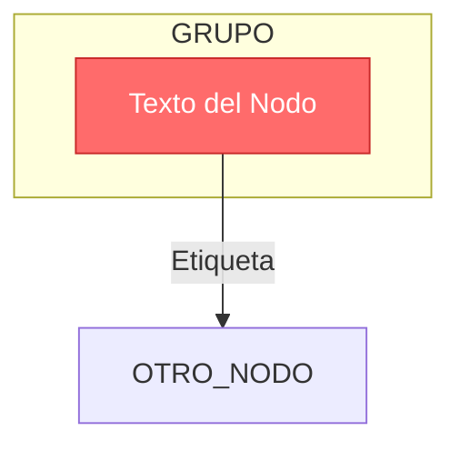

# Diagrama de Arquitectura Mermaid - Resumen

**Fecha**: 3 de Febrero, 2026  
**Documento relacionado**: [Diagrama arquitectura.md](Diagrama%20arquitectura.md)

---

## Resumen Ejecutivo

Se ha creado un **diagrama de arquitectura principal en formato Mermaid** que proporciona una visualización interactiva y renderizable de toda la infraestructura AWS del proyecto Janis-Cencosud.

## Propósito

El diagrama Mermaid permite:
- ✅ Visualización interactiva en GitHub/GitLab
- ✅ Renderizado automático en repositorios Git
- ✅ Vista de alto nivel de toda la arquitectura
- ✅ Comprensión rápida del flujo de datos
- ✅ Documentación visual con colores por tipo de servicio
- ✅ Fácil mantenimiento y actualización

## Contenido del Diagrama

### Componentes Principales

El diagrama muestra la arquitectura completa con los siguientes elementos:

#### 1. Componentes Externos
- **Janis WMS**: Sistema externo que envía webhooks y responde a polling
- **Internet**: Conectividad externa para acceso a servicios

#### 2. AWS Cloud - VPC (10.0.0.0/16)

**Public Subnet A (10.0.1.0/24)**:
- Internet Gateway
- NAT Gateway + Elastic IP
- API Gateway (Webhook Endpoints)

**Private Subnet 1A (10.0.10.0/24)**:
- Lambda Functions (Webhook Processor, Data Enrichment)
- MWAA (Apache Airflow, DAG Orchestration)
- Amazon Redshift (Data Warehouse, BI Analytics)

**Private Subnet 2A (10.0.20.0/24)**:
- AWS Glue (ETL Jobs, Spark Cluster)

**VPC Endpoints**:
- S3 Gateway Endpoint
- Glue Interface Endpoint
- Secrets Manager Endpoint
- CloudWatch Logs Endpoint
- KMS Endpoint
- STS Endpoint
- EventBridge Endpoint

#### 3. AWS Managed Services
- **Amazon S3**: Data Lake (Bronze/Silver/Gold)
- **EventBridge**: Scheduled Rules (5 Polling Jobs)
- **CloudWatch**: Logs + Metrics + Alarms
- **Secrets Manager**: Credentials
- **AWS KMS**: Encryption Keys

#### 4. Monitoring
- VPC Flow Logs
- DNS Query Logs
- CloudWatch Alarms (11+ Alerts)
- SNS Topic (Notifications)

### Flujos de Datos Visualizados

El diagrama muestra claramente:

1. **Ingesta de Webhooks**:
   - Janis → API Gateway → Lambda → Redshift/S3

2. **Polling Periódico**:
   - EventBridge → MWAA → Janis API → S3

3. **Procesamiento ETL**:
   - S3 Bronze → Glue → S3 Silver → Glue → S3 Gold → Redshift

4. **Conectividad Privada**:
   - Servicios VPC → VPC Endpoints → AWS Services

5. **Monitoreo**:
   - Todos los servicios → CloudWatch → Alarms → SNS

### Código de Colores

El diagrama utiliza colores específicos para facilitar la identificación:

- 🔴 **Rojo** (#FF6B6B): Sistemas externos (Janis), API Gateway, Alarmas
- 🟠 **Naranja** (#FF9900): Lambda Functions
- 🟣 **Púrpura** (#945DD6): MWAA (Airflow), SNS
- 🟡 **Amarillo** (#FFD93D): AWS Glue, VPC Endpoints
- 🔴 **Rojo oscuro** (#E74C3C): Redshift
- 🟢 **Verde** (#50C878): S3, S3 Gateway Endpoint
- 🟣 **Púrpura claro** (#A78BFA): EventBridge
- 🟠 **Naranja** (#F59E0B): CloudWatch
- 🔵 **Azul** (#4A90E2): NAT Gateway, Internet Gateway

## Formato Mermaid

### Ventajas del Formato Mermaid

1. **Renderizado Automático**:
   - GitHub y GitLab renderizan automáticamente los diagramas Mermaid
   - No se necesitan herramientas externas para visualizar

2. **Mantenibilidad**:
   - Código de texto plano fácil de editar
   - Control de versiones con Git
   - Diff visible en pull requests

3. **Interactividad**:
   - Zoom y pan en la visualización
   - Colores y estilos personalizables
   - Enlaces clickeables (en algunas plataformas)

4. **Portabilidad**:
   - Funciona en múltiples plataformas (GitHub, GitLab, VS Code, etc.)
   - Exportable a PNG/SVG
   - Integrable en documentación

### Sintaxis Básica



## Uso del Diagrama

### Para Desarrolladores
1. Entender el flujo completo de datos
2. Identificar puntos de integración
3. Comprender dependencias entre servicios
4. Planificar desarrollo de nuevas features

### Para Arquitectos
1. Revisar arquitectura de alto nivel
2. Validar decisiones de diseño
3. Identificar puntos de mejora
4. Comunicar arquitectura a stakeholders

### Para DevOps
1. Entender infraestructura desplegada
2. Planificar monitoreo y alertas
3. Identificar puntos críticos
4. Troubleshooting de problemas

### Para Stakeholders
1. Visualizar inversión en infraestructura
2. Entender capacidades del sistema
3. Evaluar escalabilidad
4. Comprender flujos de negocio

## Comparación con Otros Formatos

### Diagrama ASCII (diagrama-infraestructura-terraform.md)
- ✅ Más detallado (7 diagramas específicos)
- ✅ Funciona en cualquier editor de texto
- ❌ No es interactivo
- ❌ Más difícil de mantener

### Diagramas Mermaid Múltiples (diagrama-mermaid.md)
- ✅ Múltiples vistas especializadas (8 diagramas)
- ✅ Interactivo y renderizable
- ✅ Detalles técnicos por módulo
- ❌ Más complejo para vista general

### Diagrama de Arquitectura Principal (Diagrama arquitectura.md) ⭐ ESTE
- ✅ Vista de alto nivel completa
- ✅ Interactivo y renderizable
- ✅ Fácil de entender
- ✅ Ideal para documentación principal
- ❌ Menos detalles técnicos específicos

## Relación con Otros Documentos

### Documentos Complementarios

- **[../diagrama-infraestructura-terraform.md](../diagrama-infraestructura-terraform.md)** - Diagramas ASCII detallados
- **[../diagrama-mermaid.md](../diagrama-mermaid.md)** - Múltiples vistas Mermaid especializadas
- **[Diagrama de Infraestructura - Resumen.md](Diagrama%20de%20Infraestructura%20-%20Resumen.md)** - Resumen de todos los diagramas
- **[Infraestructura AWS - Resumen Ejecutivo.md](Infraestructura%20AWS%20-%20Resumen%20Ejecutivo.md)** - Visión general de alto nivel
- **[Especificación Detallada de Infraestructura AWS.md](Especificación%20Detallada%20de%20Infraestructura%20AWS.md)** - Detalles técnicos completos

### Flujo de Documentación

```
1. Diagrama de Arquitectura Principal (Mermaid) - ESTE DOCUMENTO
   ↓ (Vista de alto nivel)
2. Infraestructura AWS - Resumen Ejecutivo
   ↓ (Contexto de negocio)
3. Diagrama de Infraestructura (ASCII o Mermaid múltiples vistas)
   ↓ (Detalles técnicos)
4. Especificación Detallada de Infraestructura AWS
   ↓ (Configuración específica)
5. Deployment
   ✅ (Infraestructura desplegada)
```

## Actualizaciones del Diagrama

El diagrama debe actualizarse cuando:
- Se agreguen nuevos servicios AWS
- Se modifique la arquitectura de red
- Se cambien flujos de datos
- Se agreguen o eliminen componentes
- Se modifiquen integraciones externas

### Cómo Actualizar

1. Editar el archivo `Diagrama arquitectura.md`
2. Modificar el código Mermaid según sea necesario
3. Verificar el renderizado en GitHub/GitLab
4. Actualizar este documento de resumen si es necesario
5. Commitear cambios con mensaje descriptivo

## Visualización

### En GitHub/GitLab
El diagrama se renderiza automáticamente al abrir el archivo en la interfaz web.

### En VS Code
Instalar la extensión "Markdown Preview Mermaid Support" para visualizar el diagrama.

### En Otros Editores
Usar herramientas online como:
- [Mermaid Live Editor](https://mermaid.live/)
- [Mermaid Chart](https://www.mermaidchart.com/)

## Exportación

### A PNG/SVG
1. Abrir el diagrama en Mermaid Live Editor
2. Copiar el código Mermaid
3. Exportar a PNG o SVG

### A Presentaciones
1. Exportar a PNG/SVG
2. Insertar en PowerPoint/Google Slides
3. O usar plugins de Mermaid para presentaciones

## Próximos Pasos

1. **Equipo**: Revisar diagrama en [Diagrama arquitectura.md](Diagrama%20arquitectura.md)
2. **Arquitectos**: Validar representación de la arquitectura
3. **Desarrolladores**: Familiarizarse con el flujo de datos
4. **DevOps**: Usar como referencia para deployments
5. **Documentación**: Mantener sincronizado con cambios

## Notas Técnicas

### Formato del Diagrama
- **Formato**: Mermaid (graph TB - Top to Bottom)
- **Ubicación**: `Documentación Cenco/Diagrama arquitectura.md`
- **Longitud**: ~127 líneas
- **Subgrafos**: 5 (External, AWS Cloud, AWS Managed Services, Monitoring)
- **Nodos**: ~30 componentes
- **Conexiones**: ~50 flujos de datos

### Mantenimiento
- Actualizar después de cambios en arquitectura
- Sincronizar con código Terraform
- Revisar en cada release
- Validar con equipo de arquitectura

### Versionado
- Incluir en control de versiones (Git)
- Documentar cambios en commits
- Mantener historial de evolución
- Referenciar en documentación técnica

---

**Preparado por**: Kiro AI Assistant  
**Fecha**: 3 de Febrero, 2026  
**Versión**: 1.0  
**Estado**: ✅ Diagrama de arquitectura principal en formato Mermaid creado

**Ubicación del Diagrama**: [Diagrama arquitectura.md](Diagrama%20arquitectura.md)
