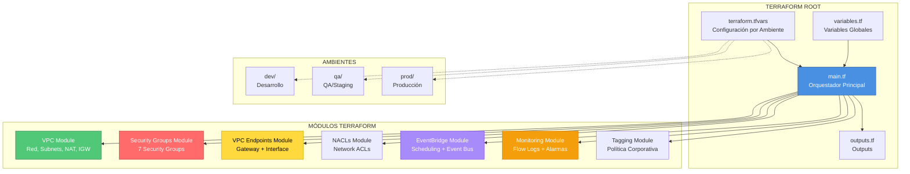
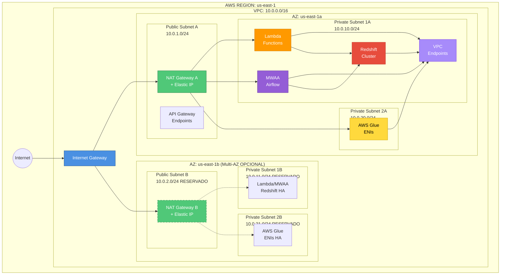
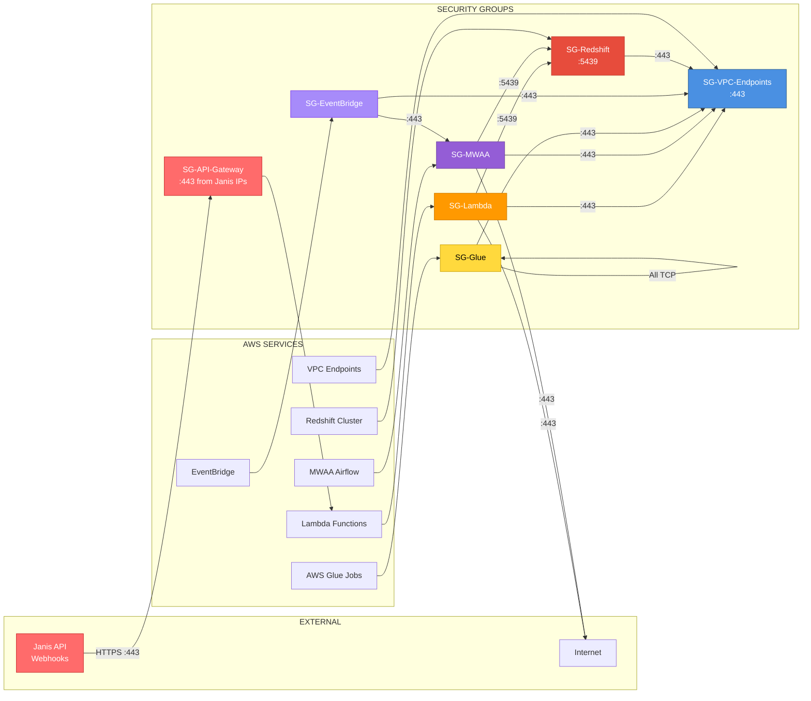
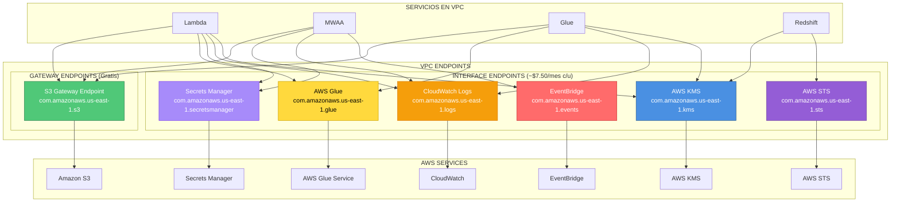
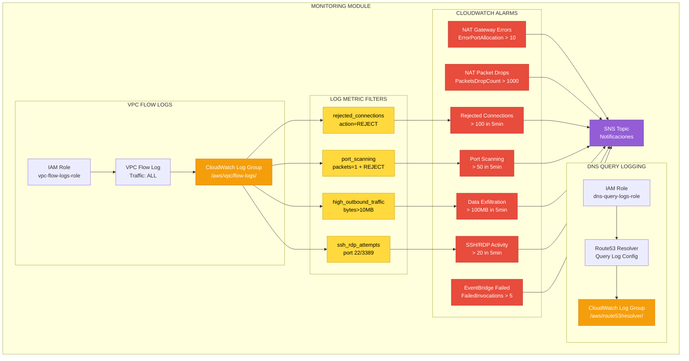
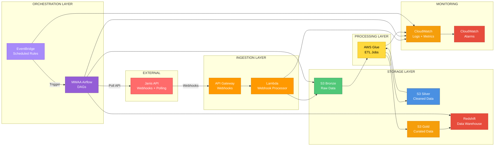
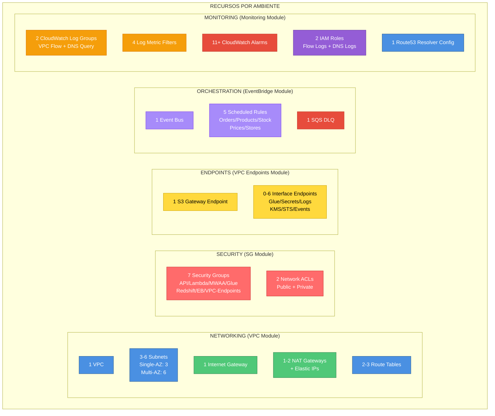

# Diagrama de Infraestructura AWS - Janis-Cencosud (Mermaid)

## Arquitectura General de Módulos Terraform

## Arquitectura de Red VPC (Single-AZ)

## Security Groups y Flujo de Tráfico

## VPC Endpoints

## EventBridge - Orquestación de Polling

```mermaid
graph TB
    subgraph "EVENTBRIDGE MODULE"
        EB_BUS[Event Bus Principal]
        
        subgraph "SCHEDULED RULES"
            RULE_ORDERS[poll-orders-rule<br/>rate: 5 min]
            RULE_PRODUCTS[poll-products-rule<br/>rate: 60 min]
            RULE_STOCK[poll-stock-rule<br/>rate: 10 min]
            RULE_PRICES[poll-prices-rule<br/>rate: 30 min]
            RULE_STORES[poll-stores-rule<br/>rate: 1440 min]
        end
        
        DLQ[SQS Dead Letter Queue<br/>eventbridge-dlq<br/>Retention: 14 días]
    end

    subgraph "MWAA AIRFLOW"
        DAG_ORDERS[dag_poll_orders]
        DAG_PRODUCTS[dag_poll_products]
        DAG_STOCK[dag_poll_stock]
        DAG_PRICES[dag_poll_prices]
        DAG_STORES[dag_poll_stores]
    end

    EB_BUS --> RULE_ORDERS
    EB_BUS --> RULE_PRODUCTS
    EB_BUS --> RULE_STOCK
    EB_BUS --> RULE_PRICES
    EB_BUS --> RULE_STORES

    RULE_ORDERS -->|Trigger| DAG_ORDERS
    RULE_PRODUCTS -->|Trigger| DAG_PRODUCTS
    RULE_STOCK -->|Trigger| DAG_STOCK
    RULE_PRICES -->|Trigger| DAG_PRICES
    RULE_STORES -->|Trigger| DAG_STORES

    RULE_ORDERS -.->|Failed| DLQ
    RULE_PRODUCTS -.->|Failed| DLQ
    RULE_STOCK -.->|Failed| DLQ
    RULE_PRICES -.->|Failed| DLQ
    RULE_STORES -.->|Failed| DLQ

    style EB_BUS fill:#A78BFA,stroke:#7C3AED,color:#fff
    style RULE_ORDERS fill:#FF6B6B,stroke:#C92A2A,color:#fff
    style RULE_PRODUCTS fill:#4A90E2,stroke:#2E5C8A,color:#fff
    style RULE_STOCK fill:#50C878,stroke:#2E7D4E,color:#fff
    style RULE_PRICES fill:#FFD93D,stroke:#C9A000,color:#000
    style RULE_STORES fill:#F59E0B,stroke:#D97706,color:#fff
    style DLQ fill:#E74C3C,stroke:#C0392B,color:#fff
    style DAG_ORDERS fill:#945DD6,stroke:#6B3FA0,color:#fff
    style DAG_PRODUCTS fill:#945DD6,stroke:#6B3FA0,color:#fff
    style DAG_STOCK fill:#945DD6,stroke:#6B3FA0,color:#fff
    style DAG_PRICES fill:#945DD6,stroke:#6B3FA0,color:#fff
    style DAG_STORES fill:#945DD6,stroke:#6B3FA0,color:#fff
```

## Monitoring - CloudWatch

## Flujo de Datos Completo

## Recursos AWS Creados por Ambiente

