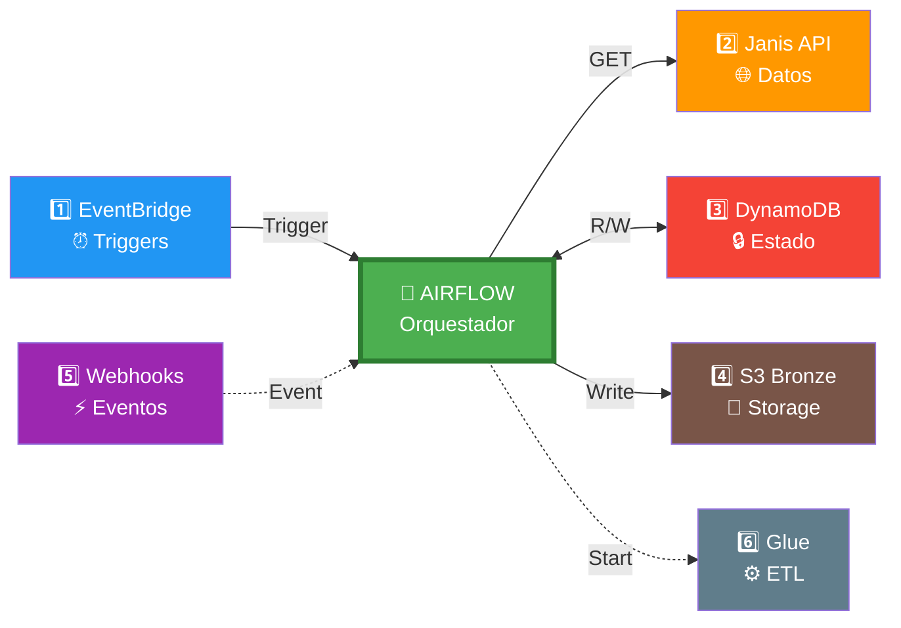

# 🧠 Airflow: Sistema Nervioso Central - Diagrama Simplificado

## Vista Rápida: Las 6 Conexiones

```
                                    🧠 APACHE AIRFLOW (MWAA)
                                  Sistema Nervioso Central
                                            |
                    +---------------------------+---------------------------+
                    |                           |                           |
                ENTRADA                      CONTROL                     SALIDA
                    |                           |                           |
        +-----------+-----------+   +-----------+-----------+   +-----------+-----------+
        |                       |   |                       |   |                       |
    1️⃣ EventBridge         5️⃣ Lambda    3️⃣ DynamoDB          4️⃣ S3 Bronze         6️⃣ Glue Jobs
    Triggers              Webhooks      State Table          Raw Data            ETL Process
    Programados           Urgentes      Locks/Timestamps     JSON Files          Transformación
```

## 🎯 Diagrama de Flujo Simplificado



## 📋 Tabla de Conexiones

| # | Desde | Hacia | Tipo | Qué Hace |
|---|-------|-------|------|----------|
| 1️⃣ | EventBridge | Airflow | ➡️ Entrada | Dispara DAGs cada X minutos |
| 2️⃣ | Airflow | Janis API | ➡️ Salida | Extrae datos (GET requests) |
| 3️⃣ | Airflow | DynamoDB | ↔️ Bidireccional | Lee/Escribe estado y locks |
| 4️⃣ | Airflow | S3 Bronze | ➡️ Salida | Guarda datos raw (JSON) |
| 5️⃣ | Lambda | Airflow | ➡️ Entrada | Eventos urgentes (webhooks) |
| 6️⃣ | Airflow | Glue | ➡️ Salida | Inicia transformaciones ETL |

## 🔄 Flujo de Ejecución de un DAG

```
INICIO
  ↓
1. ⏰ EventBridge dispara DAG
  ↓
2. 🔒 Airflow intenta Lock en DynamoDB
  ↓
3. 🔄 Construye filtro incremental (last_modified - 1 min)
  ↓
4. 🌐 Llama a Janis API con filtro
  ↓
5. 📄 Pagina resultados (100 records/página)
  ↓
6. 🔍 Deduplica registros (overlap window)
  ↓
7. ✅ Valida esquemas JSON
  ↓
8. ➕ Enriquece datos (items, SKUs)
  ↓
9. 💾 Escribe a S3 Bronze (JSON)
  ↓
10. 🔓 Libera Lock y actualiza timestamp
  ↓
11. ⚙️ Dispara Glue Job (Bronze → Silver)
  ↓
FIN ✅
```

## 🎨 Vista de Capas

```
┌─────────────────────────────────────────────────────────────┐
│                    CAPA DE SCHEDULING                        │
│  ⏰ EventBridge: Triggers cada 5min, 10min, 1h, 24h         │
└─────────────────────────────────────────────────────────────┘
                              ↓
┌─────────────────────────────────────────────────────────────┐
│              🧠 CAPA DE ORQUESTACIÓN (AIRFLOW)              │
│                                                              │
│  📋 DAGs:                                                    │
│    • poll_orders (5 min)                                    │
│    • poll_products (1 hora)                                 │
│    • poll_stock (10 min)                                    │
│    • poll_prices (30 min)                                   │
│    • poll_stores (24 horas)                                 │
│                                                              │
│  ⚙️ Componentes:                                            │
│    • JanisAPIClient (Rate Limiting)                         │
│    • PaginationHandler (Circuit Breaker)                    │
│    • IncrementalPolling (Filters + Dedup)                   │
│    • StateManager (DynamoDB)                                │
└─────────────────────────────────────────────────────────────┘
         ↓                    ↓                    ↓
┌──────────────┐    ┌──────────────┐    ┌──────────────┐
│  🌐 JANIS    │    │ 🗄️ DYNAMODB  │    │  💾 S3       │
│  API REST    │    │  Control     │    │  Bronze      │
│  (Extrae)    │    │  (Estado)    │    │  (Guarda)    │
└──────────────┘    └──────────────┘    └──────────────┘
                                                ↓
                                       ┌──────────────┐
                                       │  ⚙️ GLUE     │
                                       │  ETL Jobs    │
                                       │  (Transforma)│
                                       └──────────────┘
```

## 💡 Analogía: Airflow como Director de Orquesta

```
🎼 DIRECTOR DE ORQUESTA (Airflow)
        |
        +-- 🎺 Sección de Vientos (EventBridge)
        |   └─> Marca el tempo (triggers programados)
        |
        +-- 🎻 Sección de Cuerdas (Janis API)
        |   └─> Toca la melodía (extrae datos)
        |
        +-- 🥁 Sección de Percusión (DynamoDB)
        |   └─> Mantiene el ritmo (control de estado)
        |
        +-- 🎹 Sección de Teclados (S3)
        |   └─> Armoniza (almacena datos)
        |
        +-- 🎸 Sección de Guitarras (Glue)
            └─> Improvisa (transforma datos)
```

## 🚦 Estados de un DAG

```
🟢 RUNNING    → DAG ejecutándose activamente
🔵 SUCCESS    → DAG completado exitosamente
🔴 FAILED     → DAG falló (error en algún task)
🟡 QUEUED     → DAG esperando para ejecutarse
⚪ SKIPPED    → DAG omitido (lock ya existe)
🟣 UP_RETRY   → DAG reintentando después de fallo
```

## 📊 Frecuencias de Polling

```
Orders    ████████████████████████  (cada 5 min)  ⚡ Alta frecuencia
Stock     ████████████              (cada 10 min) ⚡ Alta frecuencia
Prices    ██████                    (cada 30 min) 🔄 Media frecuencia
Products  ███                       (cada 1 hora) 🔄 Media frecuencia
Stores    █                         (cada 24h)    🐌 Baja frecuencia
```

## 🎯 Puntos Clave

### ¿Por qué Airflow tiene tantas conexiones?

1. **Hacia ARRIBA (Entrada)** 📥
   - EventBridge: Scheduling inteligente
   - Lambda/Webhooks: Eventos urgentes

2. **Hacia AFUERA (Extracción)** 🌐
   - Janis API: Obtiene datos operacionales

3. **Hacia LOS LADOS (Control)** 🔄
   - DynamoDB: Gestiona estado y locks

4. **Hacia ABAJO (Persistencia)** 💾
   - S3 Bronze: Almacena datos raw

5. **Hacia ADELANTE (Orquestación)** ⚙️
   - Glue Jobs: Dispara transformaciones

### Beneficios de esta Arquitectura

✅ **Desacoplamiento**: Cada componente tiene una responsabilidad clara
✅ **Escalabilidad**: Airflow orquesta sin procesar datos pesados
✅ **Resiliencia**: Locks previenen ejecuciones concurrentes
✅ **Observabilidad**: Logs y métricas centralizados
✅ **Flexibilidad**: Fácil agregar nuevos DAGs o modificar existentes

---

**Recuerda:** Airflow NO procesa los datos pesados, solo ORQUESTA el flujo. 
El procesamiento real lo hace Glue (PySpark).
